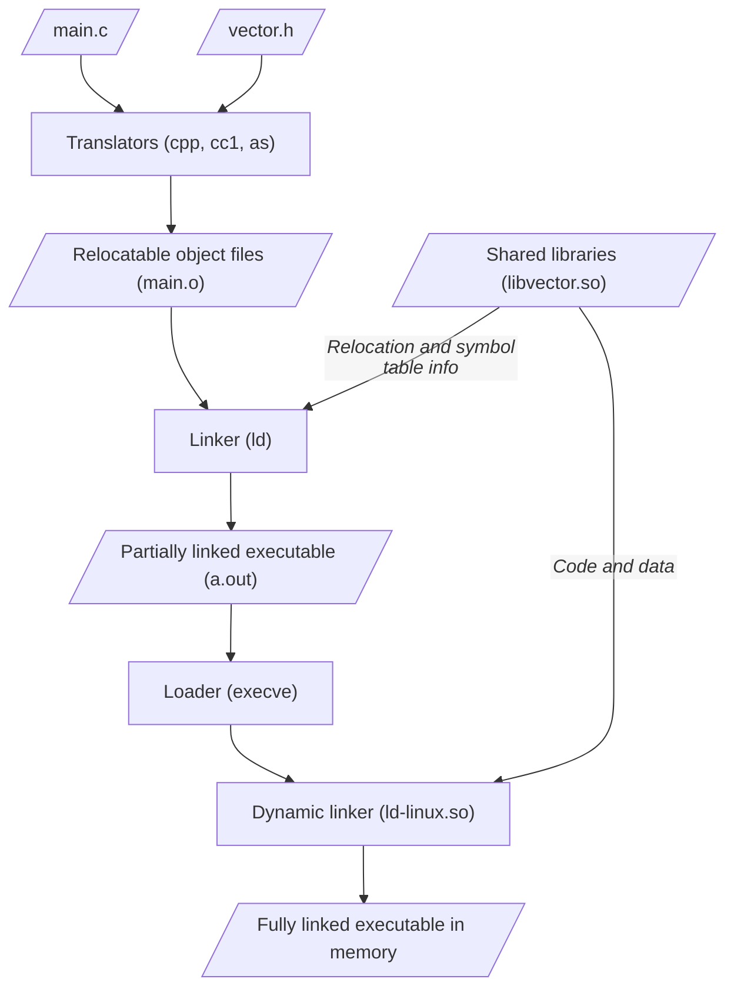

## Linking

---

### Why Linkers?

링커는 **분할 컴파일(Separate compilation)**을 통해 생성된 오브젝트 파일들과 라이브러리를 하나의 실행 파일로 결합한다.

- 프로그램을 여러 개의 모듈로 나누면, 일부 모듈이 변경되었을 때 변경된 모듈만 다시 컴파일하여 링크하면 되므로 빌드 시간을 절약할 수 있다.
- 라이브러리의 모든 함수를 가져오는 것이 아니라, 실제로 호출되는 함수들만 포함하므로 실행 파일의 크기를 줄일 수 있다.

### What Do Linkers Do?

함수 및 전역 변수와 같은 객체를 **심볼(Symbol)**이라 한다. 어셈블러가 심볼 테이블(심볼 이름, 크기, 위치 정보 등을 담고 있는 구조체의 배열)을 생성하여 오브젝트 파일에 저장한다.

- **심볼 해석(Symbol resolution)**: 각 심볼 참조를 해당 심볼의 정의와 연결한다. 중복된 심볼이나 정의되지 않은 심볼이 있는 경우, 링커 오류가 발생한다.
- **재배치(Relocation)**: 각 심볼의 메모리 주소를 결정하고, 참조를 업데이트한다.

### 3 Kinds of Object Files

|    Type     | Format  | Description                                                                              |
| :---------: | :------ | :--------------------------------------------------------------------------------------- |
| Relocatable | `.o`    | 어셈블러에 의해 생성된다.<br>바이너리 파일이지만, 메모리에 로드될 수 있는 형태는 아니다. |
| Executable  | `a.out` | 링커에 의해 생성된다.<br>메모리에 로드되어 실행할 수 있는 파일이다.                      |
|   Shared    | `.so`   | 공유 라이브러리 파일이다.                                                                |

### ELF Object File Format

**ELF(Executable and Linkable Format)**는 오브젝트 파일의 표준 바이너리 형식으로, 다양한 유형의 오브젝트 파일에 대해 통일된 형식을 제공한다.

|       Section        | Description                                                              |
| :------------------: | :----------------------------------------------------------------------- |
|      ELF header      | 바이너리에 대한 일반적인 정보 (워드 크기, 바이트 순서, 파일 형식 등)     |
| Segment header table | 메모리 세그먼트에 대한 정보                                              |
|       `.text`        | 코드                                                                     |
|      `.rodata`       | 읽기 전용 데이터 (예: `switch` 구문의 점프 테이블)                       |
|       `.data`        | 초기화된 전역/정적 변수                                                  |
|        `.bss`        | 초기화되지 않은 전역/정적 변수 (공간을 차지하지 않음)                    |
|      `.symtab`       | 심볼 테이블                                                              |
|      `.rel.txt`      | `.text` 섹션의 재배치 항목                                               |
|     `.rel.data`      | `.data` 섹션의 재배치 항목                                               |
|       `.debug`       | 소스 코드와 기계 코드의 행 번호 매핑 정보 (`-g` 옵션으로 컴파일 시 생성) |
| Section header table | 각 섹션의 상대 주소와 크기 정보                                          |

### Linker Symbols

| Type                            | Description                                                                                                |
| :------------------------------ | :--------------------------------------------------------------------------------------------------------- |
| **전역 심볼 (Global symbol)**   | 다른 모듈에서도 참조할 수 있는 심볼이다.<br>`static` 키워드 없이 정의된 함수 및 전역 변수가 이에 해당한다. |
| **외부 심볼 (External symbol)** | 다른 모듈에서 정의된 심볼이다.<br>`extern` 키워드를 사용하여 명시적으로 선언할 수 있다.                    |
| **지역 심볼 (Local symbol)**    | 한 모듈 내에서만 정의되고 참조되는 심볼이다.<br>`static`으로 정의된 함수 및 전역 변수가 이에 해당한다.     |

> 지역 심볼은 지역 변수와 다른 개념이다. 지역 변수는 스택에 저장되며 컴파일러가 관리하므로, 링커는 지역 변수에 대해 알지 못한다.
{: .prompt-info }

이러한 심볼의 개념을 이용하면, C에서도 추상화와 정보 은닉을 구현할 수 있다. 외부에 노출하고자 하는 함수는 일반 함수로 정의하고, 내부에서만 사용할 함수는 `static`으로 정의함으로써 사용자가 내부 구현의 세부 사항에 접근하지 못하도록 제한할 수 있다.

### Duplicate Symbol Definitions

- **강한 심볼(Strong symbol)**: 함수 및 초기화된 전역 변수
- **약한 심볼(Weak symbol)**: 초기화되지 않은 전역 변수

심볼의 정의가 중복되는 경우, 링커는 다음 규칙을 따른다.

1. 다수의 강한 심볼은 허용되지 않는다. (오류 발생)
2. 하나의 강한 심볼과 동일한 이름의 약한 심볼이 하나 이상 존재하는 경우, 해당 심볼에 대한 모든 참조는 강한 심볼로 연결된다.
3. 약한 심볼만 여러 개 존재하는 경우, 그 중 임의의 하나를 고른다. `gcc`의 `-fno-common` 옵션을 사용하면, 이를 오류로 간주한다.

### Global Variables

- **가능하면 전역 변수의 사용을 피하는 것이 좋다.** 변수가 파일 범위를 가진다면 `static`을 사용하자.
- 전역 변수를 사용해야 한다면, 선언과 동시에 초기화하는 것이 좋다. 강한 심볼로 간주되므로, 심볼의 중복 정의를 방지할 수 있다.
- 외부 전역 변수를 참조할 때는 `extern` 키워드를 사용하여 컴파일러에게 알리는 것이 좋다.

### Relocation Entries

다음은 `main.c` 파일이다.

```c
int sum(int *a, int n);

int array[2] = { 1, 2 };

int main() {
    int val = sum(array, 2);
    return val;
}
```

오브젝트 파일을 생성한 뒤, `objdump`의 `-r` 옵션을 사용하면 **재배치 항목(Relocation entry)**이 출력된다.

```bash
$ gcc -Wall -Og -c main.c sum.c
$ objdump -dr main.o
```

```bash
0000000000000000 <main>:
   0:   48 83 ec 08             sub    $0x8,%rsp
   4:   be 02 00 00 00          mov    $0x2,%esi
   9:   bf 00 00 00 00          mov    $0x0,%edi
                        a: R_X86_64_32  array            # Relocation entry
   e:   e8 00 00 00 00          callq  13 <main+0x13>
                        f: R_X86_64_PC32        sum-0x4  # Relocation entry
  13:   48 83 c4 08             add    $0x8,%rsp
  17:   c3                      retq
```

컴파일러가 2개의 재배치 항목을 생성하였다.

- 첫 번째는 `array`에 대한 참조이다. 컴파일러는 해당 주소를 아직 모르기에 일단 0으로 두고, `main.o`의 `.rel` 섹션에 재배치 항목을 생성함으로써, 링커에게 `main.o`를 재배치할 때 `.text` 섹션의 오프셋 `a`에서 32비트 주소 형식의 `array`에 대한 참조를 업데이트해야 한다고 알려 준다.

- 두 번째는 `sum()`에 대한 참조이다. 마찬가지로 상대 주소를 일단 0으로 두고, 재배치 항목을 생성하여 오프셋 `f`에서 심볼 `sum`에 대한 4바이트 PC 상대 참조(PC-relative reference)를 업데이트해야 한다고 알린다.

```bash
00000000004004d0 <main>:
  4004d0:       48 83 ec 08             sub    $0x8,%rsp
  4004d4:       be 02 00 00 00          mov    $0x2,%esi
  4004d9:       bf 18 10 60 00          mov    $0x601018,%edi
  4004de:       e8 05 00 00 00          callq  4004e8 <sum>  # 0x4004e8 = 0x4004e3 + 0x5
  4004e3:       48 83 c4 08             add    $0x8,%rsp
  4004e7:       c3                      retq
```

재배치된 `.text` 섹션을 보면, 0으로 두었던 부분들이 실제 주소에 맞게 업데이트된 것을 확인할 수 있다.

### Loading Executable Object Files

|                        Memory                        |
| :--------------------------------------------------: |
|           User stack (created at runtime)            |
|                          ↓                           |
|                          ⋮                           |
|      Memory-mapped region for shared libraries       |
|                          ⋮                           |
|                          ↑                           |
|         Runtime heap (created by `malloc()`)         |
|       Read/write data segment (`.data`, `bss`)       |
| Read-only code segment (`.init`, `.text`, `.rodata`) |

### Static Libraries

**정적 라이브러리(Static library)**는 여러 개의 오브젝트 파일(`.o`)을 아카이브(`ar`)하여 하나의 파일(`.a`)로 묶은 것이다.

- 프로그램에 라이브러리 코드가 포함되므로, 여러 프로그램에서 동일한 라이브러리를 사용하는 경우 코드가 중복될 수 있다.
- 정적 라이브러리가 업데이트되면, 해당 라이브러리를 사용하는 모든 프로그램을 다시 빌드해야 한다.

> 링커는 명령줄에 주어진 순서대로 `.o`와 `.a` 파일을 훑어보면서 각 파일에 정의된 심볼로 아직 해석되지 않은 참조를 해석하려고 시도하기 때문에 **잘못된 순서로 파일을 배치하면 링커 오류가 발생한다.**
{: .prompt-danger }

### Shared Libraries

**공유 라이브러리(Shared library)**는 프로그램 실행 시점에 동적으로 로드되어 사용되는 라이브러리이다. 윈도우에서는 **동적 링크 라이브러리(Dynamic-Link Library, DLL)**라고 한다.

- 프로그램에 라이브러리 코드가 포함되지 않는다.
- 여러 프로그램이 하나의 라이브러리 코드를 공유하여 사용할 수 있다.

`gcc`의 `-shared` 옵션을 사용하여 공유 라이브러리(`.so`)를 생성할 수 있다.

```c
gcc -shared -fpic -o libvector.so addvec.c multvec.c
```

> `-fpic` 옵션에 대한 설명은 여기[^fpic] 참고
{: .prompt-info }

### Dynamic Linking at Load-Time



- 링커는 공유 라이브러리 함수에 대한 참조를 심볼 테이블에 기록하고, 재배치 항목을 생성한다.
- 로더가 실행 파일과 공유 라이브러리를 메모리에 로드한 뒤, 동적 링커를 호출한다.
- 동적 링커는 로드된 공유 라이브러리를 이용하여 심볼을 해석한 뒤, 재배치를 수행한다.

### Dynamic Linking at Runtime

`dlopen()` 인터페이스[^dlopen]를 통해 런타임에도 공유 라이브러리를 동적으로 로드할 수 있다.

```c
#include <stdio.h>
#include <stdlib.h>
#include <dlfcn.h>

int x[2] = { 1, 2 };
int y[2] = { 3, 4 };
int z[2];

int main() {
    void *handle;
    void (*addvec)(int *, int *, int *, int);
    char *error;

    /* Dynamically load the shared library that contains addvec() */
    handle = dlopen("./libvector.so", RTLD_LAZY);
    if (!handle) {
        fprintf(stderr, "%s\n", dlerror());
        exit(1);
    }

    /* Get a pointer to the addvec() function we just loaded */
    addvec = dlsym(handle, "addvec");
    if ((error = dlerror()) != NULL) {
        fprintf(stderr, "%s\n", error);
        exit(1);
    }

    /* Now we can call addvec() just like any other function */
    addvec(x, y, z, 2);
    printf("z = [%d %d]\n", z[0], z[1]);

    /* Unload the shared library */
    if (dlclose(handle) < 0) {
        fprintf(stderr, "%s\n", dlerror());
        exit(1);
    }
    return 0;
}
```

<br>

## Library Interpositioning

---

**Library interpositioning**은 래퍼(wrapper)를 통해 라이브러리 함수 호출을 가로채는 링킹 기술이다.

```c
#include <malloc.h>
#include <stdlib.h>

int main(int argc, char *argv[]) {
    for (int i = 1; i < argc; i++) {
        void *p = malloc(atoi(argv[i]));
        free(p);
    }
    return 0;
}
```

이를 이용하여 `main.c`의 모든 `malloc()`과 `free()` 호출을 추적해 보자.

### Compile-Time Interpositioning

먼저 두 함수에 대한 래퍼 함수를 작성한다.

```c
#ifdef COMPILETIME
#include <malloc.h>
#include <stdio.h>

/* malloc() wrapper function */
void *mymalloc(size_t size) {
    void *ptr = malloc(size);
    fprintf(stderr, "malloc(%d)=%p\n", (int)size, ptr);
    return ptr;
}

/* free() wrapper function */
void myfree(void *ptr) {
    free(ptr);
    fprintf(stderr, "free(%p)\n", ptr);
}
#endif
```

`malloc.h`에서 라이브러리 함수를 래퍼 함수에 매핑하고, 컴파일러가 혼동하지 않도록 프로토타입을 제한한다.

```c
#define malloc(size) mymalloc(size)
#define free(ptr) myfree(ptr)

void *mymalloc(size_t size);
void myfree(void *ptr);
```

컴파일 시 `-I` 옵션으로 경로를 지정하여, `libc`의 `malloc.h` 대신 위에서 작성한 `malloc.h`를 `include`하게 한다.

```bash
$ gcc -Wall -DCOMPILETIME -c mymalloc.c
$ gcc -Wall -I. main.c mymalloc.o
$ ./a.out 2024 3
malloc(2024)=0x555cfa6742a0
free(0x555cfa6742a0)
malloc(3)=0x555cfa6742a0
free(0x555cfa6742a0)
```

### Link-Time Interpositioning

래퍼 함수를 `__wrap_malloc()`과 `__wrap_free()`라는 특별한 이름으로 정의한다.

```c
#ifdef LINKTIME
#include <stdio.h>

void *__real_malloc(size_t size);
void __real_free(void *ptr);

/* malloc() wrapper function */
void *__wrap_malloc(size_t size) {
    void *ptr = __real_malloc(size);  /* Call libc malloc() */
    fprintf(stderr, "malloc(%d) = %p\n", (int)size, ptr);
    return ptr;
}

/* free() wrapper function */
void __wrap_free(void *ptr) {
    __real_free(ptr);  /* Call libc free() */
    fprintf(stderr, "free(%p)\n", ptr);
}
#endif
```

링크 시 `-Wl` 옵션으로 링커에게 `--wrap` 옵션을 전달한다.

> 링커 옵션에 대한 설명은 여기[^ld-options] 참고
{: .prompt-info }

```bash
$ gcc -Wall -DLINKTIME -c mymalloc.c
$ gcc -Wall -c main.c
$ gcc -Wall -Wl,--wrap,malloc -Wl,--wrap,free main.o mymalloc.o
$ ./a.out 2024 3
malloc(2024) = 0x564beffc22a0
free(0x564beffc22a0)
malloc(3) = 0x564beffc22a0
free(0x564beffc22a0)
```

### Runtime Interpositioning

`dlsym()`을 호출하는 래퍼 함수를 작성한다.

```c
#ifdef RUNTIME
#define _GNU_SOURCE
#include <dlfcn.h>
#include <stdio.h>
#include <stdlib.h>

/* malloc() wrapper function */
void *malloc(size_t size) {
    void *(*real_malloc)(size_t size);
    char *error;
    real_malloc = dlsym(RTLD_NEXT, "malloc");  /* Get address of libc malloc() */
    if ((error = dlerror()) != NULL) {
        fprintf(stderr, "%s\n", error);
        exit(1);
    }
    void *ptr = real_malloc(size);  /* Call libc malloc() */
    fprintf(stderr, "malloc(%d) = %p\n", (int)size, ptr);
    return ptr;
}

/* free() wrapper function */
void free(void *ptr) {
    void (*real_free)(void *);
    char *error;
    if (!ptr)
        return;
    real_free = dlsym(RTLD_NEXT, "free");  /* Get address of libc free() */
    if ((error = dlerror()) != NULL) {
        fprintf(stderr, "%s\n", error);
        exit(1);
    }
    real_free(ptr);  /* Call libc free() */
    fprintf(stderr, "free(%p)\n", ptr);
}
#endif
```

`LD_PRELOAD`라는 환경 변수에 파일을 지정하여, 동적 링커에게 심볼을 해석할 때 해당 파일을 먼저 보라고 지시한다.

```bash
$ gcc -Wall -DRUNTIME -shared -fpic -o mymalloc.so mymalloc.c -ldl
$ gcc -Wall main.c
$ (LD_PRELOAD="./mymalloc.so" ./a.out 2024 3)
malloc(2024) = 0x55b0891432a0
free(0x55b0891432a0)
malloc(3) = 0x55b0891432a0
free(0x55b0891432a0)
```

<br>

## References

---

- [Carnegie Mellon University. (2015). Lecture 13: Linking. [Online].](https://scs.hosted.panopto.com/Panopto/Pages/Viewer.aspx?id=0aef84fc-a53b-49c6-bb43-14cb2b175249)

### Footnote

[^fpic]: [R. M. Stallman and the GCC Developer Community. _Using the GNU Compiler Collection_. [Online].](https://gcc.gnu.org/onlinedocs/gcc.pdf#Options%20for%20Code%20Generation%20Conventions)
[^dlopen]: [D. A. Wheeler. _Program Library HOWTO_. [Online].](<https://tldp.org/HOWTO/pdf/Program-Library-HOWTO.pdf#4.%20Dynamically%20Loaded%20(DL)%20Libraries>)
[^ld-options]: [S. Chamberlain and I. L. Taylor. _The GNU linker_. [Online].](https://sourceware.org/binutils/docs/ld.pdf#Command-line%20Options)
