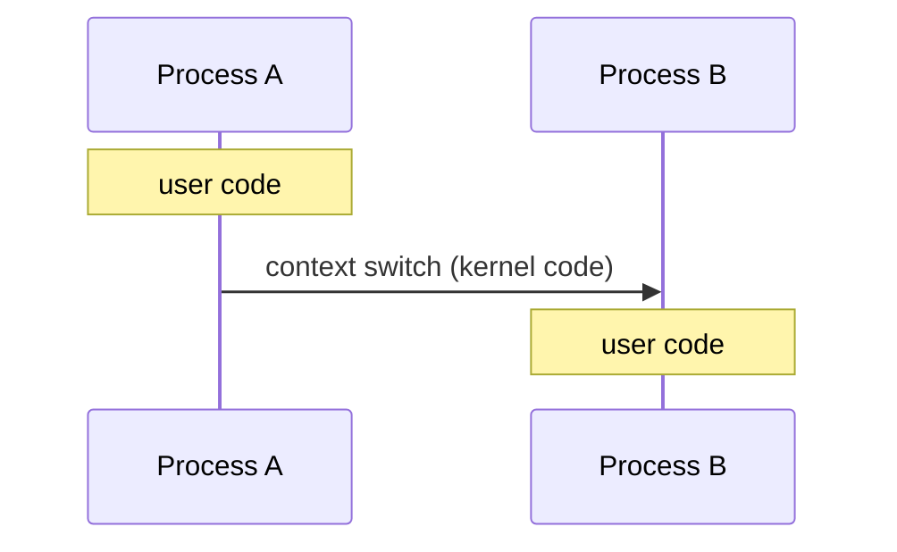
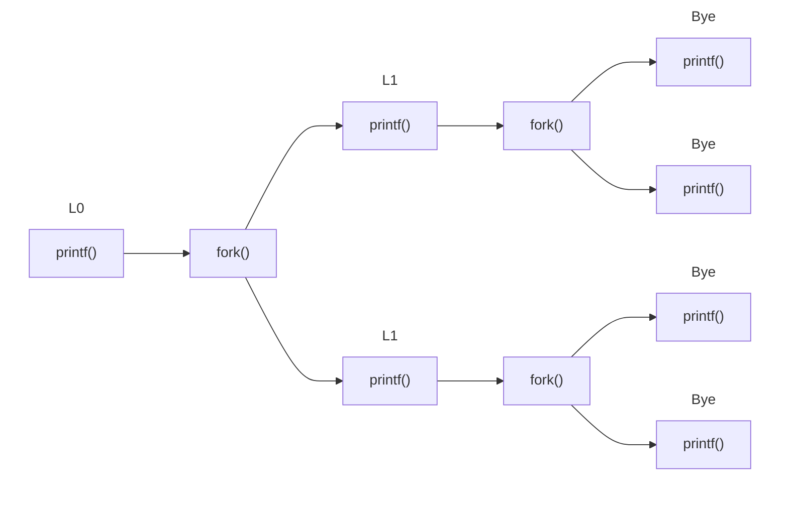
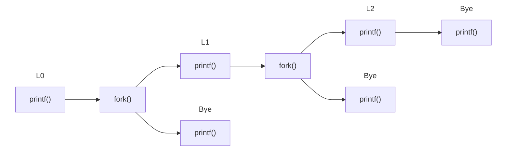

## Exceptions

---

**예외(Exception)**란 시스템 이벤트(상태 변화)로 인해 운영 체제의 커널로 제어가 전송되는 것이다. 사용자 코드에서 커널의 **예외 핸들러(Exception handler)**로 제어를 전송하면, 예외를 처리한 뒤 다음 중 하나의 상황이 발생한다.

- 현재 명령어로 제어를 반환하여 다시 실행한다.
- 다음 명령어로 제어를 반환한다.
- 프로그램을 중단한다.

각 이벤트는 고유한 예외 번호를 가지고 있으며, 이는 **예외 테이블(Exception table)**의 인덱스 역할을 한다. 이벤트 `k` 발생 시, 예외 테이블을 통해 핸들러 `k`를 호출하게 된다.

### Asynchronous Exceptions

**비동기 예외(Asynchronous exception)**는 프로세서 외부의 이벤트(인터럽트)로 인해 발생한다.

- 직접 메모리 접근[^dma]
- 타이머 인터럽트
- 외부 장치로부터의 입출력 인터럽트

### Synchronous Exceptions

**동기 예외(Synchronous exception)**에는 3가지 유형이 존재한다.

- **트랩(Trap)**은 프로그램에 의해 의도적으로 발생하는 예외이다. **시스템 콜(System call)**은 트랩의 가장 일반적인 형태로, 프로그램이 직접 접근할 수 없는 커널의 서비스를 요청하기 위해 사용된다. 시스템 콜은 함수 호출처럼 보이지만, 실제로는 커널로 제어를 전송하는 것이다.

- **폴트(Fault)**는 의도적이지는 않지만 복구 가능할 수 있는 예외이다. **페이지 폴트(Page fault)**는 프로그램이 참조한 주소 공간의 일부가 메모리에 존재하지 않을 때 발생한다. 폴트가 발생하면 현재 명령어를 다시 실행하거나 프로그램을 중단한다.

- **중단(Abort)**은 의도적이지 않으며 복구도 불가능한 예외이다. 잘못된 명령어 실행, 메모리 손상, 기계 문제 등으로 인해 발생하며, 프로그램을 중단한다.

### System Calls

| Number | Name     | Description            |
| :----: | :------- | :--------------------- |
|   0    | `read`   | Read file              |
|   1    | `write`  | Write file             |
|   2    | `open`   | Open file              |
|   3    | `close`  | Close file             |
|   4    | `stat`   | Get info about file    |
|   57   | `fork`   | Create process         |
|   59   | `execve` | Execute a program      |
|   60   | `exit`   | Terminate process      |
|   62   | `kill`   | Send signal to process |

> 레퍼런스[^syscall] 참고
{: .prompt-info }

일반적으로 프로그램에서는 시스템 콜을 수행하는 `syscall` 명령어를 직접 사용하지 않고, 시스템 수준 함수로 래핑하여 호출한다.

```bash
00000000000e5d70 <__open>:
   ⋮
   e5d79:       b8 02 00 00 00          mov    $0x2,%eax  # open is syscall #2
   e5d7e:       0f 05                   syscall           # Return value in %rax
   e5d80:       48 3d 01 f0 ff ff       cmp    $0xfffffffffffff001,%rax
   ⋮
   e5dfa:       c3                      retq
```

`syscall`은 `%rax`에 상태 값을 반환하는데, 음수이면 오류가 발생했음을 의미한다. `open()`은 `read()`/`write()` 호출에 사용되는 파일 디스크립터 값을 반환한다.

### Fault Example: Page Fault

```c
int a[1000];

int main() {
    a[500] = 13;
    return 0;
}
```

```bash
 80483b7:       c7 05 10 9d 04 08 0d    movl   $0xd,0x8049d10
```

참조한 주소가 메모리에 존재하지 않는 경우, `movl` 명령어는 페이지 폴트를 발생시킨다. 커널의 페이지 폴트 핸들러로 제어가 전달되면, 해당 페이지를 디스크에서 메모리로 복사한 뒤 제어를 반환하여 `movl` 명령어를 다시 실행한다.

```c
int a[1000];

int main() {
    a[5000] = 13;
    return 0;
}
```

잘못된 주소를 참조하는 경우, 커널은 `SIGSEGV` 시그널을 보내어 프로세스를 종료한다. 이는 악명 높은 segmentation fault 메시지를 출력하는 시그널이다.

<br>

## Processes

---

**프로세스(Process)**란 실행 중인 프로그램의 인스턴스이며, 2가지 핵심적인 추상화를 제공한다.

- 문맥 교환 메커니즘을 통해, 각 프로그램은 **CPU에 대한 독점적인 사용 권한**을 가지는 것처럼 추상화된다. 다른 프로세스가 레지스터 값을 변경할까 봐 걱정할 필요가 없으며, 각 프로세스는 서로의 존재조차 알 수 없다.

- 가상 메모리 메커니즘을 통해, 각 프로그램은 **독립된 주소 공간**을 가지는 것처럼 추상화된다. 자체적인 코드, 데이터, 힙, 스택을 가지고 있으며, 다른 프로세스에서 사용 중인 코드와 메모리를 볼 수 없다.

### Concurrent Processes

커널은 프로세스를 처리할 코어가 충분하지 않으면 **문맥 교환(Context switch)**을 수행한다. 이때 여러 프로세스의 논리적 제어 흐름이 겹치는 시간대가 존재하면 동시(concurrent)에 실행된다고 표현하고, 그렇지 않으면 순차적(sequential)이라고 한다.

| Time | Process A | Process B | Process C |
| :--: | :-------: | :-------: | :-------: |
|  1   |     ⭣     |           |           |
|  2   |           |     ⭣     |           |
|  3   |           |           |     ⭣     |
|  4   |     ⭣     |           |           |
|  5   |           |           |     ⭣     |

- Concurrent: A & B, A & C
- Sequential: B & C

### Context Switching

> 커널은 별도의 프로세스가 아니라, 예외 발생 시 실행되는 코드일 뿐이다.
{: .prompt-info }



1. 프로세스 A가 실행되다가 예외가 발생하면 커널로 제어를 전송한다.
2. 커널은 스케줄러를 호출하여 A를 계속 실행할지, 문맥 교환을 수행하여 프로세스 B를 실행할지 결정한다.
3. 스케줄러가 프로세스 B를 실행하기로 결정하면, 주소 공간을 변경하여 프로세스 B의 콘텍스트에서 실행된다. 프로세스 B의 범용 레지스터를 로드하고 B로 제어를 전송하여, B는 중단된 지점부터 다시 실행된다.

<br>

## Process Control

---

### System Call Error Handling

Linux의 시스템 수준 함수는 오류 발생 시 -1을 반환하고, 전역 변수 `errno`의 값을 설정하여 오류 발생 원인을 나타낸다. 따라서 **시스템 수준 함수를 호출할 때는 반환값을 반드시 확인**해야 한다. (`exit()`, `free()`와 같은 `void` 함수 제외)

```c
void unix_error(char *msg) {
    fprintf(stderr, "%s: %s\n", msg, strerror(errno));
    exit(1);
}

if ((pid = fork()) < 0)
    unix_error("fork() error");
```

코드를 단순화하기 위해 래퍼 함수를 정의할 수 있다.

```c
pid_t Fork(void) {
    pid_t pid;
    if ((pid = fork()) < 0)
        unix_error("fork() error");
    return pid;
}
```

래퍼 함수의 기본 동작은 래핑된 함수와 동일하며, 오류가 발생하면 처리하고 메시지를 출력한다. 이를 Stevens 스타일이라 하며, 래퍼 함수의 첫 글자를 대문자로 표기한다.

### Creating and Terminating Processes

부모 프로세스는 `fork()`를 호출하여 자식 프로세스를 생성할 수 있다.

- `fork()`는 자식 프로세스에게 0을, 부모 프로세스에게 자식의 PID(Process ID)를 반환한다.
- 자식 프로세스는 부모 프로세스의 가상 주소 공간 및 열려 있는 파일 디스크립터의 복사본을 가진다.

프로세스가 종료되는 경우는 다음과 같다.

- 종료 시그널을 받은 경우
- `main()`에서 반환한 경우
- `exit()`을 호출한 경우

`main()`의 반환값이나 `exit()`에 전달하는 매개 변수를 통해 종료 상태를 설정할 수 있으며, 정상 종료 시 0을 반환하고 오류 발생 시 0이 아닌 값을 반환한다.

### fork() Example

```c
#include <stdio.h>
#include <unistd.h>

int main()
{
    int x = 1;
    pid_t pid = Fork();
    if (pid == 0) {
        /* Child */
        printf("child : x=%d\n", ++x);
        return 0;
    }
    /* Parent */
    printf("parent: x=%d\n", --x);
    return 0;
}
```

```bash
$ ./a.out
parent: x=0
child : x=2
```

부모와 자식은 동시에 실행되므로, **실행 순서는 매번 달라질 수 있다.**

### Modeling fork() with Process Graphs

프로세스 그래프를 그려 보면 명령문이 실행되는 순서를 직관적으로 파악할 수 있다.

- 꼭짓점(vertex)은 실행되는 명령문이다.
- 간선(edge)은 선후 관계를 나타낸다.
- 변수의 현재 값으로 레이블을 붙인다.
- 모든 그래프는 들어오는 간선이 없는 꼭짓점으로 시작한다.

프로세스 그래프의 위상 정렬(topological sort) 개수는 가능한 실행 순서의 가짓수를 의미한다.

### Consecutive fork()

```c
void fork2() {
    printf("L0\n");
    fork();
    printf("L1\n");
    fork();
    printf("Bye\n");
}
```



```bash
$ ./a.out
L0
L1
L1
Bye
Bye
Bye
Bye
```

### Nested fork()

```c
void fork3() {
    printf("L0\n");
    if (fork() == 0) {
        printf("L1\n");
        if (fork() == 0)
            printf("L2\n");
    }
    printf("Bye\n");
}
```



```bash
$ ./a.out
L0
Bye
L1
Bye
L2
Bye
```

### Reaping Child Processes

자식 프로세스가 종료되어도, 종료 상태와 같은 일부 리소스는 시스템에 유지된다. 이렇게 완전히 사라지지 않은 자식 프로세스를 **좀비(Zombie)**라 한다.

- 부모 프로세스가 `wait()` 또는 `waitpid()`를 사용하여 자식 프로세스의 종료 상태 정보를 받아야 커널이 좀비 프로세스를 삭제한다.
- 부모 프로세스가 종료되면, `init` 프로세스(PID 1)가 **고아(Orphan)**가 된 자식 프로세스를 회수한다.

> 셸이나 서버처럼 긴 시간동안 실행되는 부모 프로세스의 경우 **좀비 프로세스로 인해 메모리 누수가 발생**하므로, 반드시 제때 자식 프로세스를 회수해야 한다.
{: .prompt-warning }

### Zombie Example

```c
void fork4() {
    if (fork() == 0) {
        /* Child */
        printf("Terminating Child, PID = %d\n", getpid());
        exit(0);
    } else {
        printf("Running Parent, PID = %d\n", getpid());
        while (1)
            ;  /* Infinite loop */
    }
}
```

```bash
$ ./a.out &
[1] 24643
Running Parent, PID = 24643
Terminating Child, PID = 24644
$ ps
  PID TTY          TIME CMD
24490 pts/5    00:00:00 bash
24643 pts/5    00:00:01 a.out
24644 pts/5    00:00:00 a.out <defunct>
24659 pts/5    00:00:00 ps
$ kill 24643
[1]+  Terminated              ./a.out
$ ps
24490 pts/5    00:00:00 bash
24694 pts/5    00:00:00 ps
```

- 프로그램을 백그라운드에서 실행하기 위해 `&`를 사용한다.
- `ps` 명령어로 현재 실행 중인 프로세스를 출력한다.
- `<defunct>`는 좀비 프로세스임을 나타낸다.
- 부모 프로세스를 `kill`하자 자식 프로세스가 사라진 것을 볼 수 있다.

### wait(): Synchronizing with Children

`pid_t wait(int *wstatus)`를 호출하면 해당 프로세스의 실행을 멈추고, 자식 프로세스 중 하나가 종료될 때까지 기다린다.

- 종료된 자식 프로세스의 PID를 반환한다.
- `wstatus != NULL`이면, 이 포인터가 가리키는 정수 값은 자식 프로세스의 종료 상태 값으로 설정된다.
- `wait.h`에 정의된 매크로를 이용하여 종료 상태 값을 확인할 수 있다.

> 자세한 내용은 `man 2 wait` 참고
{: .prompt-info }

```c
void fork5() {
    int child_status;
    if (fork() == 0) {
        printf("HC: hello from child\n");
        exit(0);
    } else {
        printf("HP: hello from parent\n");
        wait(&child_status);
        printf("CT: child has terminated\n");
    }
    printf("Bye\n");
}
```

```bash
$ ./a.out
HP: hello from parent
HC: hello from child
CT: child has terminated
Bye
```

### waitpid(): Waiting for a Specific Process

`pid_t waitpid(pid_t pid, int *wstatus, int options)`는 지정한 PID를 가진 자식이 종료되기를 기다린다.

```c
void fork6() {
    pid_t pid[N];
    int child_status;
    for (int i = 0; i < N; i++)
        if ((pid[i] = fork()) == 0)
            exit(100 + i);  /* Child */
    /* Parent */
    for (int i = N - 1; i >= 0; i--) {
        pid_t wpid = waitpid(pid[i], &child_status, 0);
        if (WIFEXITED(child_status))
            printf("Child %d terminated with exit status %d\n",
                    wpid, WEXITSTATUS(child_status));
        else
            printf("Child %d terminate abnormally\n", wpid);
    }
}
```

```bash
$ ./a.out
Child 27142 terminated with exit status 103
Child 27141 terminated with exit status 102
Child 27140 terminated with exit status 101
Child 27139 terminated with exit status 100
```

### execve(): Loading and Running Programs

`int execve(char *filename, char *argv[], char *envp[])`를 통해 프로세스 내에서 새로운 프로그램을 실행한다.

- 코드, 데이터, 스택을 완전히 덮어쓴다.
- PID, 열려 있는 파일은 유지된다.

`execve()` 호출에 성공하면 제어를 반환하지 않는다. 따라서 프로세스에서 작업을 계속하려면 자식 프로세스를 생성한 뒤, 자식 프로세스에서 `execve()`를 호출해야 한다.

```c
if ((pid = Fork()) == 0) {
    if (execve(myargv[0], myargv, environ) < 0) {
        fprintf(stderr, "%s: Command not found.\n", myargv[0]);
        exit(1);
    }
}
```

<br>

## References

---

- [Carnegie Mellon University. (2015). Lecture 14: Exceptional Control Flow: Exceptions and Processes. [Online].](https://scs.hosted.panopto.com/Panopto/Pages/Viewer.aspx?id=d2759175-d59e-4f80-ab9e-24c2f15c8adb)

### Footnote

[^dma]: ["Lecture 11: The Memory Hierarchy." {{ site.title }}. [Online].]({{ site.url }}/posts/ics-lecture-11/#reading-a-disk-sector)
[^syscall]: ["Linux System Call Table." The Chromium Projects. [Online].](https://www.chromium.org/chromium-os/developer-library/reference/linux-constants/syscalls/)
