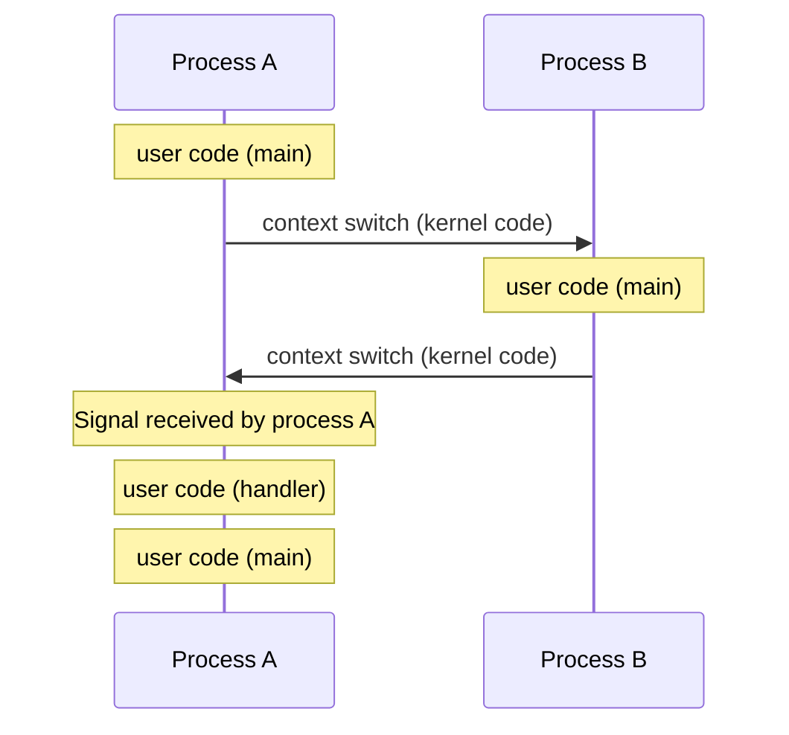
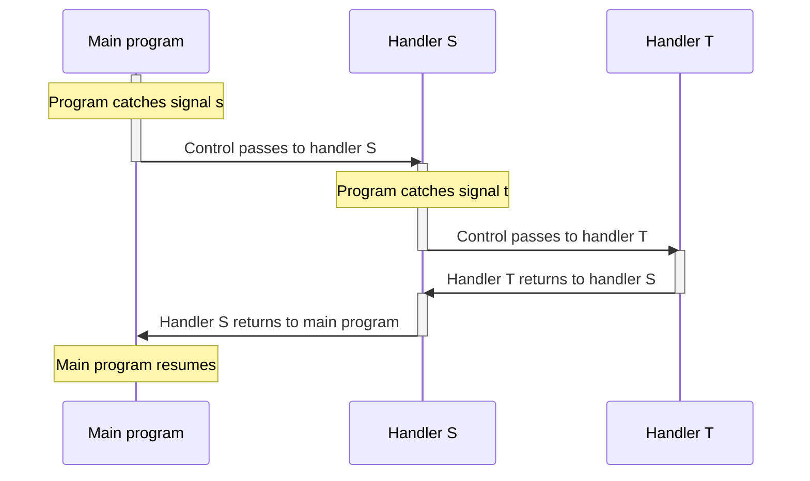

## Shells

---

### Linux Process Hierarchy

시스템의 모든 프로세스는 계층 구조를 형성한다.

```bash
$ pstree -cT
init─┬─init───init───sh───sh───sh───node─┬─node───bash───pstree
     │                                   ├─node
     │                                   └─node───node
     ├─init───init───node
     └─init───init───node
```

시스템 부팅 시 PID가 1인 `init` 프로세스가 생성되며, 다른 모든 프로세스는 `init`의 자손이다. `init` 프로세스는 시작할 때 데몬(daemon)을 생성하고, 사용자에게 **명령줄 인터페이스(Command-Line Interface, CLI)**를 제공하는 로그인 셸을 생성한다.

### Shell Programs

**셸(Shell)**은 사용자를 대신하여 프로그램을 실행하는 응용 프로그램이다. 예를 들어, `ls` 명령을 입력하면 셸은 자식 프로세스를 생성한 뒤 `ls`를 실행한다. Linux의 기본 셸은 `bash`이지만 `sh`, `csh` 등 다른 셸들도 존재한다.

```c
int main() {
    char cmdline[MAXLINE];
    while (1) {
        /* Read */
        printf("> ");
        Fgets(cmdline, MAXLINE, stdin);
        if (feof(stdin))
            exit(0);
        /* Evaluate */
        eval(cmdline);
    }
}
```

셸은 프롬프트를 출력하고 사용자의 입력을 기다리다가, 입력이 들어오면 해당 명령과 인자를 평가한다. 이러한 과정을 반복하다가, EOF 문자(Ctrl-D)가 입력으로 들어오면 셸을 종료한다.

### Simple Shell eval()

```c
void eval(char *cmdline) {
    char *argv[MAXARGS];
    char buf[MAXLINE];  /* Holds modified command line */
    int bg;             /* Should the job run in bg or fg? */
    pid_t pid;

    strcpy(buf, cmdline);
    bg = parseline(buf, argv);
    if (argv[0] == NULL)
        return;
    if (builtin_command(argv))
        return;
    if ((pid = Fork()) == 0) {
        /* Child runs user job */
        if (execve(argv[0], argv, environ) < 0) {
            fprintf(stderr, "%s: Command not found.\n", argv[0]);
            exit(1);
        }
    }
    /* Parent waits for foreground job to terminate */
    if (!bg) {
        int status;
        if (waitpid(pid, &status, 0) < 0)
            unix_error("waitfg: waitpid() error");
    } else {
        printf("%d %s", pid, cmdline);
    }
}
```

> `&`로 끝나는 명령줄은 해당 명령을 백그라운드(background)에서 실행하도록 요청하는 것이다. 셸은 해당 작업이 끝날 때까지 대기하지 않고, 다음 읽기 단계로 넘어간다.
{: .prompt-info }

위 예시에는 명령을 백그라운드로 실행할 때 자식 프로세스를 회수하는 과정이 존재하지 않기 때문에, 백그라운드 작업이 많아지면 메모리 누수가 누적되어 시스템 크래시가 발생할 수 있다. 이러한 문제를 해결하기 위해, exceptional control flow의 일종인 시그널을 활용한다.

<br>

## Signals

---

**시그널(Signal)**은 커널이 프로세스에게 전달하는 작은 메시지로, 시스템에 특정한 이벤트가 발생했음을 알려 준다. 시그널의 종류를 나타내는 ID 값 외에 어떤 데이터도 담고 있지 않으며, 특정 ID 값을 가진 시그널이 도착했다는 사실 자체가 전달되는 정보의 전부이다.

| ID  | Name      | Default action | Corresponding event                     |
| :-: | :-------- | :------------- | :-------------------------------------- |
|  2  | `SIGINT`  | Terminate      | User typed Ctrl-C                       |
|  9  | `SIGKILL` | Terminate      | Kill program (can't override or ignore) |
| 11  | `SIGSEGV` | Terminate      | Segmentation violation                  |
| 14  | `SIGALRM` | Terminate      | Timer signal                            |
| 17  | `SIGCHLD` | Ignore         | Child stopped or terminated             |

> 자세한 내용은 `man 7 signal` 참고
{: .prompt-info }

### Signal Concepts

**Send**

커널은 대상 프로세스(destination process)의 콘텍스트에서 일부 상태를 업데이트함으로써 시그널을 **전송(Send)**한다.

**Receive**

커널에 의해 시그널에 반응하도록 강제될 때 대상 프로세스는 시그널을 **수신(Receive)**한다. 이때 프로세스는 다음과 같이 반응할 수 있다.

- 시그널 무시
- 프로세스 종료
- 시그널 핸들러(사용자 수준 함수) 실행

**Pending**

커널이 전송하였으나 프로세스가 아직 수신하지 않은 시그널을 **보류 중(Pending)**이라고 한다.

- 커널은 `pending` 비트 벡터를 통해 보류 중인 시그널을 추적한다. `pending`의 `k`번째 비트는 ID가 `k`인 시그널의 상태(전송/수신)를 나타낸다.
- 각 시그널에 대해 하나의 비트만 존재하므로, 특정 시그널이 보류 상태라면 같은 종류의 후속 시그널은 버려진다.

**Block**

프로세스는 특정 시그널의 수신을 **차단(Block)**할 수 있다.

- 커널이 차단된 시그널을 전송하더라도 프로세스는 수신하지 않는다.
- 커널은 `blocked` 비트 벡터를 통해 차단된 시그널을 추적한다. `blocked`를 시그널 마스크(signal mask)라 하며, `sigprocmask()` 시스템 콜을 사용하여 값을 변경할 수 있다.

### Sending Signals

모든 프로세스는 각각 하나의 **프로세스 그룹(Process group)**에 속한다. `/bin/kill` 프로그램을 통해 한 그룹에 속하는 모든 프로세스에게 시그널을 전송할 수 있다.

```c
int main() {
    if (fork() != 0)
        return 0;
    printf("Child1: pid=%d pgrp=%d\n", getpid(), getpgrp());
    if (fork() == 0)
        printf("Child2: pid=%d pgrp=%d\n", getpid(), getpgrp());
    while (1)
        ;
}
```

```bash
$ ./a.out
Child1: pid=28191 pgrp=28190
Child2: pid=28192 pgrp=28190
$ ps
  PID TTY          TIME CMD
27955 pts/2    00:00:00 bash
28191 pts/2    00:00:04 a.out
28192 pts/2    00:00:04 a.out
28223 pts/2    00:00:00 ps
$ kill -9 -28190
$ ps
  PID TTY          TIME CMD
27955 pts/2    00:00:00 bash
28269 pts/2    00:00:00 ps
```

명령줄에서 Ctrl-C나 Ctrl-Z를 입력하면, 포그라운드(foreground) 프로세스 그룹에 특정한 시그널을 전송한다.

- Ctrl-C는 `SIGINT`를 전송한다. `SIGINT`의 기본 동작은 프로세스를 종료하는 것이다.
- Ctrl-Z는 `SIGTSTP`을 전송한다. `SIGTSTP`의 기본 동작은 프로세스를 일시 중단하는 것이다. (`SIGCONT`를 수신할 때까지)

```c
int main() {
    if (fork() == 0)
        printf("Child: pid=%d pgrp=%d\n", getpid(), getpgrp());
    else
        printf("Parent: pid=%d pgrp=%d\n", getpid(), getpgrp());
    while (1)
        ;
}
```

```bash
$ ./a.out
Parent: pid=31419 pgrp=31419
Child: pid=31420 pgrp=31419
^Z
[1]+  Stopped                 ./a.out
$ ps w
  PID TTY      STAT   TIME COMMAND
31215 pts/2    Ss     0:00 /usr/bin/bash
31419 pts/2    T      0:02 ./a.out
31420 pts/2    T      0:02 ./a.out
31487 pts/2    R+     0:00 ps w
$ fg
./a.out
^C
$ ps w
  PID TTY      STAT   TIME COMMAND
31215 pts/2    Ss     0:00 /usr/bin/bash
31570 pts/2    R+     0:00 ps w
```

- `ps w`의 `STAT`에서 `T`는 stopped를 의미한다.
- `fg`는 일시 중단된 작업을 포그라운드로 복원한다.

또한, `int kill(pid_t pid, int sig)` 시스템 콜을 사용하여 특정 PID에 원하는 시그널을 전송할 수 있다.

### Receiving Signals

프로세스가 시그널을 수신하는 과정은 다음과 같다.

1. 프로세스 A가 사용자 코드를 실행하는 중에, 예외로 인해 커널로 제어가 전송된다.
2. 커널은 스케줄러를 호출하고, 프로세스 A에서 프로세스 B로의 문맥 교환을 결정한다.
3. 프로세스 B의 사용자 코드로 제어를 전송할 준비가 되면, 프로세스 B의 보류 중인 시그널을 확인한다.
4. 보류 중이면서 차단되지 않은 시그널의 비트 벡터 `pnb = pending & ~blocked`를 계산한다.
5. `pnb`의 0이 아닌 비트 중 가장 낮은 비트부터 순서대로, 프로세스 B가 해당 시그널을 수신한다.
6. 프로세스 B의 다음 명령어로 제어를 전달한다.

### Installing Signal Handlers

`sighandler_t signal(int signum, sighandler_t handler)` 시스템 콜을 통해 시그널의 기본 동작을 변경할 수 있다.

- 사용자 수준 시그널 핸들러를 설정하는 것을 핸들러를 **설치(Install)**한다고 표현한다.
- 시그널 핸들러를 실행하는 것을 시그널을 **캐치(Catch)**한다고 표현한다.
- 예외 핸들러와 마찬가지로, 시그널 핸들러가 실행될 때 프로세스에서 실행 중인 명령을 중단한다. 핸들러 실행이 완료되면, 중단된 지점으로 제어를 반환한다.

### Signal Handlers as Concurrent Flows

시그널 핸들러는 메인 프로그램과 동시(concurrent)에 실행되는 별도의 logcial flow이다.



### Nested Signal Handlers



### Guidlines for Writing Safe Handlers

- 시그널 핸들러는 가능한 한 단순하게 유지해야 한다.

- 시그널 핸들러 내부에서는 비동기 시그널 안전성을 가진 함수들만 호출해야 한다.

- 시그널 핸들러 진입 및 종료 시 항상 `errno`를 저장하고 복원해야 한다. 다른 핸들러에 의해 인터럽트되면 `errno`가 덮어쓰일 수 있기 때문이다.

- 공유되는 자료 구조에 접근할 때는 일시적으로 모든 시그널을 차단해야 한다.

- 전역 변수는 `volatile`로 선언해야 한다. 이는 컴파일러가 해당 변수를 레지스터에 저장하는 것을 방지하여, 읽기/쓰기 작업이 항상 메모리에서 이루어지도록 한다.

- 전역 플래그는 `volatile sig_atomic_t`로 선언해야 한다. 읽기/쓰기 작업이 원자적으로 이루어지므로, 공유 데이터 접근을 위해 따로 보호할 필요가 없다.

### Async-Signal-Safety

**비동기 시그널 안전성(Async-signal-safety)**을 가지는 함수는 재진입 가능(reentrant)하거나 시그널에 의해 인터럽트될 수 없다. 재진입 가능한 함수는 지역 변수만을 참조하며, 정적/전역 변수와 같은 공유 데이터에 접근하지 않는다.

- 비동기 시그널에 안전한 함수: `_exit()`, `write()`, `wait()`, `waitpid()`, `sleep()`, `kill()` 등
- 안전하지 않은 함수: `printf()`, `sprintf()`, `malloc()`, `exit()` 등

비동기 시그널에 안전한 출력 함수는 오직 `write()`뿐이므로, 필요에 따라 `write()` 기반의 출력 함수를 정의하여 사용하는 것이 좋다.

```c
/* Put string */
ssize_t sio_puts(char s[]) {
    return write(STDOUT_FILENO, s, strlen(s));
}

/* Put long */
ssize_t sio_putl(long v) {
    char s[128];
    sio_ltoa(v, s, 10);  /* Based on K&R itoa() */
    return sio_puts(s);
}

/* Put error message and exit */
void sio_error(char s[]) {
    sio_puts(s);
    _exit(1);
}
```

### Incorrect Signal Handling

```c
#define N 5

volatile int ccount = 0;

void child_handler(int sig) {
    int old_errno = errno;
    pid_t pid;
    if ((pid = wait(NULL)) < 0)
        Sio_error("wait() error");
    ccount--;
    Sio_puts("Handler reaped child ");
    Sio_putl((long)pid);
    Sio_puts(" \n");
    sleep(1);
    errno = old_errno;
}

int main() {
    pid_t pid[N];
    ccount = N;
    Signal(SIGCHLD, child_handler);
    for (int i = 0; i < N; i++) {
        if ((pid[i] = Fork()) == 0) {
            Sleep(1);
            exit(0);  /* Child exits */
        }
    }
    while (ccount > 0)  /* Parent spins */
        ;
}
```

```bash
$ ./a.out
Handler reaped child 8189
Handler reaped child 8190

```

총 5개의 자식 프로세스를 생성하고 종료했지만, 2개만 회수된 것을 볼 수 있다.

1. 부모 프로세스가 `SIGCHLD`를 수신하여 첫 번째 `wait()`을 호출하고, 1초 동안 비활성화된다.
2. 그동안 전송된 `SIGCHLD`는 보류 상태가 되므로, `pending` 비트 벡터의 해당 비트를 계속 덮어쓰게 된다.
3. 부모 프로세스가 다시 실행되면, 보류 중인 `SIGCHLD`를 수신하여 두 번째 `wait()`을 호출한다.
4. 더 이상 보류 중인 시그널이 없으므로, 부모 프로세스는 메인 루프에서 스핀(spin)하게 된다.

이처럼 이벤트 발생 횟수를 세는 데에는 시그널을 사용할 수 없다.

### Synchronizing Flows to Avoid Races

```c
void handler(int sig) {
    int old_errno = errno;
    sigset_t mask_all, prev_all;
    pid_t pid;

    Sigfillset(&mask_all);
    while ((pid = waitpid(-1, NULL, 0)) > 0) {
        Sigprocmask(SIG_BLOCK, &mask_all, &prev_all);  /* Block signals */
        deletejob(pid);
        Sigprocmask(SIG_SETMASK, &prev_all, NULL);  /* Unblock signals */
    }
    if (errno != ECHILD)
        Sio_error("waitpid() error");
    errno = old_errno;
}

int main(int argc, char *argv[]) {
    int pid;
    sigset_t mask_all, prev_all;
    int n = N;

    Sigfillset(&mask_all);
    Signal(SIGCHLD, handler);
    initjobs();
    while (n--) {
        if ((pid = Fork()) == 0) {
            /* Child */
            Execve("/bin/date", argv, NULL);
        }
        /* Parent */
        Sigprocmask(SIG_BLOCK, &mask_all, &prev_all);  /* Block signals */
        addjob(pid);
        Sigprocmask(SIG_SETMASK, &prev_all, NULL);  /* Unblock signals */
    }
    return 0;
}
```

- `main()`과 `handler()`는 concurrent flow로서 각각 공유 자료 구조인 작업 큐에 접근하고 있으며, 작업 큐를 업데이트하는 동안 모든 시그널을 차단하고 있다.

포크 이후 부모 대신 자식 프로세스로 제어가 반환되는 경우, 자식 프로세스는 작업 큐에 추가되지 않은 작업을 삭제하게 된다. 그리고 부모 프로세스가 실행될 때 해당 작업을 작업 큐에 추가하면, 그 작업은 절대 삭제되지 않을 것이다.

프로세스의 실행 순서 및 시간은 제어할 수 없지만, 시그널 차단을 통해 `SIGCHLD`의 **핸들러가 실행되는 시점을 제어**할 수 있다.

```c
int main(int argc, char *argv[]) {
    int pid;
    sigset_t mask_all, mask_one, prev_one;
    int n = N;

    Sigfillset(&mask_all);
    Sigemptyset(&mask_one);
    Sigaddset(&mask_one, SIGCHLD);
    Signal(SIGCHLD, handler);
    initjobs();
    while (n--) {
        Sigprocmask(SIG_BLOCK, &mask_one, &prev_one);  /* Block SIGCHLD */
        if ((pid = Fork()) == 0) {
            /* Child */
            Sigprocmask(SIG_SETMASK, &prev_one, NULL);  /* Unblock SIGCHLD */
            Execve("/bin/date", argv, NULL);
        }
        /* Parent */
        Sigprocmask(SIG_BLOCK, &mask_all, NULL);  /* Block signals */
        addjob(pid);
        Sigprocmask(SIG_SETMASK, &prev_one, NULL);  /* Unblock signals */
    }
    return 0;
}
```

- 부모 프로세스에서 `SIGCHLD`를 차단한 뒤 `Fork()`를 호출하여, 자식 프로세스가 먼저 종료되더라도 시그널이 처리되지 않도록 한다.
- 자식 프로세스에서 `SIGCHLD`의 차단을 해제한 뒤 `Execve()`를 호출하여, 자식의 자식 프로세스가 종료될 때 `SIGCHLD`가 자식 프로세스로 전달될 수 있도록 한다.
- 부모 프로세스에서 `addjob()`을 호출한 뒤, 이전 시그널 마스크를 복원함으로써 `SIGCHLD`의 차단을 해제하고 보류 중인 `SIGCHLD`를 수신한다.

### Explicitly Waiting for Signals

셸은 일반적으로 `SIGCHLD`의 핸들러에서 `wait()` 호출을 수행한다. 메인 함수에서 `wait()` 호출 없이 포그라운드 작업이 완료되었는지 감지하기 위해, `SIGCHLD`의 핸들러에서 회수한 프로세스의 PID 값을 전역 플래그에 설정한다.

```c
volatile sig_atomic_t pid;

void sigchld_handler(int s) {
    int old_errno = errno;
    pid = Waitpid(-1, NULL, 0);
    errno = old_errno;
}

void sigint_handler(int s) {}

int main(int argc, char *argv[]) {
    sigset_t mask, prev;
    int n = N;

    Signal(SIGCHLD, sigchld_handler);
    Signal(SIGINT, sigint_handler);
    Sigemptyset(&mask);
    Sigaddset(&mask, SIGCHLD);
    while (n--) {
        Sigprocmask(SIG_BLOCK, &mask, &prev);  /* Block SIGCHLD */
        if (Fork() == 0) {
            /* Child */
            return 0;
        }
        /* Parent */
        pid = 0;
        Sigprocmask(SIG_SETMASK, &prev, NULL);  /* Unblock SIGCHLD */
        while (!pid)
            ;
        /* Do some work after receiving SIGCHLD */
        printf(".");
    }
    printf("\n");
    return 0;
}
```

전역 플래그를 검사하기 위해 스핀 루프를 사용할 수 있지만, 얼마나 오랫동안 실행될지 모르는 상태로 프로세서 사이클을 낭비하게 되므로 매우 비효율적이다. 이러한 낭비를 피하기 위해, `pause()`를 이용하여 `SIGCHLD`의 핸들러가 실행되기를 기다릴 수 있다.

```c
while (!pid)
    pause();
```

하지만 위 코드에서는 **경쟁 상태(Race condition)**가 발생한다. `pid`가 0임을 확인한 뒤, `pause()`가 호출되기 전에 `SIGCHLD`가 먼저 도착하면, `pause()`는 절대 도착하지 않을 시그널을 기다리게 되므로 메인 함수가 영원히 비활성화될 것이다.

```c
while (!pid)
    sleep(1);
```

`pause()`를 `sleep()`으로 대체하면 올바르게 동작하지만, 대기 시간으로 큰 값을 선택하면 너무 느리고 작은 값을 선택하면 비효율적이라는 문제가 있다.

### Waiting for Signals with sigsuspend()

`int sigsuspend(const sigset_t *mask)` 시스템 콜을 사용하여 위의 문제를 해결할 수 있다.

```c
sigprocmask(SIG_BLOCK, &mask, &prev);
pause();
sigprocmask(SIG_SETMASK, &prev, NULL);
```

`sigsuspend()`의 동작은 위 코드와 유사하지만, 시그널 마스크를 변경하고 프로세스를 비활성화하는 과정이 커널에서 **원자적(Atomic)**으로 이루어지기에, 그 사이에 시그널이 도착할 수 없다. 따라서 자원을 낭비하지 않으면서도, 경쟁 상태를 해결할 수 있다.

```c
int main(int argc, char *argv[]) {
    sigset_t mask, prev;

    Signal(SIGCHLD, sigchld_handler);
    Signal(SIGINT, sigint_handler);
    Sigemptyset(&mask);
    Sigaddset(&mask, SIGCHLD);
    while (1) {
        Sigprocmask(SIG_BLOCK, &mask, &prev);  /* Block SIGCHLD */
        if (Fork() == 0) {
            /* Child */
            return 0;
        }
        /* Parent */
        pid = 0;
        while (!pid)
            Sigsuspend(&prev);
        Sigprocmask(SIG_SETMASK, &prev, NULL);  /* Optionally unblock SIGCHLD */
        /* Do some work after receiving SIGCHLD */
        printf(".");
    }
    printf("\n");
    return 0;
}
```

<br>

## References

---

- [Carnegie Mellon University. (2015). Lecture 15: Exceptional Control Flow: Signals and Nonlocal Jumps. [Online].](https://scs.hosted.panopto.com/Panopto/Pages/Viewer.aspx?id=aa227a4e-543a-4192-bef4-4eaf6aee1c21)
