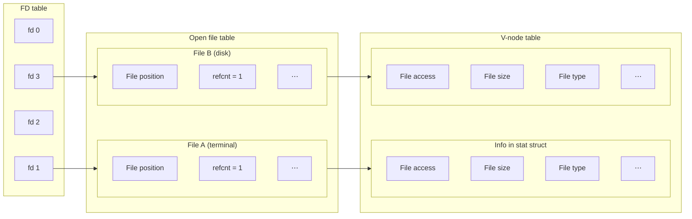
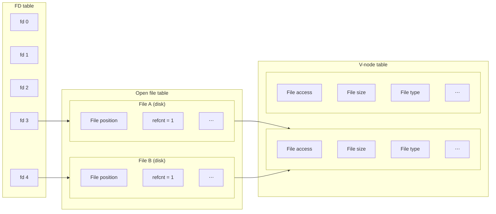
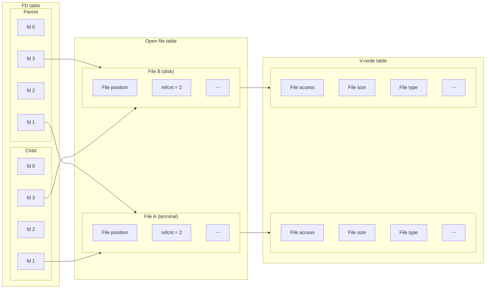
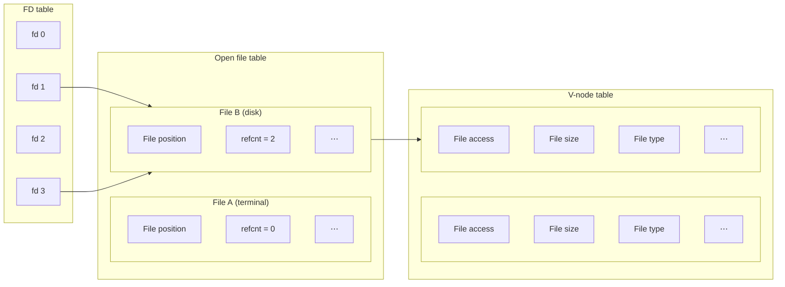

## Unix I/O

---

### Unix I/O Overview

Unix에서 모든 종류의 **파일(File)**은 바이트의 시퀀스일 뿐이다. 입출력 장치와 소켓 또한 파일로 표현되기에, **동일한 저수준 인터페이스(Unix I/O)**를 사용한다.

- 열기/닫기: `open()`, `close()`
- 읽기/쓰기: `read()`, `write()`

터미널, 소켓 등을 제외한 대부분의 파일은 현재까지 읽은 바이트 수를 나타내는 **파일 위치(File position)**라는 속성을 가진다.

### File Types

| Type                         | Description                                                             |
| :--------------------------- | :---------------------------------------------------------------------- |
| **일반 파일 (Regular file)** | 임의의 데이터를 담고 있는 파일                                          |
| **디렉터리 (Directory)**     | 다른 파일의 위치 및 속성을 설명하는 특수 파일                           |
| **소켓 (Socket)**            | 프로세스 간 통신(Inter-Process Communication, IPC)에 사용되는 특수 파일 |

이 외에도 **명명된 파이프(Named pipe), 심볼링 링크(Symbolic link), 장치 파일(Device file)**과 같은 다양한 특수 파일들이 존재한다.

### Regular Files

커널과 달리, 응용 프로그램 수준에서는 일반 파일을 텍스트 파일과 바이너리 파일로 구분하기도 한다.

| Type                            | Description                                                    |
| :------------------------------ | :------------------------------------------------------------- |
| **텍스트 파일 (Text file)**     | ASCII 또는 유니코드(Unicode) 문자만으로 이루어진 파일          |
| **바이너리 파일 (Binary file)** | 인코딩된 데이터(기계 코드, 이미지, 오디오 등)를 담고 있는 파일 |

텍스트 파일에서는 줄 바꿈 문자가 **EOL(End Of Line)**을 나타낸다.

- Linux, Mac OS: `\n` (Line Feed, **LF**)
- Windows, Internet protocols: `\r\n` (Carriage Return followed by Line Feed, **CRLF**)

### Directories

디렉터리는 파일로 저장되지만, 운영 체제의 파일 시스템에서 특별한 방식으로 해석된다.

- 모든 디렉터리에는 현재 디렉터리(`.`)와 상위 디렉터리(`..`)를 가리키는 특수 파일이 존재한다.
- 대부분의 파일 시스템은 계층 구조로 구성되며, **경로 이름(Pathname)**을 통해 파일을 식별한다.

### Opening Files

```c
int open(const char *pathname, int flags);
```

`pathname`에 해당하는 파일을 `flags` 모드로 연다. 열려 있는 파일을 식별하기 위한 **파일 디스크립터(File Descriptor, FD)** 값이 반환된다. 파일 디스크립터는 순차적으로 할당되며, 대부분의 시스템에서는 프로세스가 동시에 열 수 있는 파일의 수가 제한되어 있다.

```bash
$ limit
⋮
descriptors     1048576
⋮
```

모든 프로세스에는 3가지의 특별한 파일 디스크립터가 연결되어 있다.

| FD  | Name                        | `<unistd.h>` symbolic constant | `<stdio.h>` file stream |
| :-: | :-------------------------- | :----------------------------- | :---------------------- |
|  0  | 표준 입력 (Standard input)  | STDIN_FILENO                   | stdin                   |
|  1  | 표준 출력 (Standard output) | STDOUT_FILENO                  | stdout                  |
|  2  | 표준 오류 (Standard error)  | STDERR_FILENO                  | stderr                  |

대부분의 시스템 콜은 **반환값을 통해 오류 발생 여부를 확인**할 수 있다. 반환값의 형식은 다양하므로, 각 함수의 레퍼런스를 참고하자.

```c
int fd;
if ((fd = open("/etc/hosts", O_RDONLY)) < 0) {
    perror("open()");
    exit(1);
}
```

### Closing Files

```c
int close(int fd);
```

`fd`가 가리키는 파일을 닫는다. `close()`에도 반환값이 존재하는데, 멀티스레드(multi-thread) 프로그램에서 자료 구조와 메모리를 공유할 때 이미 닫힌 파일을 닫으려고 하면 오류가 발생할 수 있기 때문이다.

### Reading Files

```c
ssize_t read(int fd, void *buf, size_t count);
```

`fd`가 가리키는 파일로부터 `count` 바이트를 읽어 `buf`가 가리키는 버퍼에 저장한다. 반환값이 0이면 **파일의 끝(End Of File, EOF)**에 도달했거나 네트워크 연결이 닫혔음을 의미하고, 양수이면 읽은 바이트 수를, 음수이면 오류가 발생했음을 나타낸다.

- 표준 입력의 경우, 사용자가 문자열을 입력하고 Enter 키를 누르면 입력된 문자열을 프로그램으로 읽어 들인다.
- 네트워크 연결의 경우, 데이터가 도착할 때까지 기다렸다가 전송된 바이트 수만큼 읽는다.

읽은 바이트 수는 1부터 버퍼 크기까지 가변적이며, `count`보다 작은 경우를 **Short counts**라 한다.

### Writing Files

```c
ssize_t write(int fd, const void *buf, size_t count);
```

`fd`가 가리키는 파일에 `buf`가 가리키는 버퍼의 `count` 바이트를 쓴다. 반환값이 양수이면 쓴 바이트 수를, 음수이면 오류가 발생했음을 나타낸다. `read()`와 마찬가지로, short counts가 발생할 수 있다.

### Simple Unix I/O Example

```c
int main() {
    char c;
    while (Read(STDIN_FILENO, &c, 1) != 0)
        Write(STDOUT_FILENO, &c, 1);
    return 0;
}
```

위 코드는 1바이트 단위로 읽고 쓰고 있는데, 이는 매우 비효율적인 코드이다. 시스템 콜은 커널에서 해당 동작을 처리한 뒤 다시 프로그램으로 돌아와야 하므로 높은 비용이 소요되기 때문이다.

`strace`를 통해 프로그램이 호출하는 모든 시스템 콜을 추적할 수 있다.

```bash
$ strace -e trace=read,write ./a.out
read(3, "\177ELF\2\1\1\3\0\0\0\0\0\0\0\0\3\0>\0\1\0\0\0P\237\2\0\0\0\0\0"..., 832) = 832
read(0, echo
"e", 1)                         = 1
write(1, "e", 1e)                        = 1
read(0, "c", 1)                         = 1
write(1, "c", 1c)                        = 1
read(0, "h", 1)                         = 1
write(1, "h", 1h)                        = 1
read(0, "o", 1)                         = 1
write(1, "o", 1o)                        = 1
read(0, "\n", 1)                        = 1
write(1, "\n", 1
)                       = 1
read(0, "", 1)                          = 0
+++ exited with 0 +++
```

### Short Counts

Short counts는 다음과 같은 이유로 발생할 수 있다.

- 파일에서 읽다가 EOF에 도달한 경우, 더 이상 읽을 바이트가 없다.
- 터미널에서 텍스트 줄을 읽는 경우, 터미널 핸들러가 데이터를 한 줄씩 전송한다.
- 네트워크 소켓에서 읽거나 쓰는 경우, 데이터가 작은 덩어리(chunk) 단위로 전송된다.

따라서 이러한 저수준 I/O를 사용할 때는 **항상 short counts의 가능성을 고려**해야 한다.

<br>

## Robust I/O

---

**RIO(Robust I/O)**는 2가지 수준의 파일 입출력 인터페이스를 제공한다.

### Unbuffered RIO

```c
ssize_t rio_readn(int fd, void *usrbuf, size_t n);
ssize_t rio_writen(int fd, void *usrbuf, size_t n);
```

> 내부 구현은 여기[^csapp-c] 참고
{: .prompt-info }

Short counts 문제를 해결하기 위해, `n` 바이트만큼 읽거나 쓸 때까지 반환하지 않는다. (읽다가 EOF에 도달하는 경우 제외) 이로 인해 네트워크 소켓에서 읽을 때 기대한 만큼의 바이트가 없으면, 바이트를 기다리며 멈추는 문제가 발생한다.

### Buffered RIO

위의 문제를 해결하기 위해, 읽기 작업 시 **버퍼링(Buffering)**을 수행한다.

1. 프로그램이 바이트를 읽으려고 할 때, 먼저 버퍼에 아직 읽히지 않은 데이터가 있는지 확인한다.
2. 있다면 해당 데이터를 반환하고, 없다면 버퍼를 채운다.

매번 운영 체제에 작은 크기의 데이터를 요청하는 대신, **한 번에 최대한 많은 데이터를 요청하여 버퍼에 저장**해 놓고 프로그램이 필요할 때마다 버퍼로부터 읽어 들이는 방식이다.

```c
typedef struct {
    int rio_fd;                 /* Descriptor for this internal buf */
    int rio_cnt;                /* Unread bytes in internal buf */
    char *rio_bufptr;           /* Next unread byte in internal buf */
    char rio_buf[RIO_BUFSIZE];  /* Internal buffer */
} rio_t;

ssize_t rio_readlineb(rio_t *rp, void *usrbuf, size_t maxlen);  /* Reads a text line */
ssize_t rio_readnb(rio_t *rp, void *usrbuf, size_t n);          /* Reads up to n bytes */
```

### RIO Example

```c
#define MAXLINE 8192

int main(int argc, char *argv[]) {
    int n;
    rio_t rio;
    char buf[MAXLINE];
    Rio_readinitb(&rio, STDIN_FILENO);
    while ((n = Rio_readlineb(&rio, buf, MAXLINE)) != 0)
        Rio_writen(STDOUT_FILENO, buf, n);
    return 0;
}
```

```bash
$ strace -e trace=read,write ./a.out
read(3, "\177ELF\2\1\1\3\0\0\0\0\0\0\0\0\3\0>\0\1\0\0\0P\237\2\0\0\0\0\0"..., 832) = 832
read(0, echo
"echo\n", 8192)                 = 5
write(1, "echo\n", 5echo
)                   = 5
read(0, "", 8192)                       = 0
+++ exited with 0 +++
```

표준 입력에 대한 `read()`, `write()`가 한 번씩만 호출되는 것을 볼 수 있다.

<br>

## Standard I/O

---

**표준 입출력(Standard I/O)**은 C 표준의 일부로서, RIO와 마찬가지로 버퍼링을 수행하여 저수준 작업을 최소화한다.

### Buffering in Standard I/O

`printf()`는 다음과 같은 경우에 버퍼를 **플러시(Flush)**한다.

- 줄 바꿈 문자를 만났을 때
- `fflush()` 호출 시
- 프로그램 종료 시

```c
int main() {
    printf("h");
    printf("e");
    printf("l");
    printf("l");
    printf("o");
    printf("\n");
    return 0;
}
```

```bash
$ strace -e trace=write ./a.out
write(1, "hello\n", 6hello
)                  = 6
+++ exited with 0 +++
```

### Unix I/O vs Standard I/O vs RIO

- **Standard I/O**: 일반 파일에 적합하며, 소켓에는 적합하지 않다.[^standard-io-sockets]
- **Unix I/O**: 비동기 시그널 안전성[^async-signal-safety]을 만족해야 할 때나, 저수준 작업에 적합하다.
- **Robust I/O**: 소켓 통신에 적합하다.

### Aside: Working with Binary Files

텍스트 파일은 줄 바꿈 문자와 null 문자를 특수하게 취급하지만, 바이너리 파일에서는 그냥 평범한 바이트일 뿐이다. 따라서 바이너리 파일을 다룰 때, 다음과 같은 함수들은 사용하면 안 된다.

- **텍스트 지향(Text-oriented) 입출력 함수**: `fgets()`, `scanf()`, `rio_readlineb()` 등
- **문자열 함수**: `strlen()`, `strcpy()`, `strcat()` 등

<br>

## Metadata, Sharing, and Redirection

---

### File Metadata

**파일 메타데이터(File metadata)**는 파일에 대한 각종 정보를 담고 있는 데이터이며, `stat` 구조체에 저장된다.

```c
struct stat {
    dev_t     st_dev;      /* ID of device containing file */
    ino_t     st_ino;      /* Inode number */
    mode_t    st_mode;     /* File type and mode */
    nlink_t   st_nlink;    /* Number of hard links */
    uid_t     st_uid;      /* User ID of owner */
    gid_t     st_gid;      /* Group ID of owner */
    dev_t     st_rdev;     /* Device ID (if special file) */
    off_t     st_size;     /* Total size, in bytes */
    blksize_t st_blksize;  /* Block size for filesystem I/O */
    blkcnt_t  st_blocks;   /* Number of 512B blocks allocated */

    /* Since Linux 2.6, the kernel supports nanosecond
      precision for the following timestamp fields. */

    struct timespec st_atim;  /* Time of last access */
    struct timespec st_mtim;  /* Time of last modification */
    struct timespec st_ctim;  /* Time of last status change */

#define st_atime st_atim.tv_sec  /* Backward compatibility */
#define st_mtime st_mtim.tv_sec
#define st_ctime st_ctim.tv_sec
};
```

> 자세한 내용은 `man 2 stat` 참고
{: .prompt-info }

### Example of Accessing File Metadata

```c
int stat(const char *pathname, struct stat *statbuf);
```

`pathname`에 해당하는 파일의 정보를 `statbuf`가 가리키는 `stat` 구조체에 채운다. 매크로를 이용하여 메타데이터의 속성을 확인할 수 있다.

```c
int main(int argc, char *argv[]) {
    struct stat stat;
    char *type, *read_ok;

    if (argc != 2) {
        fprintf(stderr, "Usage: %s <filename>\n", argv[0]);
        return 2;
    }
    Stat(argv[1], &stat);
    if (S_ISREG(stat.st_mode))  /* Determine file type */
        type = "regular";
    else if (S_ISDIR(stat.st_mode))
        type = "directory";
    else
        type = "other";
    if (stat.st_mode & S_IRUSR)  /* Check read access */
        read_ok = "yes";
    else
        read_ok = "no";
    printf("type: %s, read: %s\n", type, read_ok);
    return 0;
}
```

```bash
$ ./a.out main.c
type: regular, read: yes
$ chmod 000 main.c
$ ./a.out main.c
type: regular, read: no
$ ./a.out ..
type: directory, read: yes
```

### How the Unix Kernel Represents Open Files



- 각 프로세스는 **파일 디스크립터 테이블(File descriptor table)**을 가지고 있으며, 여기에는 해당 프로세스가 연 파일들에 대한 파일 디스크립터가 저장된다.
- 운영 체제는 열려 있는 파일들을 관리하기 위해, 모든 프로세스 간 공유되는 **Open file table**을 유지한다.
  - 각 항목에는 해당 파일의 읽기/쓰기 위치, 참조 카운트(`refcnt`) 등의 정보가 저장된다.
  - 참조 카운트를 통해 여러 프로세스가 동일한 파일을 공유하는 상황을 추적할 수 있으며, 참조 카운트가 0이 되면 더 이상 그 파일을 사용하는 프로세스가 없다는 뜻이므로 항목을 제거할 수 있다.
  - 파일 디스크립터는 open file table의 항목을 가리키는 포인터 역할을 한다.
- 시스템의 모든 파일(열려 있든 닫혀 있든)에 대해, 각 파일의 메타데이터가 저장되어 있는 **가상 노드(V-node)**가 존재한다.

### File Sharing

프로그램에서 하나의 파일에 대해 `open()`을 2번 호출하면, 운영 체제는 별도의 파일 디스크립터를 2개 반환한다. 이들은 동일한 파일을 가리키지만, 파일 위치는 독립적으로 관리된다.



> 같은 파일을 가리키는 여러 개의 파일 디스크립터를 열어 두고 동시에 쓰기 작업을 수행하면, 파일 내용이 손상되거나 예측할 수 없는 결과가 발생할 수 있으므로 주의가 필요하다.
{: .prompt-warning }

### How Processes Share Files: fork()

`fork()`를 통해 생성된 자식 프로세스는 부모 프로세스의 파일 디스크립터 테이블을 상속받는다. 이들은 open file table의 동일한 항목을 가리키므로, 파일 위치 또한 공유하게 된다.



### I/O Redirection

```c
int dup2(int oldfd, int newfd);
```

`dup2()`는 파일 디스크립터를 복제하는 시스템 콜이며, 주로 **입출력 리다이렉션(I/O redirection)**에 사용된다. 셸에서 표준 입력 대신 파일에서 읽기 위해 `<` 기호를, 표준 출력 대신 파일에 쓰기 위해 `>` 기호를 사용하면, 셸은 `dup2()`를 호출하여 입출력 리다이렉션을 수행한다.

`dup2(3, 1)`을 호출하여 출력을 리다이렉션한 경우에 대해 살펴보자.

|    Before     |     After     |
| :-----------: | :-----------: |
| fd 1 → File A | fd 1 → File B |
| fd 3 → File B | fd 3 → File B |



`dup2()` 호출 시 `newfd`가 열려 있는 파일 디스크립터였다면, 기존의 `newfd`를 먼저 닫은 뒤 `oldfd`를 복제한다. 따라서 별도로 `close()`를 호출하지 않아도 File A의 참조 카운트가 0이 되고, 파일 디스크립터가 복제된 File B의 참조 카운트는 2가 된다.

<br>

## References

---

- [Carnegie Mellon University. (2015). Lecture 16: System Level I/O. [Online].](https://scs.hosted.panopto.com/Panopto/Pages/Viewer.aspx?id=f107c2ce-79d5-4529-baeb-2bb495d8c11a)

### Footnote

[^csapp-c]: [R. E. Bryant and D. R. O'Hallaron. "csapp.c." CS:APP3e. [Online].](https://csapp.cs.cmu.edu/3e/ics3/code/src/csapp.c)
[^standard-io-sockets]: ["Why can't use C standard I/O with sockets." Stack Overflow. [Online].](https://stackoverflow.com/questions/12029708/why-cant-use-c-standard-i-o-with-sockets)
[^async-signal-safety]: ["Lecture 15: Exceptional Control Flow: Signals." {{ site.title }}. [Online].]({{ site.url }}/posts/ics-lecture-15/#async-signal-safety)
