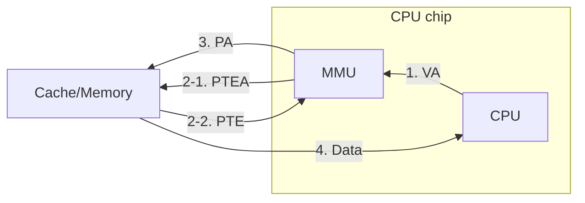
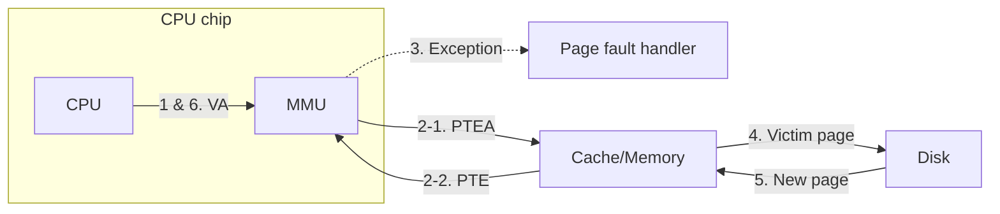
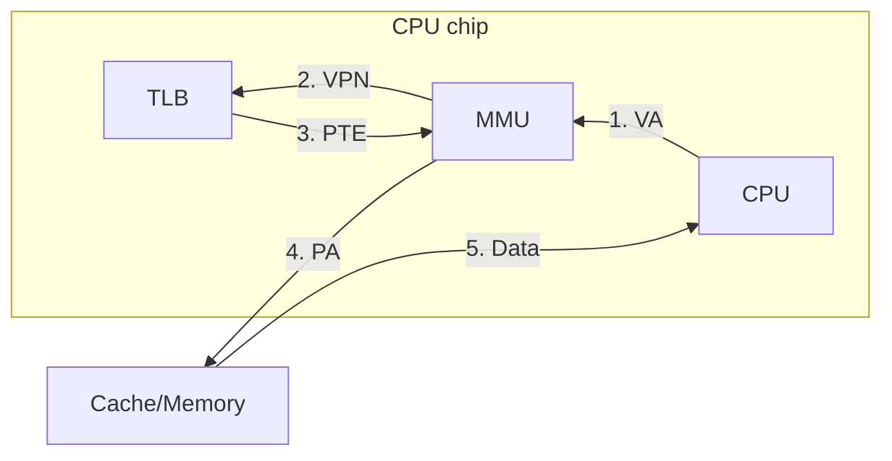

## Virtual Memory for Caching

---

**가상 메모리(Virtual memory)**는 디스크에 저장된 바이트의 시퀀스로, 주소 공간을 **페이지(Page)** 단위로 관리한다.

### DRAM Cache Organization

가상 페이지는 물리 메모리(DRAM)에 캐시되며, 캐시 미스가 발생하면 디스크에서 데이터를 가져오기 때문에 miss penalty가 매우 크다.

- Miss rate를 낮추기 위해, 캐시 블록(64 B)에 비해 페이지 크기(4 KB)가 훨씬 크다.
- Conflict miss를 배제하기 위해, 세트가 1개인 **Fully associative cache**를 사용한다.
- 페이지 교체 시, LRU(Least Recently Used)보다 훨씬 정교한 알고리즘을 사용한다.
- Write-back 정책을 적용하여, 디스크에 쓰는 것을 최대한 미룬다.

### Page Table

**PTE(Page Table Entry)** k는 가상 페이지 k가 매핑되어 있는 물리 페이지의 위치를 나타낸다.

- 요청된 가상 페이지가 물리 메모리에 캐시되어 있는 경우를 **페이지 적중(Page hit)**, 캐시되어 있지 않은 경우를 **페이지 폴트(Page fault)**라 한다.
- 페이지 폴트가 발생한 경우, 커널의 페이지 폴트 핸들러가 호출되어 필요한 가상 페이지를 디스크에서 물리 메모리로 가져오고 PTE를 업데이트한다.

> 페이지를 캐시되지 않은 상태로 유지하다가, 필요할 때 메모리에 로드하는 방식을 **Demand paging**이라 한다.
{: .prompt-info }

 

## Virtual Memory for Memory Management

---

커널이 제공하는 프로세스별 페이지 테이블을 통해, **각 프로세스는 자신만의 가상 주소 공간을 가진다.**

- 각각의 가상 페이지는 물리 주소 공간의 어디에나 매핑될 수 있다.
- 여러 개의 가상 페이지가 하나의 물리 페이지에 매핑될 수 있다. (공유 라이브러리)

### Simplifying Linking and Loading

가상 메모리 시스템을 통해, 링커는 모든 프로그램이 항상 동일한 위치에 로드될 것이라고 가정한다.

1. 실행 파일의 코드 및 데이터 섹션의 크기를 식별하여, 고정 주소에서 시작하는 가상 메모리를 할당한다.
2. 유효 비트가 0인 PTE를 생성한다.
3. 페이지 폴트가 발생하면, 커널이 해당 페이지를 물리 메모리에 복사한다.

Demand paging을 통해 접근하는 데이터만 로드되므로, 메모리를 효율적으로 사용할 수 있다.

 

## Virtual Memory for Memory Protection

---

- x86-64는 64비트 주소를 사용하지만, 실제로 사용 가능한 가상 주소 공간은 48비트로 제한되어 있다. 상위 16비트가 모두 1인 주소는 커널용으로, 모두 0인 주소는 사용자용으로 예약되어 있다.
- PTE에는 해당 가상 페이지의 접근 권한(슈퍼바이저 모드) 및 읽기/쓰기/실행 권한을 제어하는 비트가 존재한다.

**MMU(Memory Management Unit)**는 이러한 비트를 확인함으로써, **가상 주소 공간을 무단 접근으로부터 보호**한다.

 

## Address Translation

---

가상 주소 공간 $V$에서 물리 주소 공간 $P$로 매핑하는 함수 $f$가 존재한다. $a \in V$에 대하여, 함수 $f$는 다음과 같이 **주소 변환(Address translation)**을 수행한다.

$$
f(a) =
\begin{cases}
a' \in P, & \text{if } v = 1 \\
\varnothing, & \text{if } v = 0
\end{cases}
$$

### Address Translation Symbols

|  Symbol  | Description          |
| :------: | :------------------- |
|  **PA**  | Physical Address     |
| **PPN**  | Physical Page Number |
| **PPO**  | Physical Page Offset |
| **PTEA** | PTE Address          |
|  **VA**  | Virtual Address      |
| **VPN**  | Virtual Page Number  |
| **VPO**  | Virtual Page Offset  |

### Address Translation with a Page Table

.png){: w="600" }
_Address translation[^address-translation]_

- **PTBR(Page Table Base Register)**은 현재 프로세스의 페이지 테이블 시작 주소를 가리킨다.
- $\mathrm{PTEA = PTBR + VPN \times PTE \ size}$
- 물리 페이지의 번호(PPN)는 PTE에서 가져오며, 오프셋(PPO)의 값은 VPO와 동일하다.

### Address Translation: Page Hit

1. CPU가 MMU에 가상 주소(VA)를 전달한다.
2. MMU는 페이지 테이블에서 해당하는 PTE를 가져온다. (메모리 참조)
3. PTE의 유효 비트가 1이므로, 물리 주소(PA)를 생성하여 전달한다.
4. 캐시에서 CPU로 데이터가 반환된다.

> 편의상 캐시와 메모리를 통합하여 나타냈으나, 실제로는 캐시에 먼저 주소가 전달되어 적중이 발생하면 캐시에서 해당하는 데이터를 반환하고, 미스가 발생하면 메모리에서 가져온다.
{: .prompt-info }

### Address Translation: Page Fault

1. CPU가 MMU에 가상 주소(VA)를 전달한다.
2. MMU는 페이지 테이블에서 해당하는 PTE를 가져온다.
3. PTE의 유효 비트가 0이므로, 페이지 폴트가 발생한다.
4. 핸들러는 교체할 페이지를 식별하여 디스크로 내보낸다.
5. 새로운 페이지를 디스크에서 가져온 뒤, PTE를 업데이트한다.
6. 원래 프로세스로 제어가 반환되어, 폴트가 발생한 명령어를 다시 실행한다.

### Speeding Up Translation with a TLB

**TLB(Translation Look-aside Buffer)**는 MMU 내에 존재하는 set associative cache로서, 최근에 사용된 PTE를 저장함으로써 주소 변환 속도를 향상시킨다.

1. CPU가 MMU에 가상 주소(VA)를 전달한다.
2. MMU는 메모리에 접근하는 대신, 먼저 TLB에 해당 PTE가 존재하는지 확인한다.
3. TLB 적중이 발생하면, 해당 PTE를 MMU에 전달한다.
   - TLB 미스가 발생하면, MMU는 메모리에서 해당 PTE를 가져와 TLB에 저장한다.
4. 전달받은 PTE로 물리 주소(PA)를 생성하여 전달한다.
5. 캐시에서 CPU로 데이터가 반환된다.

### Multi-Level Page Tables

48비트의 유효 주소 공간을 사용하는 x86-64 시스템에서 페이지의 크기가 4 KB, PTE의 크기가 8바이트라면, 페이지 테이블을 위해 $\mathrm{2^{48} \times 2^{-12} \times 2^3 = 2^{39} \ B = 512 \ GB}$의 메모리가 필요하다. 이는 사실상 실현 불가능하므로, 사용되지 않는 가상 주소 공간에 대해 불필요한 PTE를 생성하지 않도록 **계층적인 페이지 테이블 구조**를 사용한다.

[예시](https://www.cs.cmu.edu/afs/cs/academic/class/15213-s18/www/lectures/17-vm-concepts.pdf#page=45)[^multi-level-page-table]에서는 프로그램의 코드 및 데이터 섹션을 위해 2,048개의 페이지, 스택 포인터를 위해 1개의 페이지가 할당되었다. 이러한 프로세스 레이아웃을 고려하면, 2단계 페이지 테이블은 3개로 충분하다. 따라서 1단계 테이블을 포함하여 총 4개의 페이지 테이블로 전체 가상 주소 공간을 커버할 수 있다.

[k단계 페이지 테이블](https://www.cs.cmu.edu/afs/cs/academic/class/15213-s18/www/lectures/17-vm-concepts.pdf#page=46)[^multi-level-page-table]에서는 가상 주소의 VPN 부분이 k개의 서브 VPN으로 나뉜다. 이전 단계의 PTE가 다음 단계 페이지 테이블의 시작 주소를 가리키고, 마지막 k단계 PTE는 접근하고자 하는 물리 페이지의 번호(PPN)를 담고 있다.

> 여러 단계의 PTE를 TLB에 저장해야 하므로, 단계가 너무 많아지면 TLB miss rate가 증가할 수 있다.
{: .prompt-warning }

 

## References

---

- [Carnegie Mellon University. (2015). Lecture 17: Virtual Memory: Concepts. [Online].](https://scs.hosted.panopto.com/Panopto/Pages/Viewer.aspx?id=80cd47f9-2eba-4e7b-bbab-a2867f87b7fa)
- ["Lecture 12: Cache Memories." {{ site.title }}. [Online].]({{ site.url }}/posts/ics-lecture-12/)

### Footnote

[^address-translation]: ["Address translation (32-bit)." Wikimedia Commons. [Online].](<https://commons.wikimedia.org/wiki/File:Address_translation_(32-bit).png>)
[^multi-level-page-table]: [F. Franchetti, S. C. Goldstein and B. Railing. (2018). Virtual Memory: Concepts. [Online].](https://www.cs.cmu.edu/afs/cs/academic/class/15213-s18/www/lectures/17-vm-concepts.pdf)
