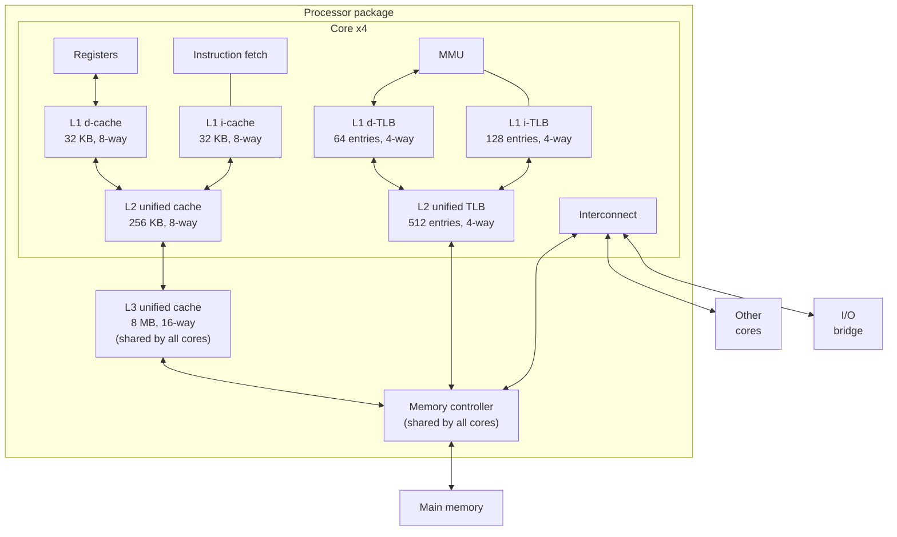
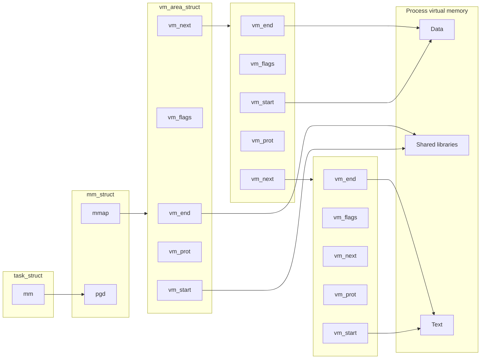

## Simple Memory System Example

---

다음과 같은 메모리 시스템이 존재한다고 가정하자.

- 가상 주소 14비트 = VPN 8비트 + VPO 6비트
- 물리 주소 12비트 = PPN 6비트 + PPO 6비트
- 페이지 크기 64바이트

이때 가상 주소 `0x03D4`와 `0x0020`에 대하여 주소 변환을 수행해 보자.

|    VA    |   Bit vector    |             VPN |  VPO   |
| :------: | :-------------: | --------------: | :----: |
| `0x03D4` | 00001111 010100 | `0b1111 = 0x0F` | 010100 |
| `0x0020` | 00000000 100000 |          `0x00` | 100000 |

### Simple Memory System TLB

- 4-way set associative cache ($E = 4$)
- 세트 4개 ($S = 4, \ s = 2$)

|  Set  | Tag | PPN |  v  |  ∣  |  Tag   |  PPN   |   v   |  ∣  |  Tag   | PPN |   v   |  ∣  | Tag | PPN |  v  |
| :---: | :-: | :-: | :-: | :-: | :----: | :----: | :---: | :-: | :----: | :-: | :---: | :-: | :-: | :-: | :-: |
| **0** | 03  |  -  |  0  |  ∣  |   09   |   0D   |   1   |  ∣  | **00** |  -  | **0** |  ∣  | 07  | 02  |  1  |
| **1** | 03  | 2D  |  1  |  ∣  |   02   |   -    |   0   |  ∣  |   04   |  -  |   0   |  ∣  | 0A  |  -  |  0  |
| **2** | 02  |  -  |  0  |  ∣  |   08   |   -    |   0   |  ∣  |   06   |  -  |   0   |  ∣  | 03  |  -  |  0  |
| **3** | 07  |  -  |  0  |  ∣  | **03** | **0D** | **1** |  ∣  |   0A   | 34  |   1   |  ∣  | 02  |  -  |  0  |

- VPN 8비트 = 태그 6비트 + 세트 인덱스 2비트

|    VA    |    VPN    |           Tag |    Set index |       PPN       |      PA       |
| :------: | :-------: | ------------: | -----------: | :-------------: | :-----------: |
| `0x03D4` | 000011 11 | `0b11 = 0x03` | `0b11 = 0x3` | `0x0D = 0b1101` | 001101 010100 |
| `0x0020` | 000000 00 |        `0x00` |        `0x0` |   _TLB 미스_    |               |

### Simple Memory System Page Table

|  VPN   |  PPN   |   v   |  ∣  |  VPN   | PPN |  v  |  ∣  |  VPN   | PPN |  v  |  ∣  |  VPN   | PPN |  v  |
| :----: | :----: | :---: | :-: | :----: | :-: | :-: | :-: | :----: | :-: | :-: | :-: | :----: | :-: | :-: |
| **00** | **28** | **1** |  ∣  | **04** |  -  |  0  |  ∣  | **08** | 13  |  1  |  ∣  | **0C** |  -  |  0  |
| **01** |   -    |   0   |  ∣  | **05** | 16  |  1  |  ∣  | **09** | 17  |  1  |  ∣  | **0D** | 2D  |  1  |
| **02** |   33   |   1   |  ∣  | **06** |  -  |  0  |  ∣  | **0A** | 09  |  1  |  ∣  | **0E** | 11  |  1  |
| **03** |   02   |   1   |  ∣  | **07** |  -  |  0  |  ∣  | **0B** |  -  |  0  |  ∣  | **0F** | 0D  |  1  |

|    VA    |  VPN   |        PPN        |      PA       |
| :------: | :----: | :---------------: | :-----------: |
| `0x0020` | `0x00` | `0x28 = 0b101000` | 101000 100000 |

### Simple Memory System Cache

- Direct mapped cache ($E = 1$)
- 블록 크기 4바이트 ($B = 4, \ b = 2$)
- 세트 16개 ($S = 16, \ s = 4$)

|  Idx  |  Tag   |   v   |   B0   | B1  | B2  | B3  |  ∣  |  Idx  |  Tag   |  v  | B0  | B1  | B2  | B3  |
| :---: | :----: | :---: | :----: | :-: | :-: | :-: | :-: | :---: | :----: | :-: | :-: | :-: | :-: | :-: |
| **0** |   19   |   1   |   99   | 11  | 23  | 11  |  ∣  | **8** | **24** |  1  | 3A  | 00  | 51  | 89  |
| **1** |   15   |   0   |   -    |  -  |  -  |  -  |  ∣  | **9** |   2D   |  0  |  -  |  -  |  -  |  -  |
| **2** |   18   |   1   |   00   | 02  | 04  | 08  |  ∣  | **A** |   2D   |  1  | 93  | 15  | DA  | 3B  |
| **3** |   36   |   0   |   -    |  -  |  -  |  -  |  ∣  | **B** |   0B   |  0  |  -  |  -  |  -  |  -  |
| **4** |   32   |   1   |   43   | 6D  | 8F  | 09  |  ∣  | **C** |   12   |  0  |  -  |  -  |  -  |  -  |
| **5** | **0D** | **1** | **36** | 72  | F0  | 1D  |  ∣  | **D** |   16   |  1  | 04  | 96  | 34  | 15  |
| **6** |   31   |   0   |   -    |  -  |  -  |  -  |  ∣  | **E** |   13   |  1  | 83  | 77  | 1B  | D3  |
| **7** |   16   |   1   |   11   | C2  | DF  | 03  |  ∣  | **F** |   14   |  0  |  -  |  -  |  -  |  -  |

- 물리 주소 12비트 = 태그 6비트 + 세트 인덱스 4비트 + 블록 오프셋 2비트

|    VA    |       PA       |               Tag |      Set index | Block offset |  Data  |
| :------: | :------------: | ----------------: | -------------: | :----------: | :----: |
| `0x03D4` | 001101 0101 00 |   `0b1101 = 0x0D` |  `0b101 = 0x5` |      0       | `0x36` |
| `0x0020` | 101000 1000 00 | `0b101000 = 0x28` | `0b1000 = 0x8` | _캐시 미스_  |        |

<br>

## Case Study: Core i7/Linux Memory System

---

### Core i7 Memory System



프로세서 패키지(칩) 안에 4개의 코어가 존재하며, 각자 CPU를 가지고 있어 명령어를 독립적으로 실행할 수 있다.

- 각 코어에는 레지스터 파일, 명령어를 가져오는 하드웨어, L1 데이터 캐시(d-cache), L1 명령어 캐시(i-cache), L2 통합(데이터 & 명령어) 캐시가 존재한다.
- L3 통합 캐시는 모든 코어가 공유한다.

  | Cache level | Access time |
  | :---------: | ----------: |
  |     L1      |     4 cycle |
  |     L2      |    10 cycle |
  |     L3      | 30~50 cycle |

- MMU에는 L1 데이터 TLB(d-TLB), L1 명령어 TLB(i-TLB), L2 통합 TLB가 존재한다.
- 프로그램에 따라 필요한 데이터/명령어 페이지 수가 다양하므로, 용도가 구분되어 있는 L1 TLB만으로는 유연성이 부족하여 capacity miss가 발생할 수 있다. 따라서 통합 캐시인 L2 TLB를 두어 miss penalty를 줄이는 것이 효과적이다.
- 메모리 컨트롤러는 메모리에서 데이터를 가져오고, 다른 코어 및 I/O bridge와 연결되어 있다.

### Core i7 Address Translation

[다이어그램](https://www.cs.cmu.edu/afs/cs/academic/class/15213-s18/www/lectures/18-vm-systems.pdf#page=21)[^vm-systems]

1. CPU가 48비트 가상 주소를 생성한다. (VPN 36비트 + VPO 12비트)
2. L1 d-TLB에서 해당 VPN에 대응하는 PTE를 찾는다.
3. TLB 적중이 발생하면, MMU는 PPN과 PPO(=VPO)를 결합하여 물리 주소를 구성한다.
   - TLB 미스가 발생하면, 다단계 페이지 테이블 탐색을 통해 PTE를 찾는다.
4. MMU가 물리 주소를 L1 데이터 캐시에 전달한다.
5. 캐시 히트가 발생하면, CPU로 데이터를 반환한다.
   - 캐시 미스가 발생하면, 하위 계층의 메모리(L2/L3 캐시, 메인 메모리, 디스크)에서 데이터를 가져온다.

> 비트 벡터의 길이를 $w$라 할 때, 캐시 세트 인덱스(CI)와 블록 오프셋(CO)에 대하여 $w_\mathrm{PPO} = w_\mathrm{CI} + w_\mathrm{CO}$인 것을 볼 수 있다. 이는 인텔의 캐시 탐색 구현 방식 때문으로, L1 캐시의 크기가 매우 작은 근본적인 원인이다.
{: .prompt-info }

### Core i7 Page Table Entries

| Offset | 0   | 1                              |     |     |     |     |     |     |     |     |     |     |     |
| :----: | :-- | :----------------------------- | :-- | :-- | :-- | :-- | :-- | :-- | :-- | :-- | :-- | :-- | :-- |
|        | P=0 | Pagle (table) location on disk |     |     |     |     |     |     |     |     |     |     |     |

| Offset | 0   | 1   | 2   | 3   | 4   | 5   | 6   | 7   | 8   | 9      | 12                                 | 52     | 63  |
| :----: | :-- | :-- | :-- | :-- | :-- | :-- | :-- | :-- | :-- | :----- | :--------------------------------- | :----- | :-- |
|        | P=1 | R/W | U/S | WT  | CD  | A   | D   | PS  | G   | Unused | Page (table) physical base address | Unused | XD  |

|  Name   | Description                                                       |
| :-----: | :---------------------------------------------------------------- |
|  **P**  | 페이지가 물리 메모리에 존재하는지를 나타내는 유효 비트            |
| **R/W** | 읽기/쓰기 권한                                                    |
| **U/S** | 접근 권한 (유저/슈퍼바이저 모드)                                  |
| **WT**  | 캐시 쓰기 정책 (Write-thorugh 또는 Write-back)                    |
|  **A**  | MMU가 페이지를 읽고 쓸 때 설정되는 레퍼런스 비트                  |
| **PS**  | 페이지 크기 (1단계 PTE에만 존재)                                  |
|  **D**  | Write-back 정책에서 사용되는 더티 비트 (마지막 단계 PTE에만 존재) |
| **XD**  | 코드 실행 권한                                                    |

### Trick for Speeding Up L1 Access

[다이어그램](https://www.cs.cmu.edu/afs/cs/academic/class/15213-s18/www/lectures/18-vm-systems.pdf#page=25)[^vm-systems]

인텔은 VPO와 PPO가 동일하다는 사실을 이용하여, **MMU의 주소 변환과 L1 캐시 조회를 병렬적으로 수행**함으로써 L1 캐시 접근 속도를 향상시켰다. MMU가 주소 변환을 수행하는 동안, L1 캐시는 VPO에서 세트 인덱스를 확인하여 해당 세트의 모든 라인을 조회하는 등 태그 검사에 필요한 준비 작업을 수행한다.

### Virtual Address Space of a Linux Process

가상 메모리 시스템 덕분에 모든 프로세스는 매우 유사한 가상 주소 공간 레이아웃을 가진다.

|                  Segment                  | Description                                  |
| :---------------------------------------: | :------------------------------------------- |
|       Process-specific data structs       | 프로세스 콘텍스트                            |
|              Physical memory              | 물리 메모리(DRAM)와 1:1로 매핑되어 있는 영역 |
|           Kernel code and data            |                                              |
|                     ⋮                     | ↑ 커널 가상 메모리                           |
|                User stack                 | ↓ 프로세스 가상 메모리                       |
|                     ↓                     | ← `%rsp` (스택 상단 추적)                    |
|                     ⋮                     |                                              |
| Memory-mapped region for shared libraries |                                              |
|                     ⋮                     |                                              |
|                     ↑                     | ← `brk` (힙 상단 추적)                       |
|         Runtime heap (`malloc()`)         |                                              |
|        Uninitialized data (`.bss`)        |                                              |
|        Initialized data (`.data`)         |                                              |
|          Program text (`.text`)           | 고정 주소(`0x400000`)에서 시작               |
|                     ⋮                     |                                              |

### Linux Organizes VM as Collection of "Areas"



| Name                 | Description                        |
| :------------------- | :--------------------------------- |
| `pgd`                | 1단계 테이블의 주소                |
| `vm_start`, `vm_end` | 영역의 시작과 끝                   |
| `vm_prot`            | 보호 속성 (읽기/쓰기 권한)         |
| `vm_flags`           | 다른 프로세스와의 페이지 공유 여부 |

### Linux Page Fault Handling

페이지 폴트가 발생했을 때, 페이지 폴트 핸들러는 다음과 같은 상황을 처리한다.

|          Segment |            |
| ---------------: | :--------- |
| Shared libraries |            |
|                  | ← 1. read  |
|          `.data` | ← 3. read  |
|          `.text` | ← 2. write |

1. 존재하지 않는 페이지에 접근하는 경우, 커널은 세그먼테이션 오류(segmentation fault)를 발생시킨다. 커널은 `vm_area_struct` 리스트를 따라 내려가면서 해당 주소가 유효한 영역에 위치하지 않는다는 것을 파악한다.
2. 읽기 전용 페이지에 쓰기를 시도하는 경우, 커널은 보호 속성을 확인한 뒤 세그먼테이션 오류를 발생시킨다.
3. 유효한 영역에서 데이터를 읽으려는 경우, 커널은 요청된 페이지를 메모리에 로드하여 CPU에 데이터를 반환한다.

> 실제 시스템에서는 `vm_area_struct`의 리스트 대신 레드-블랙 트리와 같은 트리 구조를 사용한다.
{: .prompt-info }

<br>

## Memory Mapping

---

가상 메모리 영역은 디스크 객체와 매핑되어 초기화되는데, 이를 **메모리 매핑(Memory mapping)**이라 한다.

- 각 페이지는 **일반 파일(Regular file)** 또는 **익명 파일(Anonymous file)**과 매핑되며, 그 파일로부터 초깃값을 가져온다.
- 익명 파일과 매핑된 특정 페이지에 대하여 폴트가 처음 발생하면, **0으로 채워진 물리 페이지(Demand-zero page)**를 할당한다.

### Sharing Revisited

여러 프로세스의 가상 메모리 영역이 하나의 **공유 객체(Shared object)**에 매핑될 수 있다.

[예시](https://www.cs.cmu.edu/afs/cs/academic/class/15213-s18/www/lectures/18-vm-systems.pdf#page=35)[^vm-systems]와 같이 공유 객체가 **Private Copy-On-Write(COW)** 객체인 경우, 매핑된 영역의 페이지에 COW 플래그가 설정되며 PTE가 읽기 전용으로 설정된다. 따라서 해당 영역에 쓰기를 시도하면 보호 속성으로 인해 폴트가 발생하고, 폴트 핸들러가 해당 페이지를 복사하여 읽기/쓰기가 가능하도록 설정한다. 제어가 반환되면, 복사본에 쓰기 작업을 수행한다.

### fork() Revisited

Copy-on-write 기법을 통해 `fork()`와 `execve()` 시스템 콜을 효율적으로 처리할 수 있다.

1. `fork()`가 호출되면, 커널은 부모 프로세스의 내부 자료 구조(`mm_struct`, `vm_area_struct`, 페이지 테이블)를 복사한다.
2. 부모 및 자식 프로세스의 모든 페이지를 읽기 전용으로 설정하고, 각 `vm_area_struct`를 private copy-on-write로 설정한다.
3. 읽기 작업 시 동일한 물리 페이지를 공유하며, 쓰기 작업을 수행할 때만 새로운 페이지가 생성된다.

이처럼 **메모리 복사를 반드시 필요할 때만, 최대한 늦게 수행**함으로써 `fork()`의 오버헤드를 크게 줄여 준다.

### execve() Revisited

1. 기존의 `vm_area_struct` 및 페이지 테이블을 해제한다.
2. 새로운 `vm_area_struct` 및 페이지 테이블을 생성한다.

   |                  Segment                  | Description                    |
   | :---------------------------------------: | :----------------------------- |
   |                User stack                 | Private, demand-zero           |
   |                     ↓                     |                                |
   |                     ⋮                     |                                |
   |                     ↑                     |                                |
   | Memory-mapped region for shared libraries | Shared, file-backed (`.so`)    |
   |                     ⋮                     |                                |
   |                     ↑                     |                                |
   |         Runtime heap (`malloc()`)         | Private, demand-zero           |
   |        Uninitialized data (`.bss`)        | Private, demand-zero           |
   |        Initialized data (`.data`)         | Private, file-backed (`a.out`) |
   |          Program text (`.text`)           | Private, file-backed (`a.out`) |

   - 공유 라이브러리 영역에서 정적 변수, 상태 정보(난수 생성기) 등 프로세스마다 독립적인 값을 가지는 부분은 private으로 설정된다.

3. 프로그램 카운터를 `.text`의 진입점(entry point)으로 설정한다.
4. 페이지 폴트가 발생함에 따라 필요한 코드와 데이터만 로드된다. 즉, **페이지가 참조될 때까지 로딩이 지연**된다.

### User-Level Memory Mapping

```c
void *mmap(void *addr, size_t length, int prot, int flags, int fd, off_t offset);
```

`mmap()`은 파일을 가상 메모리 영역에 매핑하는 시스템 콜이다.

- `fd`가 가리키는 파일의 `offset`부터 `length`만큼을 지정한 가상 메모리 영역에 매핑하려고 시도한다.
- `prot`에 보호 속성을 지정할 수 있다.
- `flag`를 통해 익명 파일을 매핑하거나, private 여부를 지정할 수 있다.
- 매핑된 영역의 시작 위치를 가리키는 포인터를 반환한다. 지정한 영역이 이미 사용중이었다면 다른 가능한 영역을 선택하므로, 반환값이 `addr`과 다를 수 있다.

`mmap()` 또한 파일 내용을 메모리에 로드하지 않고, **매핑만 수행**한다.

### Example: Using mmap() to Copy Files

파일을 복사할 때, `read()` 대신 `mmap()`을 사용할 수 있다.

```c
void mmapcopy(int fd, int size) {
    char *bufp = Mmap(NULL, size, PROT_READ, MAP_PRIVATE, fd, 0);
    Write(STDOUT_FILENO, bufp, size);
}

int main(int argc, char *argv[]) {
    struct stat stat;
    int fd;
    if (argc != 2) {
        fprintf(stderr, "Usage: %s <filename>\n", argv[0]);
        return 2;
    }
    /* Copy input file to stdout */
    fd = Open(argv[1], O_RDONLY, 0);
    Fstat(fd, &stat);
    mmapcopy(fd, stat.st_size);
    return 0;
}
```

**`read()`**

- 버퍼 크기에 따라 읽기/쓰기 작업이 여러 번 필요할 수 있다.
- 읽기/쓰기 작업이 사용자 수준에서 이루어지므로, 시스템 콜 오버헤드가 발생한다.

**`mmap()`**

- 파일 전체를 가상 메모리에 한 번에 매핑한다.
- 읽기/쓰기 작업이 커널 수준에서 이루어지므로, 시스템 콜 오버헤드가 적다.
- 파일의 크기가 가용 메모리를 초과하면, 페이지 폴트가 많이 발생하여 성능이 저하될 수 있다.

<br>

## References

---

- [Carnegie Mellon University. (2015). Lecture 18: Virtual Memory: Systems. [Online].](https://scs.hosted.panopto.com/Panopto/Pages/Viewer.aspx?id=d3ac31f4-331d-469c-91bf-6ac6692f0159)
- ["Lecture 12: Cache Memories." {{ site.title }}. [Online].]({{ site.url }}/posts/ics-lecture-12/)
- ["Lecture 17: Virtual Memory: Concepts." {{ site.title }}. [Online].]({{ site.url }}/posts/ics-lecture-17/)

### Footnote

[^vm-systems]: [F. Franchetti, S. C. Goldstein and B. Railing. (2018). Virtual Memory: Systems. [Online].](https://www.cs.cmu.edu/afs/cs/academic/class/15213-s18/www/lectures/18-vm-systems.pdf)
