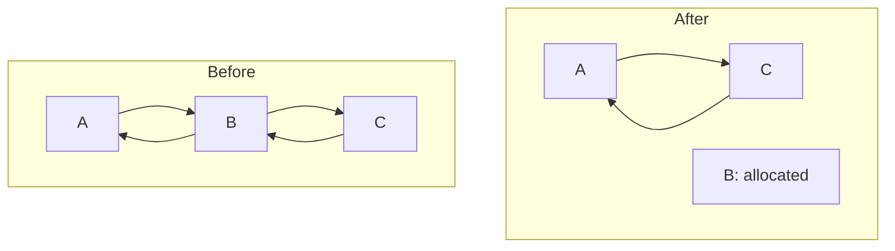

## Explicit Free Lists

---

**Explicit free list**는 free 블록 내부에 다음/이전 블록을 가리키는 포인터를 넣어, 명시적으로 양방향 연결 리스트를 구성하는 방식이다.

### Allocating from Explicit Free Lists



### Freeing with Explicit Free Lists

해제된 블록을 리스트의 어느 부분에 추가할 것인지 정해야 한다.

**LIFO policy**

- 리스트의 시작 부분에 추가한다.
- 구현이 간단하고 상수 시간이 소요되지만, 단편화가 심할 수 있다.

**Address-ordered policy**

- 주소 순서에 따라 리스트에 삽입한다.
- 삽입 위치를 찾기 위해 탐색이 필요하다.

### Freeing with a LIFO Policy

|                           |  Case 1   |  Case 2   |  Case 3   | Case 4 |
| ------------------------: | :-------: | :-------: | :-------: | :----: |
|                     **A** | Allocated | Allocated |   Free    |  Free  |
| Block being freed → **B** |           |           |           |        |
|                     **C** | Allocated |   Free    | Allocated |  Free  |

> [다이어그램](https://www.cs.cmu.edu/afs/cs/academic/class/15213-s18/www/lectures/20-malloc-advanced.pdf#page=11)[^malloc-advanced] 참고
{: .prompt-info }

- Case 3, 4에서 블록을 병합한 뒤, 해당 블록을 리스트의 시작 부분에 삽입하지 않고 원래 위치에 그대로 둘 수도 있다.

### Explicit List Summary

- 메모리 할당 시 free 블록만 탐색하므로, 모든 블록을 탐색하는 암시적 리스트에 비해 빠르다.
- 리스트 구성을 위한 추가 공간(오버헤드)이 필요하다.
- 할당/해제 시 리스트에(서) 블록을 삽입/제거해야 하므로, 구현이 조금 더 복잡하다.

<br>

## Segregated Free Lists

---

**Segregated free list(Seglist)**는 블록 크기에 따라 구분되는 여러 개의 명시적 리스트로 구성된다.

### Seglist Allocator

크기 $n$의 블록을 할당하기 위해, 크기 클래스가 $m$인 리스트에서 알맞은 블록을 찾는다. ($m > n$)

- 블록을 찾지 못한 경우, 다음으로 큰 크기 클래스에서 찾는다.
- 가장 큰 크기 클래스에서도 찾지 못한 경우, `sbrk()`를 사용하여 힙을 확장한다.

> `sbrk()`는 사용자 공간에서 커널로의 문맥 교환이 발생하는 시스템 콜이므로, 오버헤드가 크다. 따라서 큰 메모리를 할당하여 `sbrk()` 호출 횟수를 줄이는 것이 좋지만, 너무 크면 메모리 사용률이 떨어지므로 **시간-공간 트레이드오프**를 고려해야 한다.
{: .prompt-info }

해제 시, 인접한 free 블록과 병합한 뒤 알맞은 크기 클래스에 추가한다.

### Advantages of Seglist Allocators

- 여러 개의 리스트를 사용하는 만큼 각 리스트의 길이가 짧아지므로, 탐색 속도가 빠르다.
- 크기 클래스로 인해 자연스럽게 best fit에 가까워지므로, 메모리 사용률이 높다.

<br>

## Garbage Collection

---

시스템은 더 이상 참조될 수 없는 메모리 영역인 **가비지(Garbage)**를 식별하여, 자동으로 해당 블록을 해제한다.

```c
void foo() {
    int *p = malloc(128);
    return;  /* p block is now garbage */
}
```

### Memory as a Graph

메모리를 [유향 그래프](https://www.cs.cmu.edu/afs/cs/academic/class/15213-s18/www/lectures/20-malloc-advanced.pdf#page=27)[^malloc-advanced]로 나타낼 수 있다.

- **꼭짓점(Node)**은 메모리 블록, **변(Edge)**은 포인터를 의미한다.
- **루트(Root node)**는 힙 외부(스택, 레지스터 등)에서 힙의 메모리 위치를 가리키는 포인터가 저장된 위치에 해당한다.

루트에서 특정 블록으로 이어지는 **경로(Path)**가 존재하면, 해당 블록은 **도달할 수 있다(Reachable)**고 표현한다. 이때, **도달할 수 없는 블록**이 **가비지**에 해당한다.

### Mark and Sweep Collecting


_Simple animation of the mark and sweep collecting algorithm[^mark-and-sweep]_

각 루트에서 탐색을 시작하여, 도달할 수 있는 모든 블록에 **마크 비트(Mark bit)**를 설정한다. 그런 다음, 힙 전체를 탐색하면서 **할당되었지만 마킹되지 않은 블록(가비지)을 해제**한다.

### Mark and Sweep Pseudocode

```c
/* Mark using depth-first traversal of the memory graph */
void mark(ptr p) {
    if (!is_ptr(p)) return;
    if (is_mark_bit_set(p)) return;
    set_mark_bit(p);
    for (i = 0; i < length(p); i++)  // For each word in the block pointed by p
        mark(p[i]);                  // Make recursive call
}

/* Sweep using lengths to find next block */
void sweep(ptr p, ptr end) {
    while (p < end) {
        if (is_mark_bit_set(p))
            clear_mask_bit();
        else if (is_allocate_bit_set(p))
            free(p);
        p += length(p + 1);
    }
}
```

<br>

## Memory-Related Perils and Pitfalls

---

### C Pointer Declarations

변수 이름에서 시작하여, 연산자 우선순위[^operator-precedence]가 높은 것부터 읽어 나간다. (영어 기준)

> 함수 호출 연산자 `()`와 첨자 연산자 `[]`가 역참조 연산자 `*`보다 우선순위가 높다는 사실을 기억하자.
{: .prompt-tip }

| Declaration           | Description                                                        |
| :-------------------- | :----------------------------------------------------------------- |
| `int *p`              | `p` is `*` to `int`                                                |
| `int *p[13]`          | `p` is `[13]` of `*` to `int`                                      |
| `int *(p[13])`        | `p` is `[13]` of `*` to `int`                                      |
| `int **p`             | `p` is `*` to `*` to `int`                                         |
| `int (*p)[13]`        | `p` is `*` to `[13]` of `int`                                      |
| `int *f()`            | `f` is `()` returning `*` to `int`                                 |
| `int (*f)()`          | `f` is `*` to `()` returning `int`                                 |
| `int (*(*f())[13])()` | `f` is `()` returning `*` to `[13]` of `*` to `()` returning `int` |
| `int (*(*x[3])())[5]` | `x` is `[3]` of `*` to `()` returning `*` to `[5]` of `int`        |

### Deferencing Bad Pointers

```c
int val = 1;
scanf("%d", val);
```

`scanf()`에 변수의 주소가 아니라, 변수를 그대로 전달하는 버그이다.

### Reading Uninitialized Memory

```c
/* return y = Ax */
int *matvec(int **A, int *x) {
    int *y = malloc(N * sizeof(int));
    for (int i =0; i < N; i++)
        for (int j = 0; j < N; j++)
            y[i] += A[i][j] * x[j];
    return y;
}
```

초기화되지 않은 메모리를 읽는 버그이다.

> `malloc()` 대신 `calloc()`을 사용하여, 할당한 힙 데이터를 0으로 초기화할 수 있다.
{: .prompt-tip }

### Overwriting Memory

```c
int **p;
p = malloc(R * sizeof(int));
for (int i = 0; i < R; i++)
    p[i] = malloc(C * sizeof(int));
```

잘못된 크기의 객체를 할당하는 버그이다.

```c
int **p;
p = malloc(R * sizeof(int *));
for (int i = 0; i <= R; i++)
    p[i] = malloc(C * sizeof(int));
```

하위 배열을 `R`개 생성하였으므로 마지막 인덱스가 `R - 1`이지만, 인덱스 `R`까지 순회하는 **Off-by-one** 버그이다.

```c
char s[8];
gets(s);  /* Reads "123456789" from stdin */
```

경계 검사를 수행하지 않으면 버그가 발생할 수 있다.[^buffer-overflow]

```c
int *search(int *p, int val) {
    while (p && *p != val)
        p += sizeof(int);
    return p;
}
```

포인터를 증가시키면 포인터가 가리키는 객체의 크기만큼 증가한다는 사실을 잊으면 안 된다.

```c
int *Binheap_delete(int **binheap, int *size) {
    int *packet;
    packet = binheap[0];
    binheap[0] = binheap[*size - 1];
    *size--;  // (*size)-- is correct
    Heapify(binheap, *size, 0);
    return packet;
}
```

연산자 우선순위를 고려하지 않은 버그이다.

### Referencing Nonexistent Variables

```c
int *foo() {
    int val = 4;
    return &val;
}
```

**허상 포인터(Dangling pointer)** 버그이다.

### Freeing Blocks Multiple Times

```c
int *x, *y;
x = malloc(N * sizeof(int));
free(x);
y = malloc(M * sizeof(int));
free(x);
```

이미 해제된 블록을 다시 해제하는 버그이다.

### Referencing Freed Blocks

```c
int *x, *y;
x = malloc(N * sizeof(int));
free(x);
y = malloc(M * sizeof(int));
for (int i = 0; i < M; i++)
    y[i] = x[i]++;
```

해제된 블록을 참조하는 버그이다. (허상 포인터)

### Failing to Free Blocks

```c
void foo() {
    int *x = malloc(N * sizeof(int));
    return;
}
```

메모리 누수가 발생한다.

### Dealing with Memory Bugs

`gdb`와 같은 디버거는 유용하지만, 복잡한 자료 구조를 다룰 때는 한계가 있다. 가장 좋은 방법은 복잡한 자료 구조에 대해 항상 유지되어야 할 **불변성(Invariant)**을 식별하여, 해당 자료 구조를 순회하면서 모든 불변성을 검사하는 함수를 작성하는 것이다. 예를 들어, 할당자의 불변성은 다음과 같다.

- Free 블록이 인접해서는 안 된다.
- Free 블록은 반드시 free 리스트에 속해야 한다.

불변성 위반 발견 시 메시지를 출력하도록 작성하여 복잡한 자료 구조를 업데이트할 때마다 불변성 검사를 수행하면, 크래시 발생의 원인이 되는 버그를 수월하게 추적할 수 있다.

<br>

## References

---

- [Carnegie Mellon University. (2015). Lecture 20: Dynamic Memory Allocation: Advanced Concepts. [Online].](https://scs.hosted.panopto.com/Panopto/Pages/Viewer.aspx?id=3efacbed-aa6d-4d18-b354-24cdc453e1e8)
- ["Lecture 19: Dynamic Memory Allocation: Basic Concepts." {{ site.title }}. [Online].]({{ site.url }}/posts/ics-lecture-19/)

### Footnote

[^malloc-advanced]: [F. Franchetti, S. C. Goldstein and B. Railing. (2018). Dynamic Memory Allocation: Advanced Concepts. [Online].](https://www.cs.cmu.edu/afs/cs/academic/class/15213-s18/www/lectures/20-malloc-advanced.pdf)
[^mark-and-sweep]: ["Animation of the Naive Mark and Sweep Garbage Collector Algorithm." Wikimedia Commons. [Online].](https://commons.wikimedia.org/wiki/File:Animation_of_the_Naive_Mark_and_Sweep_Garbage_Collector_Algorithm.gif)
[^operator-precedence]: ["C Operator Precedence." cppreference.com. [Online].](https://en.cppreference.com/w/c/language/operator_precedence)
[^buffer-overflow]: ["Lecture 09: Machine-Level Programming V: Advanced Topics." {{ site.title }}. [Online].]({{ site.url }}/posts/ics-lecture-09/#buffer-overflow)
