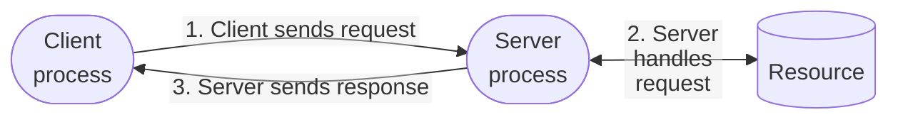
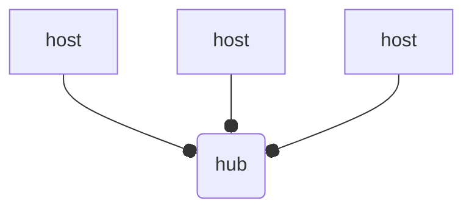
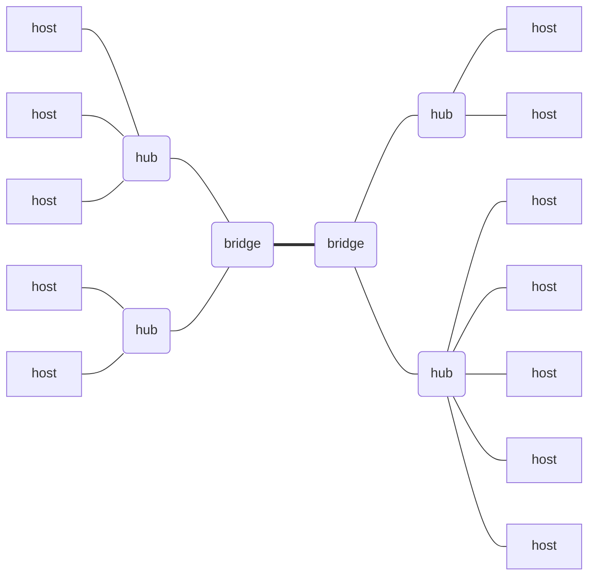
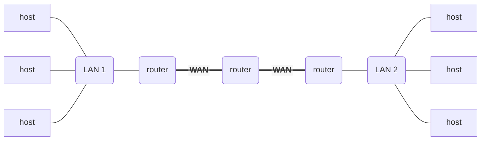
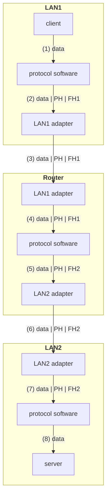
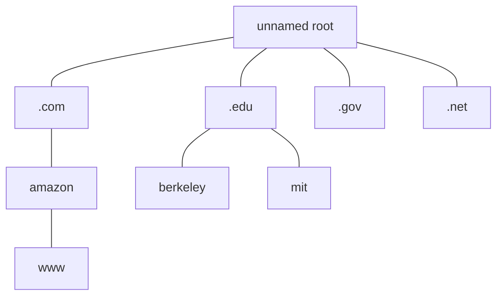
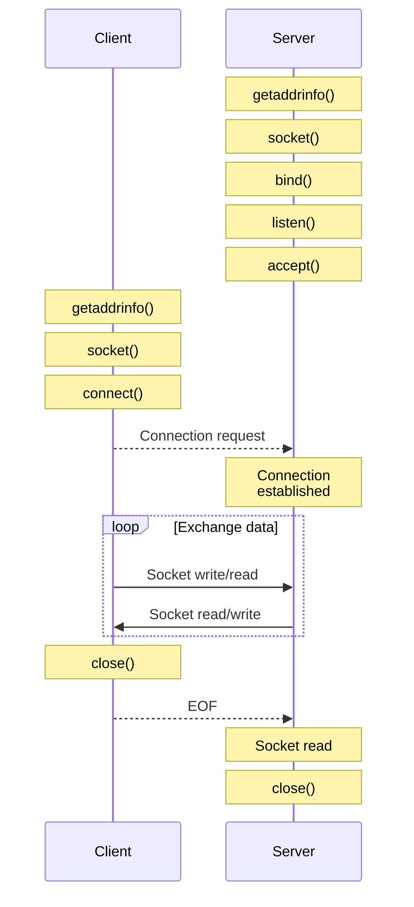
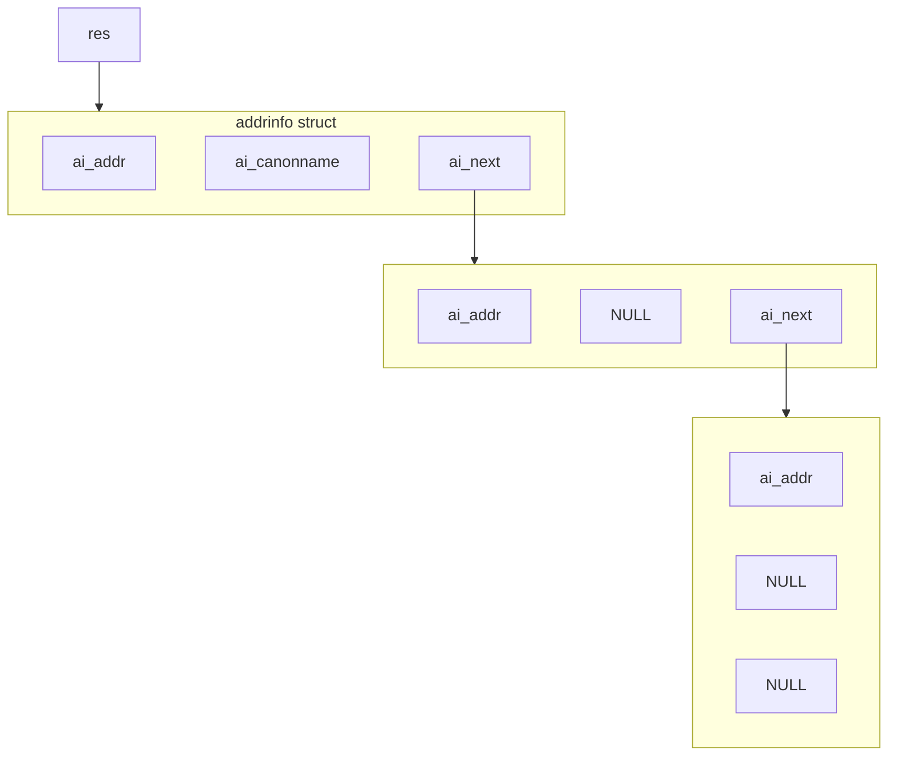

## Networks

---

### A Client-Server Transaction

대부분의 네트워크 시스템은 클라이언트-서버 모델에 기초한다.



### Hardware Organization of a Network Host

```
 CPU
+—————————————————+
|       ALU       |
|        ↕        |
|  Register file  |  System bus      Memory bus
|        ↕        | /               /
|  Bus interface ←+—→ I/O bridge ←——→ Main memory
+—————————————————+        ↑
←—————+—————————————+——————+—————+———————————+——————→
      ↓             ↓            ↓           ↓     ㄴ I/O bus
     USB         Graphics       Disk      Network
  controller      adapter    controller   adapter
  ↑       ↑         ↓            ↕           ↕
Mouse  Keyboard   Monitor       Disk      Network
```

네트워크와 컴퓨터 사이의 하드웨어 인터페이스를 **네트워크 인터페이스 카드(Network Interface Card, NIC)**라 하며, 이는 컴퓨터에게 입출력 장치처럼 보인다. Unix API는 네트워크라는 일종의 가상 파일을 읽고 씀으로써 데이터를 주고받는다.

### Computer Networks

**네트워크(Network)**란 호스트라 불리는 시스템들의 집합으로, 이들은 통신 시스템을 통해 서로 통신할 수 있다.

- **근거리 통신망 (Local Area Network, LAN)**: 건물~캠퍼스 규모
- **광역 통신망 (Wide Area Network, WAN)**: 도시 규모 이상

**인터네트워크(Internetwork)**는 네트워크들의 네트워크를 의미한다. 줄여서 internet이라고도 하지만, 고유명사 **인터넷(Internet)**과 구별하기 위해 소문자 i를 사용한다.

### Lowest Level: Ethernet Segment



### Next Level: Bridged Ethernet Segment



### Next Level: internets



### internet Protocol

다양한 시스템들이 서로 통신하기 위해서는 **프로토콜(Protocol)**, 즉 데이터 송수신에 대한 공통된 규칙 체계가 필요하다.

- **명명 규칙 (Naming scheme)**: 호스트 주소에 대한 통일된 형식을 정의한다.
- **전달 메커니즘 (Delivery mechanism)**: 데이터를 표준 전송 단위인 **패킷(Packet)**으로 분할하여, 모든 통신은 패킷 단위로 이루어진다.

### Transferring internet Data via Encapsulation



- **패킷 헤더 (Packet Header, PH)**: 인터넷 라우팅에 대한 정보
- **프레임 헤더 (Frame Header, FH)**: LAN 라우팅에 대한 정보

<br>

## Gloabl IP Internet

---

인터넷은 인터네트워크의 가장 대표적인 예로, 다음과 같은 프로토콜 집합에 기반한다.

- **IP (Internet Protocol)**: 호스트 명명 규칙과 호스트 간 패킷(데이터그램) 전달 기능을 제공한다. IP 자체는 패킷 전송의 신뢰성을 보장하지 않으며, 상위 계층의 프로토콜(TCP)에서 이를 처리한다.

- **UDP (Unreliable Datagram Protocol)**: 프로세스 간 데이터그램 전달 기능을 제공한다. 신뢰성을 보장하지 않으며, TCP에 비해 전송 속도가 빠르다.

- **TCP (Transmission Control Protocol)**: 프로세스 간 연결을 설정하여, 신뢰할 수 있는 데이터 전송 기능을 제공한다. (데이터의 순서를 보장하고, 손실된 패킷을 재전송하며, 중복 패킷을 제거한다.)

이러한 프로토콜은 **소켓 인터페이스**를 통해 추상화되므로, 우리는 프로토콜의 세부 사항을 다루지 않고 단지 파일을 읽고 씀으로써 패킷을 주고받을 수 있다.

### IPv4 and IPv6

**IPv4**는 1980년대 초반부터 사용되어 온 표준 IP 주소 체계이다.

```
128.2.203.179
```

- 주소는 32비트이며, 점(`.`)으로 구분된 10진수 형식으로 표현한다.
- 각 숫자는 1바이트 크기의 정보(0~255)를 나타낸다.
- 빅 엔디언 순서로 전달되고 저장된다.

> `128.2`로 시작하는 IP 주소는 CMU(카네기 멜런 대학교)에 할당되어 있다. CMU는 약 $2^{16}$개의 IP 주소를 소유하고 있는 셈이다.
{: .prompt-info }

**IPv6**는 128비트 주소를 제공하는 차세대 IP 주소 체계이다. 전 세계 인구가 70억 명이 넘고, 한 사람이 여러 개의 IP 주소를 사용하는 상황에서 32비트를 사용하는 IPv4 주소가 고갈되어 가자, 이에 대한 대안으로서 도입되었다. 꾸준히 채택률이 증가하고 있으나, 아직까지는 IPv4의 점유율이 훨씬 높은 상황이다.

### (1) IP Address

네트워크 프로그래밍에는 다양한 구조체가 사용되는데, 그 중 하나가 `in_addr`이다.

```c
/* Internet address structure */
struct in_addr {
    uint32_t    s_addr;
}
```

네트워크 바이트 순서는 빅 엔디언이므로, 호스트와 네트워크 간 바이트 순서를 변환하는 표준 라이브러리 함수가 제공된다.

```c
uint32_t htonl(uint32_t hostlong);
uint16_t htons(uint16_t hostshort);
uint32_t ntohl(uint32_t netlong);
uint16_t ntohs(uint16_t netshort);
```

IP 주소에 대해 점으로 구분된 10진수 형식(`128.2.194.242`)과 이진 형식(`0x8002C2F2`) 간의 변환을 위한 함수 또한 제공된다.

```c
int inet_pton(int af, const char *src, void *dst);
const char *inet_ntop(int af, const void *src, char *dst, socklen_t size);
```

### (2) Internet Domain Names

일반적으로 사용자는 IP 주소 대신 **도메인 이름(Domain name)**을 사용한다. 이는 계층적인 명명 시스템으로, `.com`, `.edu`, `.net`과 국가 코드 등이 최상위 도메인에 해당한다.



도메인 이름을 IP 주소로 매핑하는 것은 **DNS(Domain Name System)**라는 대규모 분산 시스템의 역할이다. 중앙에서는 최상위 도메인만 관리하며, 각 최상위 도메인에는 해당 도메인에 속한 IP 주소를 추적하는 대규모 시스템이 존재한다.

DNS는 개념적으로 거대한 데이터베이스로 생각할 수 있다. `nslookup`, `dig`와 같은 애플리케이션을 통해 DNS를 탐색하여 도메인 이름으로 IP 주소를 찾거나, IP 주소로 도메인 이름을 찾을 수 있다.

```bash
$ nslookup www.cs.cmu.edu
⋮
Non-authoritative answer:
www.CS.cmu.edu  canonical name = SCS-WEB-LB.ANDREW.cmu.edu.
Name:   SCS-WEB-LB.ANDREW.cmu.edu
Address: 128.2.42.95

```

도메인 이름과 IP 주소 간의 매핑은 일대일이 아닐 수 있다.

- 다수의 도메인 이름이 동일한 IP 주소에 매핑되어 있는 경우

  ```bash
  $ nslookup cs.mit.edu | grep 'Address'
  ⋮
  Address: 18.25.0.23

  $ nslookup eecs.mit.edu | grep 'Address'
  ⋮
  Address: 18.25.0.23
  ```

- 다수의 도메인 이름이 다수의 IP 주소에 매핑되어 있는 경우

  ```bash
  $ nslookup www.naver.com | grep 'Address'
  ⋮
  Address: 223.130.200.219
  Address: 223.130.192.247
  Address: 223.130.200.236
  Address: 223.130.192.248

  $ nslookup naver.com | grep 'Address'
  ⋮
  Address: 223.130.192.247
  Address: 223.130.192.248
  Address: 223.130.200.219
  Address: 223.130.200.236
  ```

- 유효한 도메인 이름이 어떠한 IP 주소에도 매핑되어 있지 않은 경우

  ```bash
  $ nslookup ics.cs.cmu.edu
  ⋮
  Non-authoritative answer:
  *** Can't find ics.cs.cmu.edu: No answer
  ```

### (3) Internet Connections

인터넷은 주로 TCP라는 연결 지향 프로토콜을 기반으로 한다. 한 호스트가 다른 호스트와 **연결(Connection)**을 설정하고, 서로 임의의 길이의 바이트 스트림을 주고받는다. 연결의 각 종단점(endpoint)을 **소켓(Socket)**이라 하며, 소켓 주소는 IP 주소와 포트로 구성된다.

**포트(Port)**는 16비트 정수로, 클라이언트나 서버 측의 특정 종단점을 식별하기 위해 사용된다.

- **임시 포트 (Ephemeral port)**: 클라이언트가 연결을 요청할 때 동적으로 할당되는 포트이다. 통신이 종료되면 할당이 해제된다.
- **잘 알려진 포트 (Well-known port)**: 서버에 특정 서비스를 요청하기 위해 사용되는 포트이다.[^well-known-port]

커널은 시스템으로 들어오는 다양한 연결을 구분하여, 다른 시스템으로부터 데이터가 도착했을 때 어떤 프로세스를 깨워야 할지 결정한다.

<br>

## Sockets Interface

---



> 서버는 클라이언트와의 연결이 종료된 후, 다른 클라이언트의 연결 요청을 받아들이기 위해 `accept()` 단계로 돌아갈 수 있다. 이를 **반복 서버(Iterative server)**라 한다.
{: .prompt-info }

### Sockets Interface: socket()

```c
int socket(int domain, int type, int protocol);
```

새로운 소켓을 생성하여, 해당 소켓의 파일 디스크립터를 반환한다.

### Sockets Interface: bind()

```c
int bind(int sockfd, const struct sockaddr *addr, socklen_t addrlen);
```

생성된 소켓을 지정한 소켓 주소에 바인딩한다.

### Sockets Interface: listen()

```c
int listen(int sockfd, int backlog);
```

바인딩된 소켓을 **수신 대기 상태(Listening socket)**로 만든다.

### Sockets Interface: accept()

```c
int accept(int sockfd, struct sockaddr *addr, socklen_t *addrlen);
```

클라이언트로부터 연결 요청이 올 때까지 대기(호출자 차단)하다가, 연결 요청이 도착하면 수락한다. **클라이언트와 통신하는 데 사용할 새로운 소켓(Connected socket)**을 생성하여, 해당 소켓의 파일 디스크립터를 반환한다.

### Sockets Interface: connect()

```c
int connect(int sockfd, const struct sockaddr *addr, socklen_t addrlen);
```

클라이언트와 서버(connected socket) 간의 연결을 설정한다.

### Socket Address Structures

```c
struct sockaddr {
    uint16_t        sa_family;      /* Protocol family */
    char            sa_data[14];    /* Address data */
};

struct sockaddr_in {
    uint16_t        sin_family;     /* AF_INET */
    uint16_t        sin_port;       /* Port number in network byte order*/
    struct in_addr  sin_addr;       /* IPv4 address in network byte order */
};
```

- `sockaddr_in`은 `sockaddr`의 하위 클래스에 해당하며, IPv4 소켓에 사용된다.

### Host and Service Conversion: getaddrinfo()

```c
int getaddrinfo(const char *node,               /* Hostname or address */
                const char *service,            /* Port or service name */
                const struct addrinfo *hints,   /* Input parameters */
                struct addrinfo **res);         /* Output linked list */
void freeaddrinfo(struct addrinfo *res);
const char *gai_strerror(int errcode);
```

`getaddrinfo()`는 호스트 이름/주소, 서비스 이름 등을 소켓 주소 구조체로 변환한다.

- 호스트 이름에 여러 개의 IP 주소가 매핑되어 있는 경우, 모든 IP 주소를 반환한다.
- IPv4와 IPv6를 모두 지원하므로, 프로토콜에 독립적이다.
- Reentrant 함수이다.

### Linked List Returned by getaddrinfo()



### addrinfo Struct

```c
struct addrinfo {
    int              ai_flags;      /* Additional options */
    int              ai_family;     /* 1st argument of socket() */
    int              ai_socktype;   /* 2nd argument of socket() */
    int              ai_protocol;   /* 3rd argument of socket() */
    socklen_t        ai_addrlen;    /* Size of ai_addr struct */
    struct sockaddr *ai_addr;       /* Pointer to socket address structure */
    char            *ai_canonname;  /* Canonical hostname */
    struct addrinfo *ai_next;       /* Pointer to next item in linked list */
};
```

### Host and Service Conversion: getnameinfo()

```c
int getnameinfo(const struct sockaddr *addr, socklen_t addrlen,
                char *host, socklen_t hostlen,
                char *serv, socklen_t servlen, int flags);
```

`getnameinfo()`는 소켓 주소 구조체를 호스트와 서비스로 변환한다. (`getaddrinfo()`의 반대 역할)

### Conversion Example

```c
#define MAXLINE 8192

int main(int argc, char *argv[]) {
    struct addrinfo hints, *listp, *p;
    char buf[MAXLINE];
    int errcode, flags;

    if (argc != 2) {
        fprintf(stderr, "Usage: %s <domain name>\n", argv[0]);
        return 2;
    }
    /* Get a list of addrinfo records */
    memset(&hints, 0, sizeof(struct addrinfo));
    hints.ai_socktype = SOCK_STREAM;  /* Connections only */
    if ((errcode = getaddrinfo(argv[1], NULL, &hints, &listp)) != 0) {
        fprintf(stderr, "getaddrinfo() error: %s\n", gai_strerror(errcode));
        return 1;
    }
    /* Walk the list and display each IP address */
    flags = NI_NUMERICHOST;  /* Numeric form of the hostname */
    for (p = listp; p; p = p->ai_next) {
        Getnameinfo(p->ai_addr, p->ai_addrlen, buf, MAXLINE, NULL, 0, flags);
        printf("%s\n", buf);
    }
    /* Clean up */
    Freeaddrinfo(listp);
    return 0;
}
```

```bash
$ ./a.out www.cs.cmu.edu
128.2.42.95
$ ./a.out www.naver.com
223.130.200.219
223.130.192.247
223.130.200.236
223.130.192.248
$ ./a.out ics.cs.cmu.edu
getaddrinfo() error: No address associated with hostname
$ ./a.out localhost
127.0.0.1
```

> `localhost`는 현재 사용 중인 컴퓨터를 가리키는 호스트 이름이다. 일반적으로 IP 주소 `127.0.0.1`로 표시되며, IPv6에서는 `::1`로 표시된다.
{: .prompt-info }

<br>

## References

---

- [Carnegie Mellon University. (2015). Lecture 21: Network Programming: Part I. [Online].](https://scs.hosted.panopto.com/Panopto/Pages/Viewer.aspx?id=54178cf8-d57e-4984-b46c-b66db645431a)

### Footnote

[^well-known-port]: ["Service Name and Transport Protocol Port Number Registry." IANA. [Online].](https://www.iana.org/assignments/service-names-port-numbers/service-names-port-numbers.xhtml)
