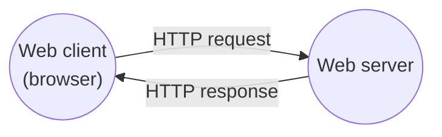
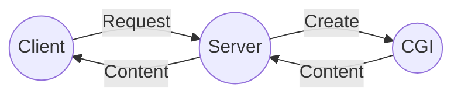

## Sockets Interface

---

### Sockets Helper: open_clientfd()

```c
int open_clientfd(char *hostname, char *port) {
    struct addrinfo hints, *listp, *p;
    int clientfd, errcode;

    /* Get a list of potential server addresses */
    memset(&hints, 0, sizeof(struct addrinfo));
    hints.ai_socktype = SOCK_STREAM;  /* Open a connection */
    hints.ai_flags = AI_NUMERICSERV;  /* Numeric port number */
    hints.ai_flags |= AI_ADDRCONFIG;  /* Recommended for connections */
    if ((errcode = getaddrinfo(hostname, port, &hints, &listp)) != 0) {
        fprintf(stderr, "getaddrinfo() failed (%s:%s): %s\n",
                hostname, port, gai_strerror(errcode));
        return -2;
    }
    /* Walk the list for one that we can successfully connect to */
    for (p = listp; p; p = p->ai_next) {
        if ((clientfd = socket(p->ai_family, p->ai_socktype, p->ai_protocol)) < 0)
            continue;
        if (connect(clientfd, p->ai_addr, p->ai_addrlen) != -1)
            break;
        if (close(clientfd) < 0) {
            fprintf(stderr, "open_clientfd(): close() failed: %s\n", strerror(errno));
            return -1;
        }
    }
    Freeaddrinfo(listp);
    if (!p)
        return -1;
    return clientfd;
}
```

### Sockets Helper: open_listenfd()

```c
int open_listenfd(char *port) {
    struct addrinfo hints, *listp, *p;
    int listenfd, errcode, optval = 1;

    /* Get a list of potential server addresses */
    memset(&hints, 0, sizeof(struct addrinfo));
    hints.ai_socktype = SOCK_STREAM;                /* Accept connections */
    hints.ai_flags = AI_PASSIVE | AI_ADDRCONFIG;    /* ... on any IP address */
    hints.ai_flags |= AI_NUMERICSERV;               /* ... using port number */
    if ((errcode = getaddrinfo(NULL, port, &hints, &listp)) != 0) {
        fprintf(stderr, "getaddrinfo failed (port %s): %s\n",
                port, gai_strerror(errcode));
        return -2;
    }
    /* Walk the list for one that we can bind to */
    for (p = listp; p; p = p->ai_next) {
        if ((listenfd = socket(p->ai_family, p->ai_socktype, p->ai_protocol)) < 0)
            continue;
        /* Eliminates "Address already in use" error from bind */
        Setsockopt(listenfd, SOL_SOCKET, SO_REUSEADDR,
                   (const void *)&optval , sizeof(int));
        if (bind(listenfd, p->ai_addr, p->ai_addrlen) == 0)
            break;
        if (close(listenfd) < 0) {
            fprintf(stderr, "open_listenfd(): close() failed: %s\n", strerror(errno));
            return -1;
        }
    }
    Freeaddrinfo(listp);
    if (!p)
        return -1;
    /* Make it a listening socket ready to accept connection requests */
    if (listen(listenfd, LISTENQ) < 0) {
        Close(listenfd);
        return -1;
    }
    return listenfd;
}
```

### Echo Client: Main Routine

```c
int main(int argc, char *argv[]) {
    int clientfd;
    char *host, *port, buf[MAXLINE];
    rio_t rio;

    if (argc != 3) {
        fprintf(stderr, "Usage: %s <host> <port>\n", argv[0]);
        return 2;
    }
    host = argv[1];
    port = argv[2];
    clientfd = Open_clientfd(host, port);
    Rio_readinitb(&rio, clientfd);
    while (Fgets(buf, MAXLINE, stdin) != NULL) {
        Rio_writen(clientfd, buf, strlen(buf));
        Rio_readlineb(&rio, buf, MAXLINE);
        Fputs(buf, stdout);
    }
    Close(clientfd);
    return 0;
}
```

### Iterative Echo Server: Main Routine

```c
int main(int argc, char *argv[]) {
    int listenfd, connfd;
    socklen_t clientlen;
    struct sockaddr_storage clientaddr;  /* Enough space for any address */
    char client_hostname[MAXLINE], client_port[MAXLINE];

    if (argc != 2) {
        fprintf(stderr, "Usage: %s <port>\n", argv[0]);
        return 2;
    }
    listenfd = Open_listenfd(argv[1]);
    while (1) {
        clientlen = sizeof(struct sockaddr_storage);
        connfd = Accept(listenfd, (struct sockaddr *)&clientaddr, &clientlen);
        Getnameinfo((struct sockaddr *)&clientaddr, clientlen, client_hostname,
                    MAXLINE, client_port, MAXLINE, 0);
        printf("Connected to (%s, %s)\n", client_hostname, client_port);
        echo(connfd);
        Close(connfd);
    }
    return 0;
}
```

### Echo Server: echo()

```c
void echo(int connfd) {
    size_t n;
    char buf[MAXLINE];
    rio_t rio;

    Rio_readinitb(&rio, connfd);
    while ((n = Rio_readlineb(&rio, buf, MAXLINE)) != 0) {
        printf("Server received %d bytes\n", (int)n);
        Rio_writen(connfd, buf, n);
    }
}
```

### Testing Servers Using telnet

`telnet`은 원격 호스트와 통신할 수 있는 유틸리티 프로그램이다. 보안에 취약하기 때문에 암호화된 프로토콜인 SSH로 대체되었지만, 네트워크 서비스를 테스트하는 용도로 사용할 수 있다.

```bash
$ ./echoserveri 15213

```

```bash
$ telnet localhost 15213
Trying 127.0.0.1...
Connected to localhost.
Escape character is '^]'.

```

```bash
$ ./echoserveri 15213
Connected to (localhost, 41270)

```

```bash
$ telnet localhost 15213
Trying 127.0.0.1...
Connected to localhost.
Escape character is '^]'.
123456789
123456789

```

```bash
$ ./echoserveri 15213
Connected to (localhost, 41270)
Server received 11 bytes

```

<br>

## Web Servers

---

### Web Server Basics

**월드 와이드 웹(World Wide Web, WWW)**은 클라이언트-서버 모델의 대표적인 예시이다.



<br>


_Protocol stack[^protocol-stack]_

### Web Content

웹 서버는 클라이언트에게 **콘텐츠(Content)**를 반환하는데, 텍스트나 이미지 등을 MIME 타입[^mime-type]으로 인코딩하여 전송한다.

- **정적 콘텐츠 (Static content)**: 서버에 저장되어 있는 파일(HTML, 이미지 등)로 구성된다.
- **동적 콘텐츠 (Dynamic content)**: 클라이언트의 요청에 따라 그때그때 생성된다.

### URLs

**URL(Uniform Resource Locator)**은 리소스의 위치를 나타내는 표준 주소 체계이다.


_Anatomy of a URL[^url]_

### HTTP Messages

클라이언트(웹 브라우저)는 서버에 HTTP 요청을 보내고, 서버는 그에 대한 응답(웹 페이지)을 반환한다.

> 자세한 내용은 여기[^http-messages] 참고
{: .prompt-info }

### Example HTTP Transaction

```bash
$ telnet www.cs.cmu.edu 80
Trying 128.2.42.95...
Connected to SCS-WEB-LB.ANDREW.cmu.edu.
Escape character is '^]'.
GET /~bryant/test.html HTTP/1.1
Host: www.cs.cmu.edu

HTTP/1.1 200 OK
Date: Wed, 12 Jun 2024 02:59:22 GMT
Server: Apache/2.4.18 (Ubuntu)
Set-Cookie: SHIBLOCATION=tilde; path=/; domain=.cs.cmu.edu
Accept-Ranges: bytes
Vary: Accept-Encoding
Content-Length: 479
Content-Type: text/html
Set-Cookie: BALANCEID=balancer.web38.srv.cs.cmu.edu; path=/;
Set-Cookie: BIGipServer~SCS~cs-userdir-pool-80=550109824.20480.0000; path=/; Httponly

<html>
<head><title>Some Tests</title></head>

<body>
<h1>Some Tests</h1>
<ul>
<li><a href="index.html">Bryant's Home</a>
<li><a href="http://csapp.cs.cmu.edu">CSAPP</a>
<li><a href="nothing.html">Nonexistent file</a>
<li><a href="http://www.nowhere.cs.cmu.edu">Nonexistent host</a>
<li><a href="http://www.google.com">Google</a>
<li><a href="http://www.cmu.edu">CMU</a>
<li><a href="http://www.yahoo.com">Yahoo</a>
<li><a href="http://www.nfl.com">NFL</a>
</ul>
</body>
</html>
Connection closed by foreign host.
```

<br>

## Tiny Web Server

---

### Serving Static Content

```c
void serve_static(int fd, char *filename, int filesize) {
    int srcfd;
    char *srcp, filetype[MAXLINE], buf[MAXBUF];

    /* Send response headers to client */
    get_filetype(filename, filetype);
    sprintf(buf, "HTTP/1.0 200 OK\r\n");
    sprintf(buf, "%sServer: Tiny Web Server\r\n", buf);
    sprintf(buf, "%sConnection: close\r\n", buf);
    sprintf(buf, "%sContent-length: %d\r\n", buf, filesize);
    sprintf(buf, "%sContent-type: %s\r\n\r\n", buf, filetype);
    Rio_writen(fd, buf, strlen(buf));
    printf("Response headers:\n");
    printf("%s", buf);

    /* Send response body to client */
    srcfd = Open(filename, O_RDONLY, 0);
    srcp = Mmap(0, filesize, PROT_READ, MAP_PRIVATE, srcfd, 0);
    Close(srcfd);
    Rio_writen(fd, srcp, filesize);
    Munmap(srcp, filesize);
}
```

### Serving Dynamic Content



- **CGI(Common Gateway Interface)** 프로그램에 인자를 전달하여 동적으로 웹 페이지를 구성한다.

### Serving Dynamic Content with GET

```c
void serve_dynamic(int fd, char *filename, char *cgiargs) {
    char buf[MAXLINE], *emptylist[] = { NULL };

    /* Return first part of HTTP response */
    sprintf(buf, "HTTP/1.0 200 OK\r\n");
    Rio_writen(fd, buf, strlen(buf));
    sprintf(buf, "Server: Tiny Web Server\r\n");
    Rio_writen(fd, buf, strlen(buf));
    if (Fork() == 0) {
        /* Real server would set all CGI vars here */
        setenv("QUERY_STRING", cgiargs, 1);
        Dup2(fd, STDOUT_FILENO);                /* Redirect stdout to client */
        Execve(filename, emptylist, environ);   /* Run CGI program */
    }
    Wait(NULL);  /* Parent waits for and reaps child */
}
```

- 서버는 CGI 프로그램에게 인자를 전달하기 위해 환경 변수를 이용한다.
- 서버는 `stdout`을 connected socket으로 리다이렉트하고, CGI 프로그램은 생성한 콘텐츠를 `stdout`에 출력한다.

<br>

## References

---

- [Carnegie Mellon University. (2015). Lecture 22: Network Programming: Part II. [Online].](https://scs.hosted.panopto.com/Panopto/Pages/Viewer.aspx?id=0015deb4-3584-4b10-98c9-38f27784feb4)
- ["Lecture 21: Network Programming: Part I." {{ site.title }}. [Online].]({{ site.url }}/posts/ics-lecture-21/)

### Footnote

[^protocol-stack]: [Sedrubal. "HTTP-1.1 vs. HTTP-2 vs. HTTP-3 Protocol Stack." Wikimedia Commons. [Online].](https://commons.wikimedia.org/wiki/File:HTTP-1.1_vs._HTTP-2_vs._HTTP-3_Protocol_Stack.svg)
[^mime-type]: [MDN contributors. "MIME types (IANA media types)." MDN. [Online].](https://developer.mozilla.org/en-US/docs/Web/HTTP/Basics_of_HTTP/MIME_types)
[^url]: [MDN contributors. "What is a URL?" MDN. [Online].](https://developer.mozilla.org/en-US/docs/Learn/Common_questions/Web_mechanics/What_is_a_URL)
[^http-messages]: [MDN contributors. "HTTP Messages." MDN. [Online].](https://developer.mozilla.org/en-US/docs/Web/HTTP/Messages)
