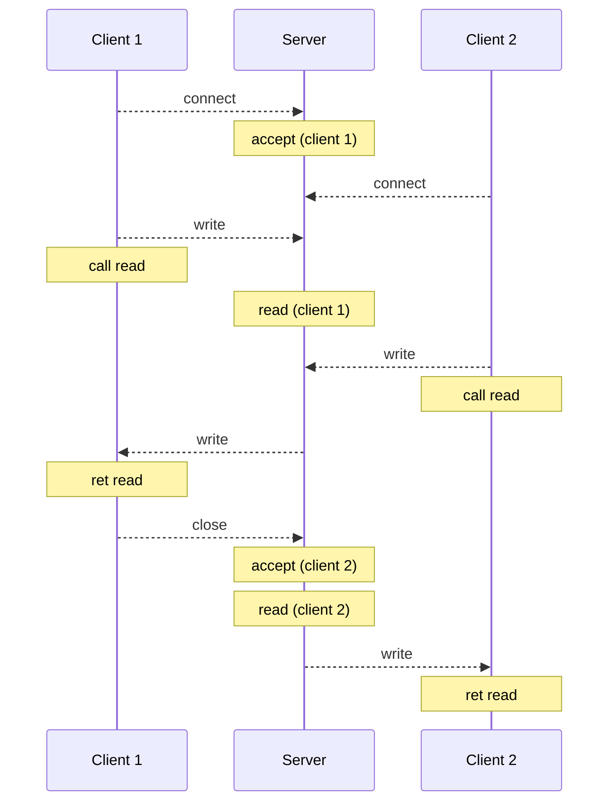
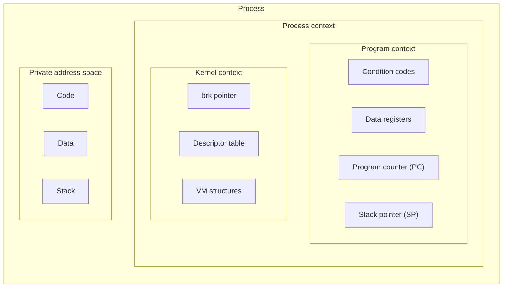
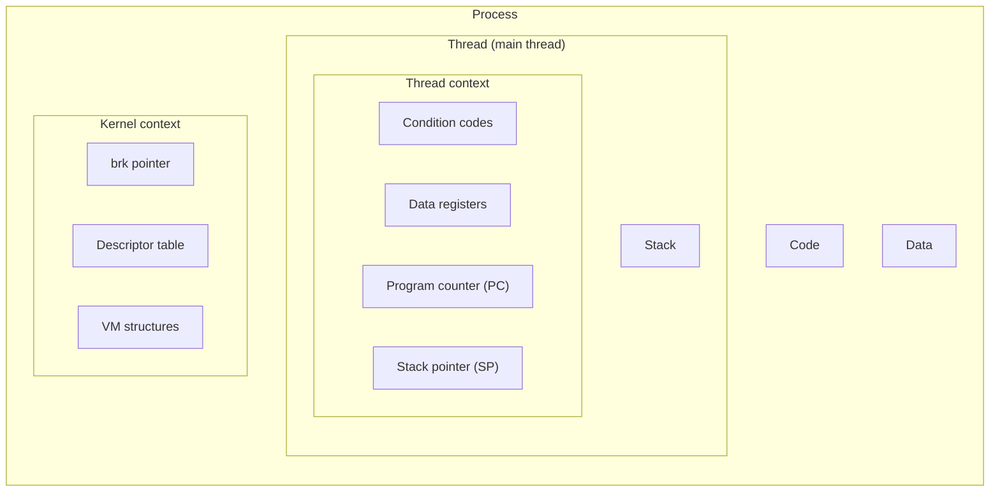
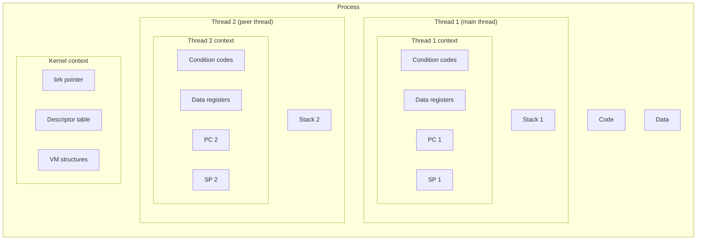
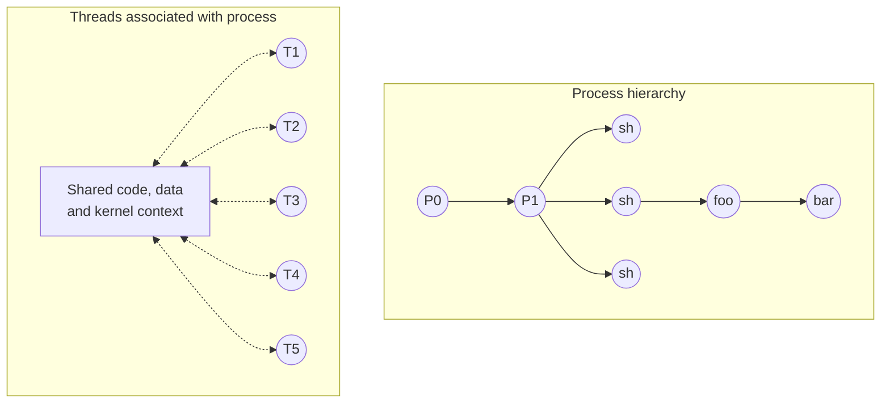

## Concurrent Programming Basics

---

동시성 프로그래밍에서는 다음과 같은 문제가 발생할 수 있다.

- **경쟁 (Race)**: 여러 흐름(flow)이 공유 자원에 동시에 접근할 때, 임의의 스케줄링 결정(접근 순서)에 따라 결과가 달라진다.
- **교착 (Deadlock)**: 여러 흐름이 결코 발생하지 않을 이벤트(서로가 가진 자원)를 기다리며 영원히 차단된다.
- **기아 (Starvation)**: 부적절한 스케줄링 등으로 인해, 특정 흐름이 필요한 자원을 할당받지 못하고 계속 대기한다.

### Iterative Servers

**반복 서버(Iterative server)**는 한 번에 한 클라이언트의 요청만을 처리한다.



> 커널은 연결 요청과 작성(write)된 데이터를 대기열에 넣을 수 있다. 따라서 클라이언트에서 `connect()`와 `write()` 호출은 즉시 반환되지만, `read()` 호출 시 데이터를 읽을 때까지 반환되지 않으므로 호출자가 차단된다.
{: .prompt-info }

### Approaches for Writing Concurrent Servers

**동시 서버(Concurrent server)**는 **동시 흐름(Concurrent flow)**을 통해 각 클라이언트와 상호 작용한다. 동시 흐름을 생성하는 방법에는 3가지가 있다.

**프로세스 기반 (Process-based)**

- 커널이 모든 스케줄링을 처리한다.
- 각 흐름(프로세스)은 자체적인 주소 공간을 가지므로, 서로 독립적이다.

**이벤트 기반 (Event-based)**

- 입출력 다중화(I/O multiplexing)를 통해 흐름을 interleave한다.
- 모든 흐름이 동일한 주소 공간을 공유한다.

**스레드 기반 (Thread-based)**

- 커널이 흐름을 interleave한다.
- 각 흐름(스레드)은 동일한 주소 공간을 공유한다.

<br>

## Process-Based Servers

---

### Process-Based Concurrent Echo Server

```c
void sigchld_handler(int sig) {
    while (waitpid(-1, 0, WNOHANG) > 0)
        ;
}

int main(int argc, char *argv[]) {
    int listenfd, connfd;
    socklen_t clientlen;
    struct sockaddr_storage clientaddr;

    if (argc != 2) {
        fprintf(stderr, "Usage: %s <port>\n", argv[0]);
        return 2;
    }
    Signal(SIGCHLD, sigchld_handler);
    listenfd = Open_listenfd(argv[1]);
    while (1) {
        clientlen = sizeof(struct sockaddr_storage);
        connfd = Accept(listenfd, (struct sockaddr *)&clientaddr, &clientlen);
        if (Fork() == 0) {
            Close(listenfd);
            echo(connfd);
            Close(connfd);
            exit(0);
        }
        Close(connfd);
    }
}
```

- 서버는 연결 요청을 수락하여 `accept()` 호출에서 반환된 후, 자식 프로세스를 생성하여 클라이언트와 상호 작용한다.

### Issues with Process-Based Servers

- `SIGCHLD` 핸들러에서 종료된 모든 자식 프로세스를 회수하여 메모리 누수를 방지해야 한다.

- 부모 프로세스는 `connfd`를 사용하지 않으므로 닫아 주어야 한다. 커널은 열려 있는 각 소켓에 대해 `refcnt`를 유지하는데, `refcnt`가 0이 될 때까지 연결이 닫히지 않는다.

### Pros and Cons of Process-Based Servers

**장점**

- 각 프로세스는 독립된 주소 공간을 가진다.
- 동시 서버를 구현하는 가장 간단한 방법이다.

**단점**

- 프로세스 제어 시 발생하는 오버헤드가 크다.
- 프로세스 간 데이터 공유가 까다롭다.

<br>

## Event-Based Servers

---

이벤트 기반 서버는 `listenfd`와 `connfd`의 배열(활성화된 연결의 집합)을 가지고 있으며, `select()`나 `epoll()`과 같은 시스템 콜을 사용하여 어느 디스크립터에 입력이 대기 중인지 알아내어 작업을 수행한다. (I/O multiplexing)

> 디스크립터에 데이터가 도착하면 디스크립터의 상태가 변경되는데, 이를 **이벤트**라 한다.
{: .prompt-info }

### Pros and Cons of Event-Based Servers

**장점**

- 단일 프로세스 및 스레드로 동작하기 때문에, 디버거를 통해 단계별 실행이 가능하여 디버깅이 수월하다.
- 프로세스 및 스레드 제어가 필요 없기 때문에, 오버헤드가 매우 적다.

> Node.js, nginx, Tornado와 같은 고성능 웹 서버는 모두 이벤트 기반 모델을 사용한다.
{: .prompt-info }

**단점**

- 프로세스나 스레드 기반 서버에 비해 구현이 훨씬 복잡하다.
- 하나의 작업이 오래 걸리면 다른 작업들이 차단되어 지연될 수 있다.
- 멀티 코어를 활용할 수 없다.

<br>

## Thread-Based Servers

---

### Traditional View of a Process



### Alternate View of a Process



### A Process with Multiple Threads



- 커널은 각 스레드를 별도의 제어 흐름으로 처리하고, 프로세스와 유사한 방식으로 스케줄링한다.
- 프로세스에 비해, 스레드 생성/회수 및 콘텍스트 전환 시 발생하는 오버헤드가 적다.

### Logical View of Threads



### Pthreads Interface

```c
/* Thread routine */
void *thread(void *vargp) {
    printf("Hello, world!\n");
    return NULL;
}

int main() {
    pthread_t tid;
    Pthread_create(&tid, NULL, thread, NULL);
    Pthread_join(tid, NULL);
    return 0;
}
```

- `Pthread_create()`를 통해 생성된 스레드는 스레드 루틴을 실행한다.
  - 스레드 루틴은 `void *`를 선택적 인자로 받는다. 스레드에 무언가를 전달하고 싶다면, 모든 데이터를 하나의 객체로 묶어서 그 주소를 전달해야 한다.
- 메인 스레드는 `Pthread_join()`을 호출하여 peer 스레드가 종료되기를 기다린다.

### Thread-Based Concurrent Echo Server

```c
/* Thread routine */
void *thread(void *vargp) {
    int connfd = *((int *)vargp);

    Pthread_detach(pthread_self());
    Free(vargp);
    echo(connfd);
    Close(connfd);
    return NULL;
}

int main(int argc, char *argv[]) {
    int listenfd, *connfdp;
    socklen_t clientlen;
    struct sockaddr_storage clientaddr;
    pthread_t tid;
    char client_hostname[MAXLINE], client_port[MAXLINE];

    if (argc != 2) {
        fprintf(stderr, "Usage: %s <port>\n", argv[0]);
        return 2;
    }
    listenfd = Open_listenfd(argv[1]);
    while (1) {
        clientlen = sizeof(struct sockaddr_storage);
        connfdp = Malloc(sizeof(int));
        *connfdp = Accept(listenfd, (struct sockaddr *)&clientaddr, &clientlen);
        Pthread_create(&tid, NULL, thread, connfdp);
        Getnameinfo((struct sockaddr *)&clientaddr, clientlen, client_hostname,
                    MAXLINE, client_port, MAXLINE, 0);
        printf("Connected to (%s, %s) via thread %d\n",
                client_hostname, client_port, (int) tid);
    }
}
```

> 각 스레드는 자체적인 스택을 가지므로, 서로 독립적으로 실행될 수 있다.
{: .prompt-info }

### Issues with Thread-Based Servers

잠재적인 메모리 누수를 방지하기 위해, 스레드를 detached 모드로 실행해야 한다. (`Pthread_detach()`)

- **Joinable** (기본값): 다른 스레드에 의해 종료될 수 있으며, `Pthread_join()`을 통해 회수되어야 한다.
- **Detached**: 다른 스레드에 의해 종료될 수 없으며, 종료 시 커널에 의해 자동으로 회수된다.

### Pros and Cons of Thread-Based Servers

**장점**

- 스레드 간 데이터 공유가 매우 쉽다.
- 스레드는 프로세서보다 효율적이다.

**단점**

- 의도하지 않은 자원 공유가 발생하지 않도록 주의해야 한다.
- 경쟁 상태가 발생하면 디버깅하기가 까다롭다.

## References

---

- [Carnegie Mellon University. (2015). Lecture 23: Concurrent Programming. [Online].](https://scs.hosted.panopto.com/Panopto/Pages/Viewer.aspx?id=0be3c53f-5d35-40f0-a5ab-55897a2c91a5)
- ["Lecture 21: Network Programming: Part I." {{ site.title }}. [Online].]({{ site.url }}/posts/ics-lecture-21/)
- ["Lecture 22: Network Programming: Part II." {{ site.title }}. [Online].]({{ site.url }}/posts/ics-lecture-22/)
