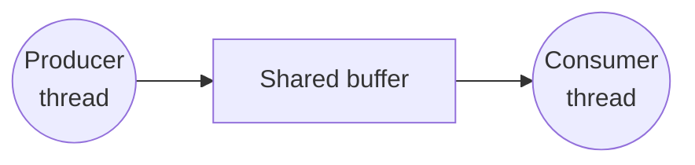
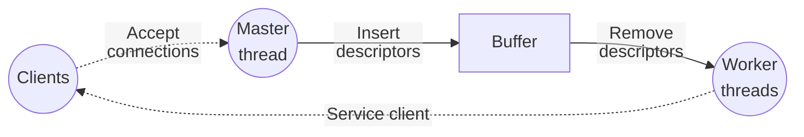
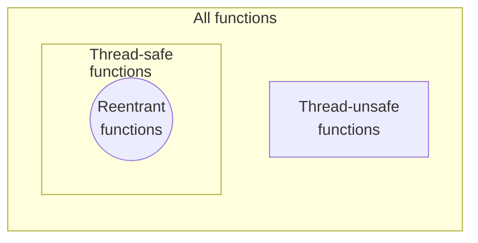

## Producer-Consumer Problem

---



- 생산자는 버퍼에 빈 자리가 생기면 아이템을 삽입한 뒤, 소비자에게 새 아이템이 있음을 알린다.
- 소비자는 버퍼에 아이템이 생기면 꺼낸 뒤, 생산자에게 빈 자리가 있음을 알린다.

### sbuf Package - Declarations

```c
typedef struct {
    int *buf;
    int n;
    int front;
    int rear;
    sem_t mutex;    /* Protects accesses to buf */
    sem_t slots;    /* Counts available slots */
    sem_t items;    /* Counts available items */
} sbuf_t;

void sbuf_init(sbuf_t *sp, int n);
void sbuf_deinit(sbuf_t *sp);
void sbuf_insert(sbuf_t *sp, int item);
int sbuf_remove(sbuf_t *sp);
```

### sbuf Package - Implementation

```c
/* Create an empty, bounded, shared FIFO buffer with n slots */
void sbuf_init(sbuf_t *sp, int n) {
    sp->buf = Calloc(n, sizeof(int));
    sp->n = n;
    sp->front = sp->rear = 0;
    Sem_init(&sp->mutex, 0, 1);
    Sem_init(&sp->slots, 0, n);
    Sem_init(&sp->items, 0, 0);
}

/* Clean up buffer sp */
void sbuf_deinit(sbuf_t *sp) {
    Free(sp->buf);
}

/* Insert item onto the rear of shared buffer sp */
void sbuf_insert(sbuf_t *sp, int item) {
    Sem_wait(&sp->slots);
    Sem_wait(&sp->mutex);
    if (++sp->rear >= sp->n)
        sp->rear = 0;
    sp->buf[sp->rear] = item;
    Sem_post(&sp->mutex);
    Sem_post(&sp->items);
}

/* Remove and return the first item from buffer sp */
int sbuf_remove(sbuf_t *sp) {
    int item;
    Sem_wait(&sp->items);
    Sem_wait(&sp->mutex);
    if (++sp->front >= sp->n)
        sp->front = 0;
    item = sp->buf[sp->front];
    Sem_post(&sp->mutex);
    Sem_post(&sp->slots);
    return item;
}
```

<br>

## Readers-Writers Problem

---

여러 스레드가 공유 자원을 읽기만 한다면 해당 자원을 보호할 필요가 없으며, **쓰기 작업을 수행할 때만 동기화(상호 배제)**하면 된다.

### Variants of Readers-Writers

**Reader 우선**

- Writer가 공유 자원에 대해 쓰기 작업을 수행하는 중이 아니라면, 어떤 reader도 기다리게 해서는 안 된다.
- Writer가 뮤텍스 획득을 기다리는 중에 다른 reader가 들어오면, 해당 reader가 먼저 읽기를 수행한다.
- Reader가 계속 들어오면, writer는 기아 상태에 빠질 수 있다.

**Writer 우선**

- Writer가 쓰기 작업을 수행할 준비가 되면, 대기 중인 모든 reader보다 높은 우선순위를 가진다.
- Writer가 계속 들어오면, reader는 기아 상태에 빠질 수 있다.

### Solution to First Readers-Writers Problem

```c
int readcnt;     /* Initially 0 */
sem_t mutex, w;  /* Initially 1 */

void reader(void) {
    while (1) {
        Sem_wait(&mutex);
        readcnt++;
        if (readcnt == 1)  /* First in */
            Sem_wait(&w);
        Sem_post(&mutex);

        /* Critical section */
        /* Reading happens */

        Sem_wait(&mutex);
        readcnt--;
        if (readcnt == 0)  /* Last out */
            Sem_post(&w);
        Sem_post(&mutex);
    }
}

void writer(void) {
    while (1) {
        Sem_wait(&w);

        /* Critical section */
        /* Writing happens */

        Sem_post(&w);
    }
}
```

- 임계 구역 내에 다수의 reader는 허용하되, 다수의 writer는 허용하지 않는다.

<br>

## Prethreaded Concurrent Server

---

Producer-consumer 모델을 사용하여 동시 서버를 구현할 수 있다.



- 서버 시작 시, 작업자 스레드 풀을 생성해 놓는다.
- 클라이언트의 요청이 도착하면, 사용 가능한 작업자 스레드 중 하나가 해당 요청을 처리한다.
- 클라이언트의 요청이 도착할 때마다 새로운 스레드를 생성할 필요가 없어, 오버헤드가 적다.

### Prethreaded Concurrent Server: Main Routine

```c
sbuf_t sbuf;  /* Shared buffer of connfds */

void *thread(void *vargp) {
    Pthread_detach(pthread_self());
    while (1) {
        int connfd = sbuf_remove(&sbuf);    /* Remove connfd from buffer */
        echo_cnt(connfd);                   /* Service client */
        Close(connfd);
    }
}

int main(int argc, char *argv[]) {
    int listenfd, connfd;
    socklen_t clientlen;
    struct sockaddr_storage clientaddr;
    pthread_t tid;

    if (argc != 2) {
        fprintf(stderr, "Usage: %s <port>\n", argv[0]);
        return 2;
    }
    listenfd = Open_listenfd(argv[1]);
    sbuf_init(&sbuf, SBUFSIZE);
    for (int i = 0; i < NTHREADS; i++)
        Pthread_create(&tid, NULL, thread, NULL);  /* Create worker threads */
    while (1) {
        clientlen = sizeof(struct sockaddr_storage);
        connfd = Accept(listenfd, (struct sockaddr *)&clientaddr, &clientlen);
        sbuf_insert(&sbuf, connfd);  /* Insert connfd in buffer */
    }
}
```

### Prethreaded Concurrent Server: Worker Thread Service Routine

```c
static int byte_cnt;
static sem_t mutex;

static void init_echo_cnt(void) {
    Sem_init(&mutex, 0, 1);
    byte_cnt = 0;
}

void echo_cnt(int connfd) {
    int n;
    char buf[MAXLINE];
    rio_t rio;
    static pthread_once_t once = PTHREAD_ONCE_INIT;

    Pthread_once(&once, init_echo_cnt);
    Rio_readinitb(&rio, connfd);
    while ((n = Rio_readlineb(&rio, buf, MAXLINE)) != 0) {
	Sem_wait(&mutex);
	byte_cnt += n;
	printf("Thread %d received %d (%d total) bytes on fd %d\n",
	       (int)pthread_self(), n, byte_cnt, connfd);
	Sem_post(&mutex);
	Rio_writen(connfd, buf, n);
    }
}
```

- `Pthread_once()`는 첫 번째 호출 시에만 인자로 전달된 함수를 호출한다. 이를 통해, 메인 스레드가 아닌 peer 스레드에서도 초기화를 수행할 수 있다.

<br>

## Thread Safety

---

**스레드에 안전(Thread-safe)**한 함수는 여러 스레드에서 동시에 호출되어도 항상 올바른 결과를 생성한다. (경쟁 상태가 발생하지 않는다.)

스레드에 안전하지 않은 함수를 4가지로 구분할 수 있다.

1. 공유 변수를 뮤텍스로 보호하지 않는 함수
2. 여러 호출에 걸쳐 상태를 유지하는 함수
3. 정적 변수에 대한 포인터를 반환하는 함수
4. 스레드에 안전하지 않은 함수를 호출하는 함수

### Thread-Unsafe Functions (Class 2)

```c
static unsigned int next = 1;

/* Return pseudo-random integer on 0~32767 */
int rand(void) {
    next = next * 1103515245 + 12345;
    return (unsigned int)(next / 65536) % 32768;
}

/* Set seed for rand() */
void srand(unsigned int seed) {
    next = seed;
}
```

위 함수는 단일 스레드에서 문제가 없으나, 여러 스레드에서 호출하면 다른 스레드의 호출에 영향을 받게 되어 의사 난수의 특성이 깨진다.

이를 해결하기 위해서는 전역 상태를 사용하는 대신, 각각의 스레드에 대해 별도의 상태를 유지해야 한다.

```c
int rand_r(int *seedp) {
    *seedp = *seedp * 1103515245 + 12345;
    return (unsigned int)(*seedp / 65536) % 32768;
}
```

### Thread-Unsafe Functions (Class 3)

```c
char *ctime(const time_t *timep);
```

`ctime()`은 `time` 구조체가 나타내는 날짜 및 시각을 문자열로 변환하는 함수인데, 문자열을 정적 버퍼에 저장하여 반환한다. 스레드 A가 `ctime()`을 호출한 뒤 해당 문자열을 사용하기 전에 스레드 B가 `ctime()`을 호출하면, 스레드 B의 `ctime()` 호출이 스레드 A가 얻은 문자열을 덮어쓰는 문제가 발생한다.

각 스레드에 문자열을 저장할 수 있는 버퍼를 만든 뒤, lock-and-copy 기법을 이용하여 스레드에 안전한 래퍼 함수를 작성할 수 있다.

```c
char *ctime_r(const time_t *timep, char *buf) {
    char *sharedp;

    Sem_wait(&mutex);
    sharedp = ctime(timep);
    strcpy(buf, sharedp);
    Sem_post(&mutex);
    return buf;
}
```

### Reentrant Functions

**재진입 가능(Reentrant)**한 함수는 스택에 저장되는 변수(지역 변수 및 매개변수)에만 접근하며, 공유 변수에 접근하지 않는다. 여러 스레드에서 호출되어도 독립적으로 실행되므로, 동기화가 필요하지 않다.



- 공유 변수에 접근하지만 뮤텍스로 보호하는 함수는 스레드에 안전하지만, 재진입이 불가능하다.

<br>

## Races

---

```c
void *thread(void *vargp) {
    int myid = *((int *)vargp);
    printf("Hello from thread %d\n", myid);
    return NULL;
}

int main() {
    pthread_t tid[N];
    int i;

    for (i = 0; i < N; i++)
        Pthread_create(&tid[i], NULL, thread, &i);
    for (i = 0; i < N; i++)
        Pthread_join(tid[i], NULL);
    return 0;
}
```

메인 스레드에서 peer 스레드를 생성하며 스레드 루틴에 `&i`를 전달하고 있는데, 메인 스레드에서 `i`를 증가시키는 것과 peer 스레드에서 `&i`를 역참조하는 것 사이에 **경쟁(Race)**이 발생한다.

### Race Elimination

상태를 공유하지 않음으로써 경쟁을 제거할 수 있다.

```c
void *thread(void *vargp) {
    int myid = *((int *)vargp);

    Free(vargp);
    printf("Hello from thread %d\n", myid);
    return NULL;
}

int main() {
    pthread_t tid[N];
    int i, *ptr;

    for (i = 0; i < N; i++) {
        ptr = Malloc(sizeof(int));
        *ptr = i;
        Pthread_create(&tid[i], NULL, thread, ptr);
    }
    for (i = 0; i < N; i++)
        Pthread_join(tid[i], NULL);
    exit(0);
}
```

<br>

## Deadlocks

---

```c
int cnt;
sem_t mutex[2];

void *count(void *vargp) {
    int id = (int)vargp;

    for (int i = 0; i < NITERS; i++) {
        Sem_wait(&mutex[id]);
        Sem_wait(&mutex[1 - id]);
        cnt ++;
        Sem_post(&mutex[id]);
        Sem_post(&mutex[1 - id]);
    }
    return NULL;
}

int main(int argc, char *argv[]) {
    pthread_t tid[2];

    Sem_init(&mutex[0], 0, 1);
    Sem_init(&mutex[1], 0, 1);
    Pthread_create(&tid[0], NULL, count, (void *)0);
    Pthread_create(&tid[1], NULL, count, (void *)1);
    Pthread_join(tid[0], NULL);
    Pthread_join(tid[1], NULL);
    printf("cnt=%d\n", cnt);
    return 0;
}
```

Peer 스레드 0이 `mutex[0]`을 획득하고 스레드 1이 `mutex[1]`을 획득하면, 두 스레드는 서로가 가지고 있는 세마포어를 기다리게 되어 **교착 상태(Deadlock)**에 빠지게 된다.

> [Progress graph](https://www.cs.cmu.edu/afs/cs/academic/class/15213-s18/www/lectures/25-sync-advanced.pdf#page=44)[^sync-advanced] 참고
{: .prompt-info }

교착 상태는 주로 경쟁 상태와 마찬가지로 비결정적이다. 커널의 스케줄링 결정에 따라 발생 여부가 달라지므로, 디버깅이 까다롭다.

### Avoiding Deadlock

두 스레드가 세마포어를 같은 순서로 획득하게 함으로써 교착 상태를 피할 수 있다.

```c
void *count(void *vargp) {
    int id = (int)vargp;

    for (int i = 0; i < NITERS; i++) {
        Sem_wait(&mutex[0]);
        Sem_wait(&mutex[1]);
        cnt ++;
        Sem_post(&mutex[id]);
        Sem_post(&mutex[1 - id]);
    }
    return NULL;
}
```

<br>

## References

---

- [Carnegie Mellon University. (2015). Lecture 25: Synchronization: Advanced. [Online].](https://scs.hosted.panopto.com/Panopto/Pages/Viewer.aspx?id=06892ab8-1a16-46de-8910-537dab546828)
- ["Lecture 23: Concurrent Programming." {{ site.title }}. [Online].]({{ site.url }}/posts/ics-lecture-23/)
- ["Lecture 24: Synchronization: Basics." {{ site.title }}. [Online].]({{ site.url }}/posts/ics-lecture-24/)

### Footnote

[^sync-advanced]: [F. Franchetti, S. C. Goldstein and B. Railing. (2018). Synchronization: Basics. [Online].](https://www.cs.cmu.edu/afs/cs/academic/class/15213-s18/www/lectures/25-sync-advanced.pdf)
