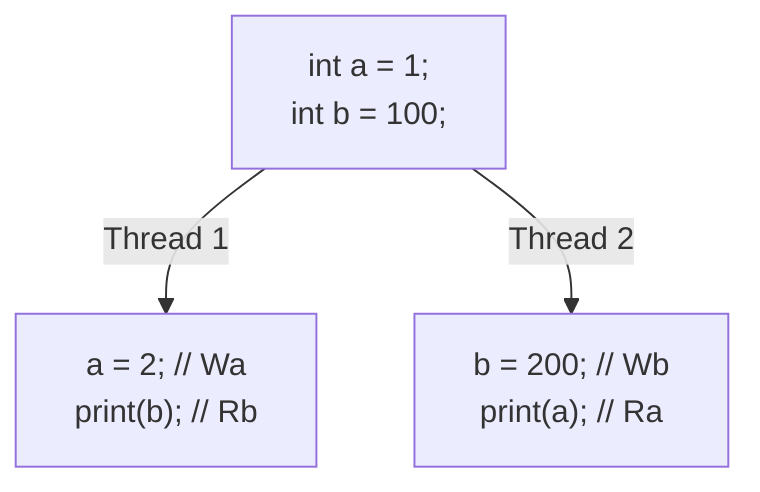
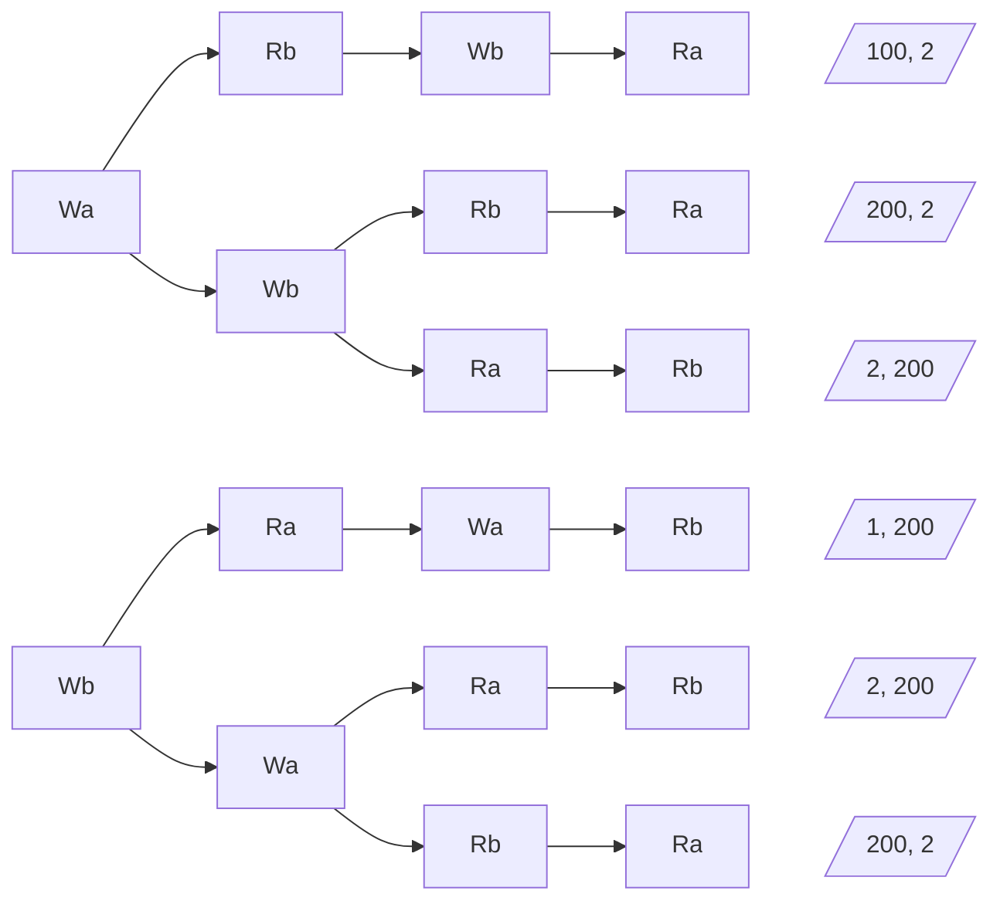
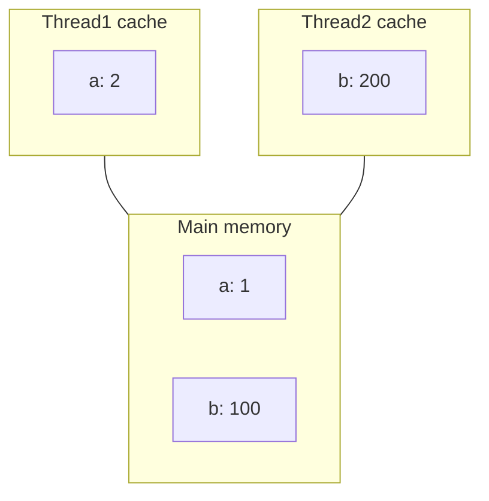
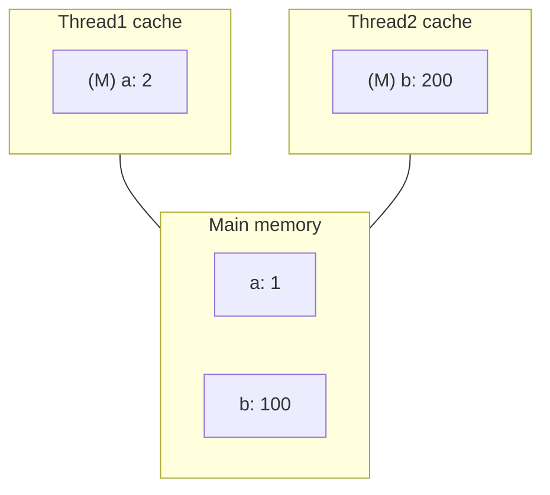
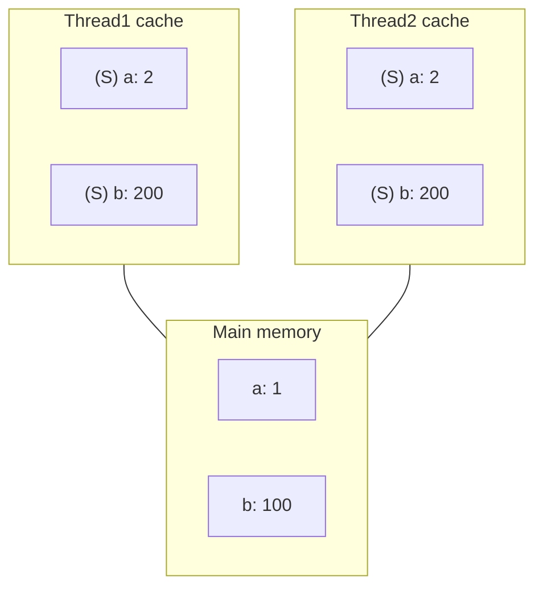

## Hyperthreading

---

프로세서는 명령어 스트림에서 명령어를 읽어 들인 뒤, 이를 분해하여 데이터 의존성과 제어 의존성을 추적한다. 그런 다음, 서로 독립적으로 동작하는 다양한 기능 유닛에 여러 연산을 스케줄링하여 명령어를 병렬적으로 실행한다.

그런데 대부분의 프로그램은 모든 기능 유닛을 다 활용하지 않는다. 예를 들어, 캐시 미스로 인한 로드(load) 블로킹이 발생하면 산술 연산 유닛들이 놀게 된다.

**하이퍼스레딩(Hyperthreading)**이라고도 알려진 **동시 멀티스레딩(Simultaneous Multi-Threading, SMT)**은 이러한 문제를 해결하기 위해 고안되었다. 명령어 제어와 관련된 상태를 여러 배로 늘려, 다수의 스레드가 기능 유닛을 공유하며 실행될 수 있게 한다.

> [다이어그램](https://www.cs.cmu.edu/afs/cs/academic/class/15213-s18/www/lectures/26-parallelism.pdf#page=6)[^parallelism] 참고
{: .prompt-info }

<br>

## Thread-Level Parallelism

---

### Example: Parallel Summation

$0$부터 $n - 1$까지의 정수 합을 구하는 간단한 병렬 프로그램에 대해 생각해 보자. $t$개의 스레드가 각각 $\lfloor \frac{n}{t} \rfloor$개의 수를 더한 뒤, 각 스레드의 결과를 합치는 방식으로 구현할 수 있다.

```c
/* Thread routine */
void *sum_local(void *vargp) {
    long myid = *((long *)vargp);
    long start = myid * nelems_per_thread;
    long end = start + nelems_per_thread;
    long sum = 0;

    for (long i = start; i < end; i++) {
        sum += i;
    }
    psum[myid] = sum;
    return NULL;
}
```

|         Threads (Cores) | 1 (1) | 2 (2) | 4 (4) | 8 (8) | 16 (8) |
| ----------------------: | ----: | ----: | ----: | ----: | -----: |
| **Running time (secs)** |  1.98 |  1.14 |   0.6 |  0.32 |   0.33 |

> CPU 스케줄러는 스레드들을 여러 코어에 분산시켜 실행하는데, 스레드 수가 코어보다 많으면 순환적으로 스케줄링하기 때문에 오히려 느려질 수 있다.
{: .prompt-info }

### Characterizing Parallel Program Performance

**스피드업(Speedup)**과 **효율성(Efficiency)**을 통해 병렬 프로그램의 성능을 평가할 수 있다.

**Speedup**

$$
S_p = \frac{T_1}{T_p}
$$

- $T_k$: 코어 $k$개를 사용할 때의 실행 시간
- **상대 스피드업(Relative speedup)**: 비교 기준$(T_1)$이 병렬 코드인 경우
- **절대 스피드업(Absolute speedup)**: 비교 기준$(T_1)$이 순차 코드인 경우

**Efficiency**

$$
E_p = \frac{S_p}{p} = \frac{T_1}{pT_p}
$$

- 이상적인 스피드업에 얼마나 근접하는지를 나타낸다.

### Performance of Parallel Summation

| Threads (Cores) | 1 (1) | 2 (2) | 4 (4) | 8 (8) | 16 (8) |
| --------------: | ----: | ----: | ----: | ----: | -----: |
|           $T_p$ |  1.98 |  1.14 |  0.60 |  0.32 |   0.33 |
|           $S_p$ |     1 |  1.74 |  3.30 |  6.19 |   6.00 |
|           $E_p$ |  100% |   87% |   82% |   77% |    75% |

### Amdahl's Law

**암달의 법칙(Amdahl's law)**을 통해 시스템의 일부를 개선하면 전체 성능이 얼마나 향상될지 예측할 수 있다.

$$
T_k = \frac{pT}{k} + (1 - p)T
$$

- $T$: 총 순차적 소요 시간
- $p$: 스피드업될 수 있는 부분의 비율 $(0 \leq p \leq 1)$
- $k$: 스피드업 인자

이로부터 최대 스피드업을 계산할 수 있다.

$$
S_\infty = \frac{T}{T_\infty} = \frac{1}{1 - p}
$$

$p = 0.1$인 경우, 나머지 90%를 아무리 빠르게 실행해도 10배 이상의 성능 향상은 얻을 수 없다. 이는 병렬 프로그래밍에서 $k$개의 코어로 애플리케이션의 일부를 $k$배 빠르게 실행하더라도, 순차적으로 실행되는 부분이 전체 성능을 제한한다는 것을 의미한다.

### More Substantial Example: Quicksort

이번에는 **퀵 정렬(Quicksort)**을 이용하여 숫자를 정렬하는 경우에 대해 생각해 보자.

1. 배열에서 피벗 원소를 선택하여, 피벗을 기준으로 작은 원소와 큰 원소로 나눈다.
2. 재귀적으로 두 부분을 각각 정렬(분할 정복)해 나가면, 최종적으로 전체 배열이 정렬된다.

{: .bg-white }
_Full example of quicksort[^quicksort]_

퀵 정렬은 **제자리 알고리즘(In-place algorithm)**으로, 추가 공간을 거의 사용하지 않고 배열 내에서 원소들을 교환하는 것만으로 정렬할 수 있다.

### Sequential Quicksort

```c
void qsort_serial(data_t *base, size_t nele) {
    if (nele <= 1)
        return;
    if (nele == 2) {
        if (base[0] > base[1])
            swap(base, base + 1);
        return;
    }
    size_t m = partition(base, nele);  /* Returns index of pivot */
    if (m > 1)
        qsort_serial(base, m);
    if (nele - 1 > m + 1)
        qsort_serial(base + m + 1, nele - m - 1);
}
```

### Parallel Quicksort

피벗으로 구분된 양쪽이 각각 정렬되어야 하므로, 재귀적으로 2개의 스레드를 생성하여 처리할 수 있다. 다만 스레드를 생성하고 초기화하는 데 큰 오버헤드가 발생하므로, 일반적으로 코어 수만큼의 스레드를 미리 생성해 놓고 계속해서 재사용한다. 각 스레드는 공유 작업 큐를 통해 작업을 할당받는다.

```c
/* Top-level function (Simplified) */
void tqsort(data_t *base, size_t nele) {
    init_task(nele);
    global_base = base;
    global_end = global_base + nele - 1;
    task_queue_ptr tq = new_task_queue();   /* Set up data structures */
    tqsort_helper(base, nele, tq);          /* Call recursive sort routine */
    join_tasks(tq);                         /* Keep joining thread until none left */
    free_task_queue(tq);                    /* Free data structures */
}

/* Recursive sort routine (Simplified) */
static void tqsort_helper(data_t *base, size_t nele, task_queue_ptr tq) {
    /* Small partition: Sort serially */
    if (nele <= nele_max_sort_serial) {
        qsort_serial(base, nele);
        return;
    }
    /* Large partition: Spawn new sort task */
    sort_task_t *t = new_task(base, nele, tq);
    spawn_task(tq, sort_thread, (void *)t);
}

/* Thread routine (Simplified) */
static void *sort_thread(void *vargp) {
    /* Get task parameters */
    sort_task_t *t = (sort_task_t *)vargp;
    data_t *base = t->base;
    size_t nele = t->nele;
    task_queue_ptr tq = t->tq;
    free(vargp);

    /* Perform partitioning step */
    size_t m = partition(base, nele);

    /* Call recursive sort routine on each partition */
    if (m > 1)
        tqsort_helper(base, m, scratch_base, tq);
    if (nele - 1 > m + 1)
        tqsort_helper(base + m + 1, nele - m - 1, tq);
    return NULL;
}
```

<br>

## Memory Consistency

---

전역 변수 `a`, `b`와 2개의 스레드가 있다. 스레드 1은 `a`에 값을 할당한 뒤 `b`의 값을 출력하고, 스레드 2는 `b`에 값을 할당한 뒤 `a`의 값을 출력한다. 이 프로그램의 출력은 어떻게 될까?



### Sequential Consistency

**순차적 일관성(Sequential consistency)** 모델은 한 스레드 내에서는 이벤트가 순서대로 발생하지만, 스레드 간의 이벤트 순서는 임의적이다.



### Non-Coherent Cache Scenario

각 스레드가 서로 동기화되지 않는 자체적인 write-back 캐시를 가지고 있다면, 두 스레드는 서로가 `a`, `b`의 수정된 사본을 가지고 있다는 것을 모른 채 메모리에서 값을 가져와 `1`과 `100`을 출력할 것이다.



### Snoopy Caches

멀티 코어 프로세서에서는 캐시 일관성을 유지하기 위해 **스누피 캐시(Snoopy Cache)**라는 메커니즘을 사용한다.

- 모든 코어가 공유 값을 읽기만 하는 경우, 각 코어는 성능 최적화를 위해 해당 값을 자신의 캐시에 복사할 수 있다.
- 한 코어가 쓰기를 원할 경우, 배타적 사본을 획득하여 다른 스레드가 접근하는 것을 차단해야 한다. 이를 위해, 태그를 이용하여 캐시 블록의 상태를 표시한다.

  | 상태          | 의미   |   접근    | 다른 코어와 공유 | 주 메모리와 일치 |
  | :------------ | :----- | :-------: | :--------------: | :--------------: |
  | Modified (M)  | 수정됨 | 읽기/쓰기 |      불가능      |      불일치      |
  | Exclusive (E) | 배타적 | 읽기/쓰기 |      불가능      |       일치       |
  | Shared (S)    | 공유됨 |   읽기    |       가능       |       일치       |
  | Invalid (I)   | 무효   |     -     |        -         |        -         |

두 스레드가 각각 `a`, `b`에 쓰기 위해서는 해당 요소의 배타적 사본(E)을 획득하고 다른 캐시의 사본을 무효화(I)해야 한다.



쓰기 작업이 완료(M)된 후 읽기가 발생하면, 캐시 미스가 발생하여 버스를 통해 해당 값을 읽고 싶다는 신호를 보낸다. 이때 주 메모리 대신 다른 캐시에서 값을 제공하고, 로컬에서는 공유 상태(S)로 표시된다.



<br>

## References

---

- [Carnegie Mellon University. (2015). Lecture 26: Thread-Level Parallelism. [Online].](https://scs.hosted.panopto.com/Panopto/Pages/Viewer.aspx?id=9ba08262-5318-45f2-a7e1-475e33a98e53)

### Footnote

[^parallelism]: [F. Franchetti, S. C. Goldstein and B. Railing. (2018). Thread-Level Parallelism. [Online].](https://www.cs.cmu.edu/afs/cs/academic/class/15213-s18/www/lectures/26-parallelism.pdf)
[^quicksort]: ["Quicksort-diagram." Wikimedia Commons. [Online].](https://commons.wikimedia.org/wiki/File:Quicksort-diagram.svg)
