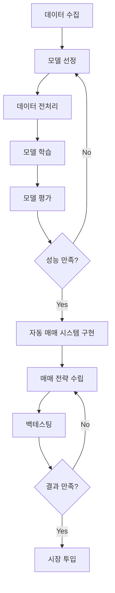
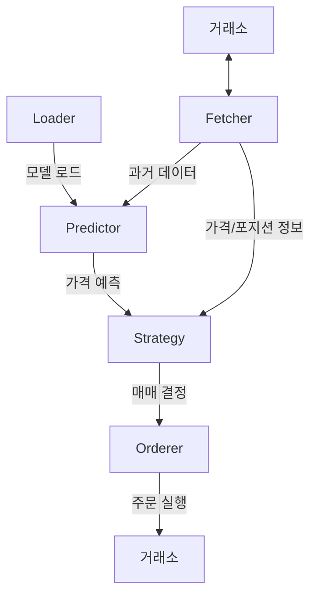
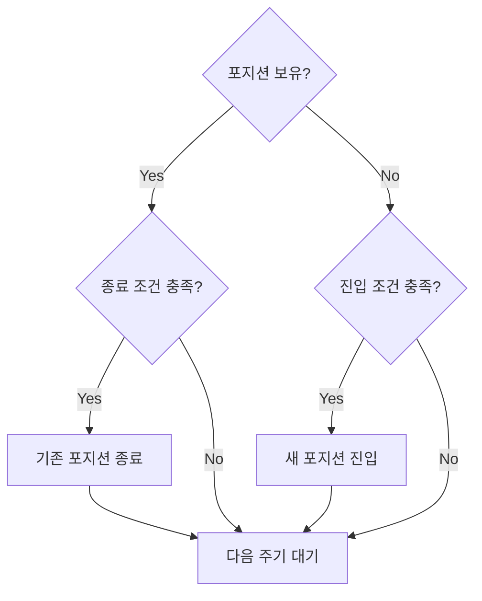

## Introduction

---

암호화폐 시장은 2009년 비트코인의 탄생 이후, 급격한 성장을 거듭하며 금융계의 주요 화두로 자리잡았다. 2021년 코인 열풍이 불던 당시, 나 또한 여느 불나방처럼 시장에 날아들었지만 자이로드롭 뺨치는 가격 변동성에 정신없이 휘둘리기만 하다가 결국 뛰쳐나왔다.

{: w="300" .border }
_뉴비에게는 너무 가혹한 장이었다..[^mongle]_

그렇게 관심을 끄고 지내던 중, 올해 초 흥미로운 소식을 접하게 되었다. 미국 증권거래위원회(SEC)가 비트코인 ETF를 승인했다는 것이었다. 게다가 마침 4년마다 찾아오는 비트코인 반감기까지 다가오고 있었다. 이러한 소식들에 힘입어, 비트코인은 다시금 내 머릿속을 비집고 들어왔다. 그리고 문득, 대학 시절 딥러닝 강의에서 수행했던 '암호화폐 시계열 예측' 프로젝트가 떠올랐고, 이를 실제 거래에 적용할 수 있는 자동화 시스템으로 발전시키기로 결심했다.

<br>

## Project Outline

---

프로젝트의 목표는 딥러닝 모델을 이용해 비트코인의 가격을 예측하고, 이를 바탕으로 자동으로 거래를 수행하는 시스템을 구축하는 것이다. 프로젝트의 전체적인 흐름은 다음과 같다.



지난번에 모델 평가 단계에서 그쳤던 셈이기에, 이번에는 자동 매매 시스템 구현과 배포에 초점을 맞추었다. 로컬 서버를 24시간 가동할 수 있는 환경이 갖춰지지 않은 관계로, 서버리스 컴퓨팅 서비스의 일종인 [AWS Lambda](https://aws.amazon.com/lambda/)를 이용해 보기로 했다.

<br>

## Deep-Learning Models

---

### Model Training

딥러닝에 관심 있는 사람이라면 누구나 한 번쯤은 '금융 시장의 과거 데이터로 미래 가격 예측'이라는 주제에 대해 생각해 봤을 것이다. 이를 실행에 옮긴 많은 시도가 기록으로 남아 있으니, 관련 자료를 탐색해 보는 것을 추천한다.

이 프로젝트에서는 다변량 데이터를 이용한 Conv-LSTM 모델이 가장 높은 예측 정확도를 보인다는 연구 결과를 참고했다.[^study]

> 해당 자료는 공식적인 피어 리뷰를 거치지 않은 preprint 논문이므로, 보다 신뢰할 만한 자료를 원한다면 정식 학술지에 게재된 연구를 참고하는 것이 좋다.
{: .prompt-info }

모델 생성을 위해 [GitHub](https://github.com/sydney-machine-learning/deeplearning-crypto)[^study]에 공개되어 있는 소스 코드(`main.py`)에서 필요한 부분을 수정하여 사용했다. 나중에 새로운 입력 데이터에 대해 학습 데이터와 동일한 전처리를 수행해야 하므로, 학습 데이터 전처리에 사용된 스케일러도 저장해 두어야 한다.

```diff
@@ -14,37 +14,21 @@ from pmdarima import auto_arima
 from scipy import stats
 from statsmodels.tsa.arima.model import ARIMA
 import matplotlib.pyplot as plt
+from pickle import dump
+import ccxt
+from config import Config
+from fetcher import Fetcher

 def read_data(path, dim_type, gold_path=None, use_percentage=1):
     '''
     读取数据(详细说明)
     '''
-    df = pd.read_csv(path)
-    data_len = df.shape[0]
-    data = None
-    if dim_type!='Multi':
-        data = df[dim_type].values.reshape((data_len, 1))
-    else:
-        # Multi
-        df["Date"]=pd.to_datetime(df["Date"], format='%Y-%m-%d %H:%M:%S').dt.strftime('%Y-%m-%d')
-        open_data = df["Open"].values.reshape((data_len, 1))
-        high_data = df["High"].values.reshape((data_len, 1))
-        low_data = df["Low"].values.reshape((data_len, 1))
-        close_data = df["Close"].values.reshape((data_len, 1))
-        if gold_path is not None:
-            gold=pd.read_excel(gold_path) # 读取金价
-            gold['Date']=gold['Date'].dt.strftime('%Y-%m-%d')
-            df['Gold']=df['Date']
-
-            # calc the gold series
-            df['Gold'] = df['Gold'].apply(lambda x: gold['Price'][x==gold['Date']].values[0] if x in gold['Date'].values else np.nan)
-            # fillna using interpolating
-            df['Gold'] = df['Gold'].interpolate(limit_direction="both")
-
-            gold_data=df["Gold"].values.reshape((data_len, 1))
-            data = np.hstack((close_data, open_data, high_data, low_data, gold_data))
-        else:
-            data = np.hstack((close_data, open_data, high_data, low_data))
+    config = Config()
+    exchange_class = getattr(ccxt, config.EXCHANGE_ID)
+    exchange = exchange_class()
+    fetcher = Fetcher(exchange, config.SYMBOL)
+    data = fetcher.fetch_historical_data(config.INTERVAL, config.START_TIME)
+    data_len = len(data)
     return data[0:int(np.floor(data_len * use_percentage))], np.floor(data_len * use_percentage)

 def split_sequence(sequence, dim_type, n_steps_in, n_steps_out):
@@ -59,7 +43,7 @@ def split_sequence(sequence, dim_type, n_steps_in, n_steps_out):
             break
         if dim_type == 'Multi':
             # gather input and output parts of the pattern
-            seq_x = sequence[i:end_ix, 1:]
+            seq_x = sequence[i:end_ix]
             seq_y = sequence[end_ix:out_end_ix, 0]
         else:
             seq_x, seq_y = sequence[i:end_ix], sequence[end_ix:out_end_ix]
@@ -313,14 +297,14 @@ def main():
     # -----------------parameters-----------------
     model_hub = ['LSTM', 'BD LSTM', 'ED LSTM', 'CNN', 'Convolutional LSTM', 'Transformer', 'MLP', 'ARIMA']
     file_path = r"./coin_Bitcoin.csv"
-    dim_type = 'Close'  # 'Multi' or 'Open', 'High', 'Low', 'Close', 'Marketcap' (选取数据的维度或类型)
+    dim_type = 'Multi'  # 'Multi' or 'Open', 'High', 'Low', 'Close', 'Marketcap' (选取数据的维度或类型)
     gold_path = r"./GoldPrice.xlsx"
-    use_percentage = 1  # 使用的数据百分比(=1就是全部数据)
+    use_percentage = 0.9  # 使用的数据百分比(=1就是全部数据)

-    n_steps_in = 6  # 输入步长
-    n_steps_out = 5 # 输出步长
+    n_steps_in = 5  # 输入步长
+    n_steps_out = 1 # 输出步长

-    percentage = 0.7  # 训练集百分比
+    percentage = 0.9  # 训练集百分比
     epochs = 100  # 迭代次数
     rounds = 30  # Number of exp

@@ -339,7 +323,7 @@ def main():

     # define the used features
     # used gold price or no used
-    n_features = len(train_set[0]) - 1 if len(train_set[0]) > 1 else 1
+    n_features = len(train_set[0])

     # ------------------create model and prediction---------------
     model_type = 'Convolutional LSTM' # Encoder-Decoder
@@ -347,6 +331,8 @@ def main():

     exp_result=pd.DataFrame({},columns=['Train MINMAX RMSE', 'Test MINMAX RMSE', 'Train MAPE', 'Test MAPE'])

+    if not os.path.exists('models'):
+        os.makedirs('models')

     for round in range(rounds):
         print(f"the {round}-th exp, total:{rounds} rounds")
@@ -397,6 +383,12 @@ def main():
                                                     test_MAPE]
         exp_result.to_excel("results.xlsx")

+        model_path = f'models/model-{round}.keras'
+        scalers_path = 'models/scalers.pkl'
+        Model.save(model_path)
+        if not os.path.exists(scalers_path):
+            with open(scalers_path, 'wb') as f:
+                dump(scalers, f)

     # 绘图
     if n_steps_out == 1:
```

실행하기에 앞서, `config.yaml` 파일에서 필요한 값들을 설정해 주어야 한다.

[Binance Futures](https://www.binance.com/en/futures/home)에서 비트코인의 일봉 데이터를 가져오는 경우:

- `EXCHANGE_ID: 'binanceusdm'`
- `INTERVAL: '1d'`
- `SYMBOL: 'BTC/USDT:USDT'`
- `START_TIME: '2019-09-13T04:00:00Z'` (바이낸스 선물 출시일)

> 거래소 데이터 접근을 위해 [CCXT](https://github.com/ccxt/ccxt) 라이브러리를 사용했으며, 가능한 설정 값들은 [CCXT docs](https://docs.ccxt.com/#/)에서 확인할 수 있다.
{: .prompt-info }

`main.py`를 `fetcher.py`와 같은 디렉터리에 위치시키고, 필요한 모듈을 설치한 뒤 코드를 실행하자.

```bash
(env) user@host:~/trading-bot/src$ python main.py
```

`round`개의 모델이 생성되고, 각 모델의 오차 값이 `results.xlsx` 파일에 기록된다. 입력 데이터가 동일하므로, 스케일러는 하나만 생성된다.

{: w="600" .border }
_results.xlsx_

### Model Evaluation

{: w="600" .border }

현재 가격과 예측 가격을 비교해 보면, 두 그래프가 얼추 포개어질 정도로 별다른 차이가 없어 보인다. Loss를 최소화하는 방향으로 모델을 학습시키고 봤더니, '다음 가격도 현재와 비슷할 것'이라는 결론을 내리는 것이다. 예측 가격은 다음 시점의 가격을 예측한 것이므로, 두 그래프의 시점을 일치시켜 보면...

{: w="600" .border }
_엥? 이거 완전 이평선 아니냐?_

이처럼 후행성 지표나 다름없는 예측 결과가 나타나게 된다. 각종 연구 자료에서 '우리 모델의 예측 오차가 이만큼 작다'고 결론짓는 모습을 볼 수 있는데, 위와 같은 time-lag 현상으로 인해 오차가 작다고 해서 반드시 실용적인 모델인지는 알 수 없다. 이러한 문제를 해결하기 위해, 금융 데이터를 단순 시계열로 취급하는 데서 그치지 않고 시세 형성에 영향을 미치는 다양한 외부 요인을 고려하기도 한다. 예를 들면, 뉴스나 SNS 같은 대중 매체를 감성 분석하여 그 데이터를 모델 학습에 활용하는 것이다.

요점은, 모델의 예측 성능을 평가한 지표에 너무 집중할 필요는 없다는 것이다. 차라리 예측 결과를 토대로 매매 전략을 세우고, 이를 백테스팅하여 얻은 투자 수익률이 더 현실적이고 유용한 지표가 될 수 있다.

<br>

## Design

---

세부적인 구현과 사용법은 [GitHub 리포지토리](https://github.com/jjongs2/trading-bot)를 참고하기 바란다.

### Data Flow



### Trade Decision Process



<br>

## Conclusion

---

백테스팅 결과를 바탕으로 매매 전략을 최적화해 보자.

- 시장 상황에 따른 거래 결과와 잔고 변화의 추이를 면밀히 관찰하자.
- 시장 외부 요인으로 인해 가격 변동성이 급격하게 커질 수 있으므로, 리스크 관리를 소홀히 하지 말자.

백테스팅을 마쳤으면, 이제 실전 투자에 나설 때이다.

{: w="300" }
_드가자~[^mongle]_

백테스팅 결과를 근거로 하여 매매 전략을 세우는 것은, 미래 시장이 과거와 유사한 패턴을 보일 것이라는 가정에 기초한다는 사실을 명심하자. 즉, 실전에서는 백테스팅 결과와 다른 성적이 나올 수 있으므로, 재미로 굴릴 만한 정도의 시드만 투입하는 것이 좋다.

<br>

## References

---

### Footnote

[^mongle]: [몽글이. Facebook. [Online].](https://www.facebook.com/monglebabo)
[^study]: [J. Wu, X. Zhang, F. Huang, H. Zhou, and R. Chandra, "Review of deep learning models for crypto price prediction: implementation and evaluation," 2024, arXiv:2405.11431. [Online].](https://arxiv.org/abs/2405.11431)
