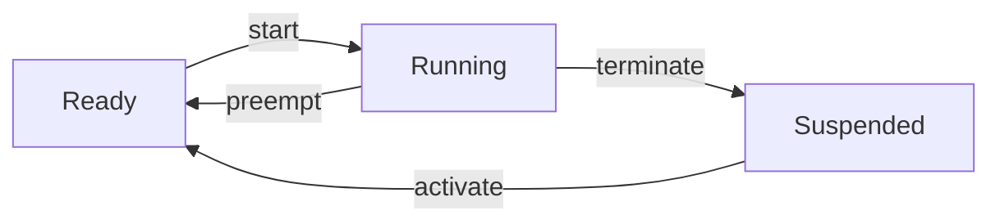
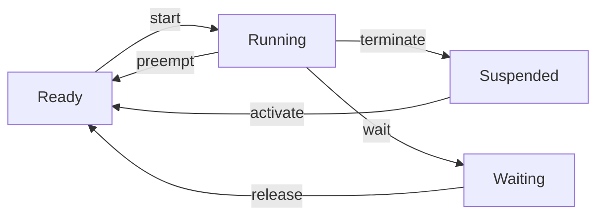

## Real-Time Embedded Systems

---

### Real-Time System

**실시간 시스템**은 논리적 정확성과 시간적 정확성을 모두 만족해야 하는 컴퓨팅 시스템이다.

- **논리적 정확성 (Logical correctness)**: 올바른 출력을 생성
- **시간적 정확성 (Temporal correctness)**: 정해진 시간 내에 출력을 생성

### Embedded System

**임베디드 시스템**은 특정 기능을 전담하여 수행하며, 보통 사용자에게 드러나지 않는 형태로 더 큰 시스템의 일부로 포함된다. 자동차, 가전제품, 산업용 로봇 등 다양한 분야에서 사용된다.

### Automotive System

자동차 시스템은 **실시간 임베디드 시스템**의 대표적인 예시이다.

- 다수의 **ECU(Electronic Control Unit)**가 네트워크로 연결
- 시간적 정확성은 **종단 간 지연(End-to-end delay)**으로 정의
  - 센서 → ECU 및 네트워크 → 액추에이터

<br>

## Automotive Computing Platforms

---

자동차 컴퓨팅 플랫폼은 용도에 따라 크게 세 가지로 분류된다.

| Category         | Hardware        | Network                 | Requirements                                                                                     |
| :--------------- | :-------------- | :---------------------- | :----------------------------------------------------------------------------------------------- |
| **Control**      | (Multicore) CPU | CAN                     | • Functional Safety (ISO 26262)<br>• Real-Time Scheduling<br>• Multicore Validation/Optimization |
| **Infotainment** | CPU + GPU       | Wireless (LTE, BT, ...) | • Security (ISO/SAE 21434)<br>• Connectivity (OTA)<br>• New User Experiences                     |
| **Intelligence** | CPU + GPU + NPU | Ethernet                | • Accelerators (GPU, NPU, ...)<br>• Intended Safety (SOTIF)<br>• Choice of Operating System      |

<br>

## Why RTOS?

---

임베디드 시스템의 소프트웨어는 크게 펌웨어와 RTOS 기반 방식으로 나눌 수 있다.

| Firmware (Superloop)                                     | RTOS                                                                               |
| :------------------------------------------------------- | :--------------------------------------------------------------------------------- |
| 단일 루프 내에서 모든 작업을 순차적으로 처리한다.        | 여러 개의 독립적인 **태스크(Task)**로 작업을 분할하고,<br>운영체제가 스케줄링한다. |
| 구조가 간단하고 예측이 쉽다.                             | 복잡한 시스템을 체계적으로 설계하고 관리할 수 있다.                                |
| 작업이 많아지면 특정 작업의 실행 주기를 보장하기 어렵다. | 태스크별로 우선순위를 부여하여 중요한 작업을 먼저 처리할 수 있다.                  |

**Firmware (Superloop)**

```c
main()
{
    system_init();
    while(1) {
        do_A();
        do_B();
        do_C();
    }
}
```

**RTOS**

```c
TASK(5ms)
{
    do_A();
    TerminateTask();
}

TASK(10ms)
{
    do_B();
    TerminateTask();
}

TASK(50ms)
{
    do_C();
    TerminateTask();
}
```

<br>

## Real-Time Scheduling Theory

---

실시간 시스템의 동작을 분석하고 설계하기 위해 **참조 모델(Reference model)**을 사용한다. 이는 불필요한 세부 사항을 숨기고 문제의 핵심 특성(워크로드, 리소스, 알고리즘)에 집중하게 해준다.

- **Workload Model**: 시스템이 처리해야 할 작업의 특성을 정의
- **Resource Model**: 작업을 처리하는 데 사용되는 하드웨어 자원을 정의
- **Scheduling Algorithm**: 작업을 리소스에 할당하는 규칙

### Workload Model

- **Job**: 작업의 단위 (e.g. 센서 값 읽기)
- **Task**: 동일한 job의 시퀀스 (e.g. 센서 값 주기적 읽기 태스크)

- **Release Time**: Job이 실행 준비되는 시점

  | Type          | Description                |
  | :------------ | :------------------------- |
  | **Periodic**  | 엄격하게 주기적으로 릴리스 |
  | **Sporadic**  | 최소 릴리스 간격 보장      |
  | **Aperiodic** | 불규칙한 패턴              |

- **Deadline**: Job이 완료되어야 하는 시점

  | Type         | Description                             |
  | :----------- | :-------------------------------------- |
  | **Absolute** | 절대 시간으로 지정                      |
  | **Relative** | Job 릴리스 시점으로부터의 시간으로 표현 |

  | Type            | Description                      |
  | :-------------- | :------------------------------- |
  | **Implicit**    | Deadline = Period                |
  | **Constrained** | Deadline ≤ Period                |
  | **Arbitrary**   | Deadline이 Period보다 클 수 있음 |

  | Type     | Description                  |
  | :------- | :--------------------------- |
  | **Hard** | 미충족 시 치명적인 결과 초래 |
  | **Soft** | 미충족 시 성능 저하에 그침   |

- **Execution Time**: Job을 완료하는 데 필요한 시간

  | Type              | Description                                                              |
  | :---------------- | :----------------------------------------------------------------------- |
  | **Deterministic** | 주로 **최악 실행 시간(Worst-Case Execution Time, WCET)**을 기준으로 분석 |
  | **Stochastic**    | 확률 분포로 표현                                                         |

### Scheduling Algorithm

- **Schedule**: 시간에 따라 job을 리소스에 할당한 결과
- **Scheduler**: 스케줄링 알고리즘을 구현한 운영체제의 모듈
- **Feasibility**: 특정 스케줄에 대해 모든 태스크가 데드라인 내에 처리될 수 있는가?
- **Schedulability**: 특정 태스크 집합에 대해 실행 가능한 스케줄이 존재하는가?

**Scheduling Types**

| Type               | Description                              |
| :----------------- | :--------------------------------------- |
| **Preemptive**     | 현재 실행 중인 태스크를 임의로 중단 가능 |
| **Non-preemptive** | 현재 태스크가 완료될 때까지 대기         |
| **Cooperative**    | 미리 정의된 시점에서만 선점 허용         |

<br>

## OSEK/VDX Specification

---

**OSEK/VDX**[^osek]는 자동차 전자장치용 RTOS에 대한 공개 표준이다. 독일의 OSEK과 프랑스의 VDX 표준이 통합된 것으로, 특정 구현이 아닌 산업 표준 **명세(Specification)**이다. 이를 기반으로 다양한 상용 및 오픈 소스 RTOS가 개발되었다.

- **상용**: ETAS RTA-OSEK, EB TRESOS OSEKCORE, Vector osCAN
- **오픈 소스**: ERIKA Enterprise, Trampoline OSEK, nxtOSEK

### OS Objects

| Object       | Description                                                            |
| :----------- | :--------------------------------------------------------------------- |
| **Task**     | OS가 제어하는 코드 단위                                                |
| **ISR**      | 하드웨어가 트리거하는 인터럽트 핸들러 (Interrupt Service Routine)      |
| **Resource** | 공유 자원에 대한 동시 접근을 막기 위한 잠금 메커니즘                   |
| **Counter**  | 하드웨어 타이머의 추상화                                               |
| **Alarm**    | 특정 카운터 값에 도달했을 때 태스크 활성화, 이벤트 설정 등의 액션 수행 |
| **Event**    | 태스크 간의 동기화를 위해 사용                                         |

### Task

**C 코드**로 실제 동작을 정의하고, **OIL(OSEK Implementation Language) 코드**로 속성(우선순위, 스케줄링 방식 등)을 설정한다.

**Basic Task**



**Extended Task**



> 확장 태스크의 경우 waiting 상태가 있어, 특정 이벤트가 발생할 때까지 대기할 수 있다.
{: .prompt-info }

### Hook Routines

운영체제 내부의 특정 이벤트 발생 시점(부팅, 종료, 에러 발생 등)에 사용자가 정의한 함수를 실행할 수 있게 하는 기능이다.

| Routine                        | Description                                           |
| :----------------------------- | :---------------------------------------------------- |
| **StartupHook**                | 시스템 부팅 시 OS 초기화와 첫 태스크 실행 사이에 호출 |
| **ShutdownHook**               | 시스템 종료 시 호출                                   |
| **ErrorHook**                  | OS 서비스에서 에러 발생 시 호출                       |
| **PreTaskHook / PostTaskHook** | Context switch 시점에 호출                            |

### AUTOSAR OS

**AUTOSAR(AUTomotive Open System ARchitecture)**는 자동차 소프트웨어 구조의 표준화를 위한 글로벌 파트너십으로, AUTOSAR OS는 OSEK/VDX 표준을 확장한 것이다. 다음과 같은 기능들이 추가되었다.

- **스케줄 테이블 (Schedule table)**: 정해진 시간에 태스크를 실행
- **타이밍 보호 (Timing protection)**: 태스크가 할당된 실행 시간을 초과하지 않도록 보호
- **메모리 보호 (Memory protection)**: 태스크가 할당된 메모리 영역을 벗어나 접근하지 않도록 보호

<br>

## References

---

### Footnote

[^osek]: [_OSEK/VDX Operating System Specification 2.2.3_, 2005. [Online].](https://www.irisa.fr/alf/downloads/puaut/TPNXT/images/os223.pdf)
