## Resource Sharing

---

### Shared Resource

컴퓨터 시스템에는 다양한 **공유 자원(Shared resource)**이 존재한다.

- 전역 및 정적 변수
- 파일
- 공유 메모리 영역
- 하드웨어 레지스터

여러 스레드가 동시에 같은 자원에 접근할 때 **경쟁 상태(Race condition)**를 유발할 수 있다.

> 경쟁 상태란 **실행 결과가 스케줄링과 같은 제어할 수 없는 이벤트의 순서나 타이밍에 따라 달라지는 현상**을 의미한다.[^race-condition]
{: .prompt-info }

### Mutual Exclusion

**임계 구역(Critical section)**은 공유 자원을 다루는 코드 영역이다. 경쟁 상태를 방지하기 위해서는 **상호 배제(Mutual exclusion)**, 즉 한 번에 하나의 스레드만 임계 구역에 들어갈 수 있도록 보장해야 한다.

1. **스케줄링 비활성화**: 임계 구역 진입 전 스케줄링을 비활성화하고, 진출 후 다시 활성화한다. 하지만 이는 특별한 권한이 필요하며, 악의적인 프로그램이 시스템을 마비시킬 수 있는 위험이 있다. 또한 인터럽트 핸들러의 접근으로부터 보호되지 않는다.
2. **인터럽트 비활성화**: 타이머 인터럽트(스케줄링)를 포함한 모든 인터럽트를 비활성화한다. 그러나 외부 이벤트에 응답할 수 없게 되는 단점이 있다.
3. **잠금 (Lock)**: 스레드 간의 약속을 통해 임계 구역을 보호하는 가장 일반적인 방법이다. Lock을 획득한 스레드만이 임계 구역에 진입할 수 있다.

<br>

## Lock Implementation

---

단순하게 플래그 변수를 사용한 lock 구현은 `test`와 `set` 동작 사이에서 선점이 발생할 경우 상호 배제를 보장하지 못하는 문제가 있다.

```c
typedef struct __lock_t { int flag; } lock_t;

void lock(lock_t *mutex) {
    while (mutex->flag == 1)  // TEST
        ;                     // spin-wait
    // ← 만약 이 시점에 선점된다면?
    mutex->flag = 1;          // SET
}
```

이러한 문제를 해결하기 위해 하드웨어 수준에서 원자적(atomic) 명령어를 지원한다.

```c
void lock(lock_t *mutex) {
    while (test_and_set(&mutex->flag) == 1)
        ;  // spin-wait
}
```

Lock을 얻지 못했을 때의 대기 방식에 따라 다음과 같이 나뉜다.

**Spinlock**

Lock을 얻을 때까지 계속 확인하며 CPU 자원을 소모한다. 대기 시간이 짧을 것으로 예상될 때 유리하다. (주로 멀티 코어 환경)

**Mutex (Blocking Lock)**

대기 큐에 들어가 휴면 상태로 전환되어 CPU를 낭비하지 않는다. 스레드 상태 전환에 따른 오버헤드가 있다. (주로 단일 코어 환경)

<br>

## Problems Caused by Locks

---

Lock 메커니즘은 상호 배제를 보장하지만, **교착 상태(Deadlock)**나 **우선순위 역전(Priority inversion)**과 같은 심각한 문제를 야기할 수 있다.

### Deadlock

두 개 이상의 태스크가 서로가 점유하고 있는 자원을 기다리며 무한 대기 상태에 빠지는 현상이다.[^deadlock] **모든 태스크가 동일한 순서로 자원을 요청하도록 강제**하여 순환 대기(circular wait)를 원천적으로 방지할 수 있다.

### Priority Inversion

우선순위 높은 태스크 $T_H$가 낮은 태스크 $T_L$ 때문에 대기 상태에 빠지는 현상이다.

```mermaid
---
    displayMode: compact
---
gantt
    dateFormat X
    axisFormat %s

    section T_H
    ⠀ : 5, 6
    Blocked : done, 6, 12
    ⠀ : crit, 12, 15
    ⠀ : 15, 16
    P : milestone, 6, 0s
    V : milestone, 15, 0s
    section T_L
    ⠀ : 0, 3
    ⠀ : crit, 3, 5
    ⠀ : crit, 6, 12
    ⠀ : 16, 17
    P : milestone, 3, 0s
    V : milestone, 11, 2s
```



- **P**: Lock(S)
- **V**: Unlock(S)

### Unbounded Priority Inversion

우선순위 역전이 발생한 상태에서 중간 우선순위 태스크 $T_M$이 실행되면, $T_L$은 선점되어 lock을 해제하지 못한다. 만약 $T_M$과 같은 중간 우선순위의 태스크가 계속해서 들어온다면, $T_H$는 무한 대기 상태에 빠지게 된다.

```mermaid
---
    displayMode: compact
---
gantt
    dateFormat X
    axisFormat %s

    section T_H
    ⠀ : 6, 7
    Blocked : done, 7, 11
    ⠀ : crit, 11, 14
    ⠀ : crit, active, 14, 17
    ⠀ : crit, 17, 18
    ⠀ : 18, 19
    P1 : milestone, 7, 0s
    P2 : milestone, 14, 0s
    V2 : milestone, 17, 0s
    V1 : milestone, 18, 0s
    section T_M
    ⠀ : 4, 5
    ⠀ : crit, active, 5, 6
    ⠀ : crit, active, 7, 8
    ⠀ : 8, 9
    P2 : milestone, 5, 0s
    V2 : milestone, 8, 0s
    section T_L
    ⠀ : 0, 2
    ⠀ : crit, 2, 4
    ⠀ : crit, 9, 11
    ⠀ : 19, 20
    P1 : milestone, 2, 0s
    V1 : milestone, 10, 2s
```



> 이 문제는 1997년 화성 탐사선 패스파인더(Mars Pathfinder)에서 시스템 리셋을 유발한 원인이기도 했다.[^mars-pathfinder]
{: .prompt-info }

<br>

## Resource Sharing Protocols

---

### PIP (Priority Inheritance Protocol)

$T_H$가 $T_L$이 점유한 자원을 기다릴 때, $T_L$의 우선순위를 일시적으로 $T_H$의 우선순위로 높인다. 이로써 $T_M$이 $T_L$을 선점하는 것을 막아 $T_H$의 대기 시간을 줄인다. 하지만 chained blocking이나 교착 상태가 발생하는 것을 막지는 못한다.

```mermaid
---
    displayMode: compact
---
gantt
    dateFormat X
    axisFormat %s

    section T_H
    ⠀ : 6, 7
    ⠀ : done, 7, 9
    ⠀ : crit, 9, 12
    ⠀ : done, 12, 13
    ⠀ : crit, active, 13, 16
    ⠀ : crit, 16, 17
    ⠀ : 17, 18
    P1 : milestone, 7, 0s
    P2 : milestone, 12, 0s
    V2 : milestone, 16, 0s
    V1 : milestone, 17, 0s
    section T_M
    ⠀ : 4, 5
    ⠀ : crit, active, 5, 6
    ⠀ : crit, active, 12, 13
    ⠀ : 18, 19
    P2 : milestone, 5, 0s
    V2 : milestone, 12, 2s
    section T_L
    ⠀ : 0, 2
    ⠀ : crit, 2, 4
    ⠀ : crit, 7, 9
    ⠀ : 19, 20
    P1 : milestone, 2, 0s
    V1 : milestone, 8, 2s
```



### PCP (Priority Ceiling Protocol)

우선순위 상속의 문제점을 해결하기 위해 자원 획득 규칙이 추가되었다. 먼저 각 자원에 대해 **해당 자원을 사용하는 모든 태스크 중 가장 높은 우선순위**를 우선순위 상한으로 정한다. 어떤 태스크가 공유 자원을 사용하려고 할 때, **자신의 우선순위가 현재 다른 태스크에 의해 점유된 모든 자원들의 우선순위 상한보다 높아야만** 자원을 획득할 수 있다.

```mermaid
---
    displayMode: compact
---
gantt
    dateFormat X
    axisFormat %s

    section T_H
    ⠀ : 6, 7
    ⠀ : done, 7, 8
    ⠀ : crit, 8, 11
    ⠀ : crit, active, 11, 14
    ⠀ : crit, 14, 15
    ⠀ : 15, 16
    P1 : milestone, 7, 0s
    P2 : milestone, 11, 0s
    V2 : milestone, 14, 0s
    V1 : milestone, 15, 0s
    section T_M
    ⠀ : 4, 5
    ⠀ : crit, active, 16, 18
    ⠀ : 18, 19
    P2 : milestone, 4, 2s
    V2 : milestone, 18, 0s
    section T_L
    ⠀ : 0, 2
    ⠀ : crit, 2, 4
    ⠀ : crit, 5, 6
    ⠀ : crit, 7, 8
    ⠀ : 19, 20
    P1 : milestone, 2, 0s
    V1 : milestone, 7, 2s
```



### IPCP (Immediate Priority Ceiling Protocol)

$T_H$가 $T_L$이 점유한 자원을 요청해야만 $T_L$의 우선순위를 올리는 기존의 PCP와 달리, IPCP는 $T_L$이 **자원을 획득하는 그 즉시** 우선순위를 상한으로 올린다. PCP에 비해 단순한 만큼 예측 가능성이 높고 context switch 오버헤드가 적지만, 자원 경쟁이 발생하지 않는 상황에서도 무조건적으로 우선순위를 올려버리기 때문에 불필요한 blocking이 발생할 수 있다.

```mermaid
---
    displayMode: compact
---
gantt
    dateFormat X
    axisFormat %s

    section T_H
    ⠀ : 6, 7
    ⠀ : crit, 7, 10
    ⠀ : crit, active, 10, 13
    ⠀ : crit, 13, 14
    ⠀ : 14, 15
    P1 : milestone, 7, 0s
    P2 : milestone, 10, 0s
    V2 : milestone, 13, 0s
    V1 : milestone, 14, 0s
    section T_M
    ⠀ : 15, 16
    ⠀ : crit, active, 16, 18
    ⠀ : 18, 19
    P2 : milestone, 16, 0s
    V2 : milestone, 18, 0s
    section T_L
    ⠀ : 0, 2
    ⠀ : crit, 2, 6
    ⠀ : 19, 20
    P1 : milestone, 2, 0s
    V1 : milestone, 5, 2s
```



<br>

## References

---

### Footnote

[^race-condition]: ["Lecture 24: Synchronization: Basics." {{ site.title }}. [Online].]({{ site.url }}/posts/ics-lecture-24/#concurrent-execution)
[^deadlock]: ["Lecture 25: Synchronization: Advanced." {{ site.title }}. [Online].]({{ site.url }}/posts/ics-lecture-25/#deadlocks)
[^mars-pathfinder]: [R. M. Pathan, "Mars Pathfinder: Priority Inversion Problem." [Online].](https://www.cse.chalmers.se/~risat/Report_MarsPathFinder.pdf)
